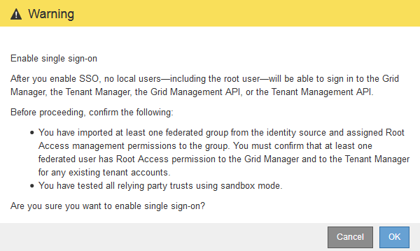

= Enabling single sign-on
:icons: font
:imagesdir: ../media/

[.lead]
After using sandbox mode to test all of your StorageGRID relying party trusts, you are ready to enable single sign-on (SSO).

.What you'll need

* You must have imported at least one federated group from the identity source and assigned Root Access management permissions to the group. You must confirm that at least one federated user has Root Access permission to the Grid Manager and to the Tenant Manager for any existing tenant accounts.
* You must have tested all relying party trusts using sandbox mode.

.Steps

. Select *Configuration* > *Access Control* > *Single Sign-on*.
+
The Single Sign-on page appears with *Sandbox Mode* selected.

. Change the SSO Status to *Enabled*.
. Click *Save*.
+
A warning message appears.
+

. Review the warning, and click *OK*.
+
Single sign-on is now enabled.
+
IMPORTANT: All users must use SSO to access the Grid Manager, the Tenant Manager, the Grid Management API, and the Tenant Management API. Local users can no longer access StorageGRID.
