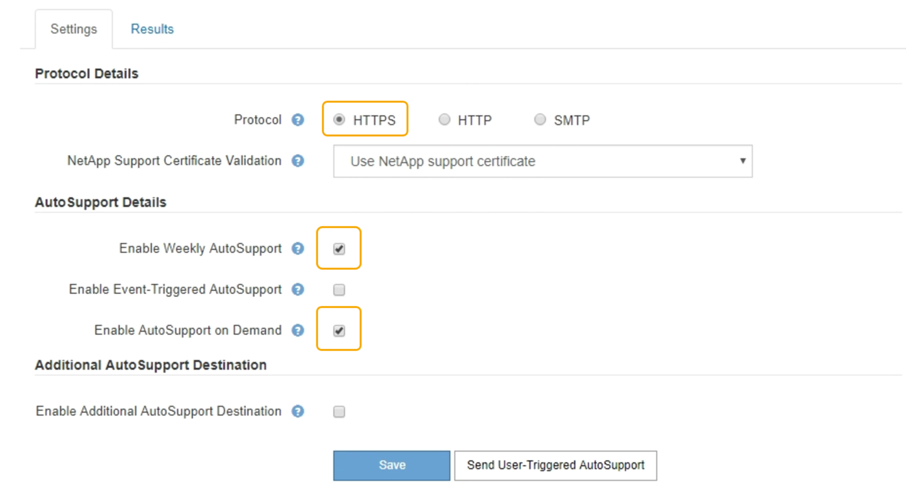

= Enabling AutoSupport on Demand
:icons: font
:imagesdir: ../media/

[.lead]
AutoSupport on Demand can assist in solving issues that technical support is actively working on. When you enable AutoSupport on Demand, technical support can request that AutoSupport messages be sent without the need for your intervention.

* You must be signed in to the Grid Manager using a supported browser.
* You must have the Root Access or Other Grid Configuration permission.
* You must have enabled weekly AutoSupport messages.
* You must have set the transport protocol to HTTPS.

When you enable this feature, technical support can request that your StorageGRID system send AutoSupport messages automatically. Technical support can also set the polling time interval for AutoSupport on Demand queries.

Technical support cannot enable or disable AutoSupport on Demand.

. Select *Support* > *Tools* > *AutoSupport*.
+
The AutoSupport page appears with the *Settings* tab selected.

. Select the HTTPS radio button in the *Protocol Details* section of the page.
+

. Select the *Enable Weekly AutoSupport* check box.
. Select the *Enable AutoSupport on Demand* check box.
. Select *Save*.
+
AutoSupport on Demand is enabled, and technical support can send AutoSupport on Demand requests to StorageGRID.
