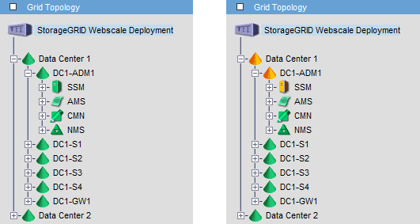

= How Admin Nodes show acknowledged alarms (legacy system)
:icons: font
:imagesdir: ../media/

[.lead]
When you acknowledge an alarm on one Admin Node, the acknowledged alarm is not copied to any other Admin Node. Because acknowledgments are not copied to other Admin Nodes, the Grid Topology tree might not look the same for each Admin Node.

This difference can be useful when connecting web clients. Web clients can have different views of the StorageGRID system based on the administrator needs.

Note that notifications are sent from the Admin Node where the acknowledgment occurs.
