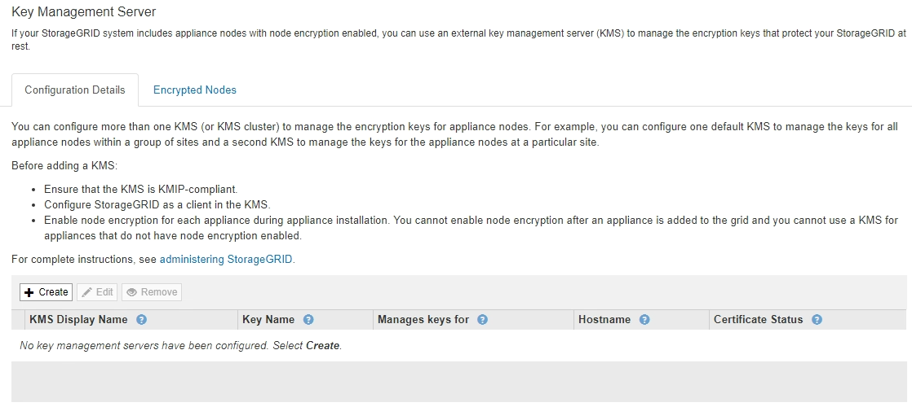
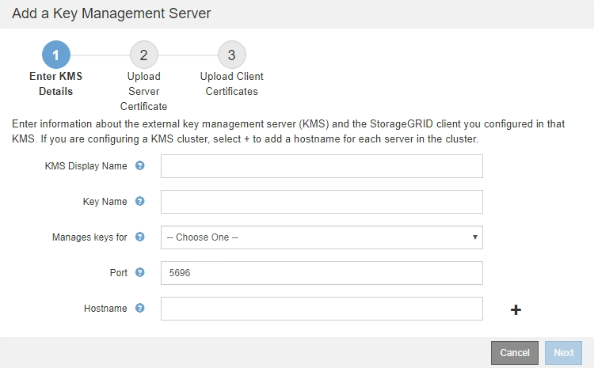

= Step 1: Enter KMS Details
:icons: font
:imagesdir: ../media/

[.lead]
In Step 1 (Enter KMS Details) of the Add a Key Management Server wizard, you provide details about the KMS or KMS cluster.

.Steps

. Select *Configuration* > *System Settings* > *Key Management Server*.
+
The Key Management Server page appears with the Configuration Details tab selected.
+

. Select *Create*.
+
Step 1 (Enter KMS Details) of the Add a Key Management Server wizard appears.
+

. Enter the following information for the KMS and the StorageGRID client you configured in that KMS.
+
[cols="1a,1a" options="header"]
|===
| Field| Description
a|
KMS Display Name
a|
A descriptive name to help you identify this KMS. Must be between 1 and 64 characters.
a|
Key Name
a|
The exact key alias for the StorageGRID client in the KMS. Must be between 1 and 255 characters.
a|
Manages keys for
a|
The StorageGRID site that will be associated with this KMS. If possible, you should configure any site-specific key management servers before configuring a default KMS that applies to all sites not managed by another KMS.

 ** Select a site if this KMS will manage encryption keys for the appliance nodes at a specific site.
 ** Select *Sites not managed by another KMS (default KMS)* to configure a default KMS that will apply to any sites that do not have a dedicated KMS and to any sites you add in subsequent expansions.
+
*Note:* A validation error will occur when you save the KMS configuration if you select a site that was previously encrypted by the default KMS but you did not provide the current version of original encryption key to the new KMS.

a|
Port
a|
The port the KMS server uses for Key Management Interoperability Protocol (KMIP) communications. Defaults to 5696, which is the KMIP standard port.
a|
Hostname
a|
The fully qualified domain name or IP address for the KMS.

*Note:* The SAN field of the server certificate must include the FQDN or IP address you enter here. Otherwise, StorageGRID will not be able to connect to the KMS or to all servers in a KMS cluster.

|===

. If you are using a KMS cluster, select the plus sign  to add a hostname for each server in the cluster.
. Select *Next*.
+
Step 2 (Upload Server Certificate) of the Add a Key Management Server wizard appears.
