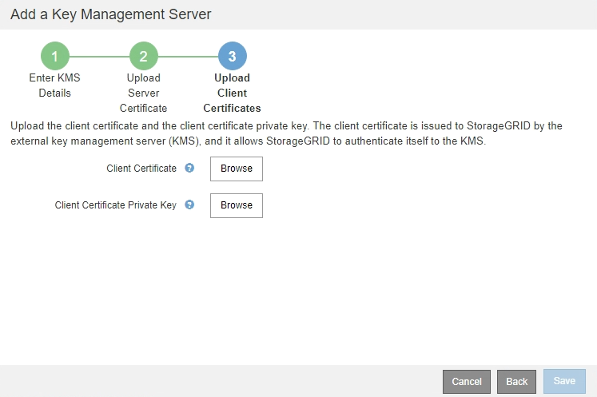
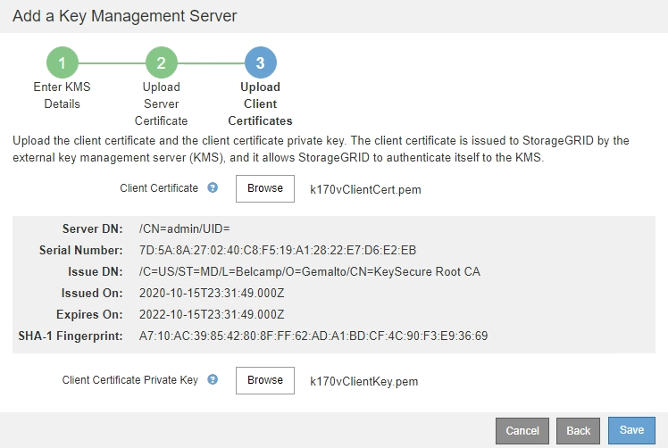
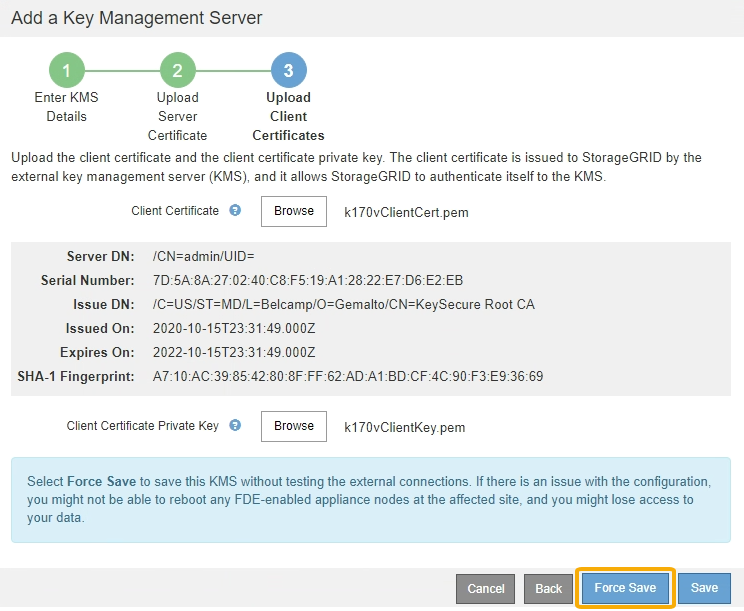
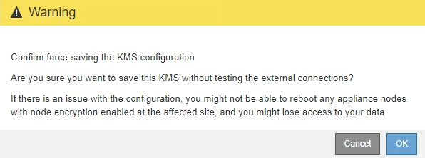

= Step 3: Upload Client Certificates
:icons: font
:imagesdir: ../media/

[.lead]
In Step 3 (Upload Client Certificates) of the Add a Key Management Server wizard, you upload the client certificate and the client certificate private key. The client certificate allows StorageGRID to authenticate itself to the KMS.

.Steps

. From *Step 3 (Upload Client Certificates)*, browse to the location of the client certificate.
+

. Upload the client certificate file.
+
The client certificate metadata appears.

. Browse to the location of the private key for the client certificate.
. Upload the private key file.
+
The metadata for the client certificate and the client certificate private key appear.
+

. Select *Save*.
+
The connections between the key management server and the appliance nodes are tested. If all connections are valid and the correct key is found on the KMS, the new key management server is added to the table on the Key Management Server page.
+
NOTE: Immediately after you add a KMS, the certificate status on the Key Management Server page appears as Unknown. It might take StorageGRID as long as 30 minutes to get the actual status of each certificate. You must refresh your web browser to see the current status.

. If an error message appears when you select *Save*, review the message details and then select *OK*.
+
For example, you might receive a 422: Unprocessable Entity error if a connection test failed.

. If you need to save the current configuration without testing the external connection, select *Force Save*.
+

+
IMPORTANT: Selecting *Force Save* saves the KMS configuration, but it does not test the external connection from each appliance to that KMS. If there is an issue with the configuration, you might not be able to reboot appliance nodes that have node encryption enabled at the affected site. You might lose access to your data until the issues are resolved.

. Review the confirmation warning, and select *OK* if you are sure you want to force save the configuration.
+

+
The KMS configuration is saved but the connection to the KMS is not tested.
