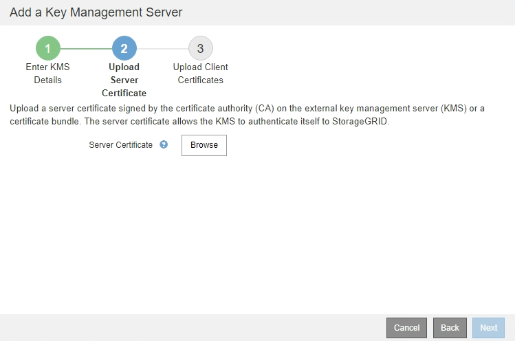
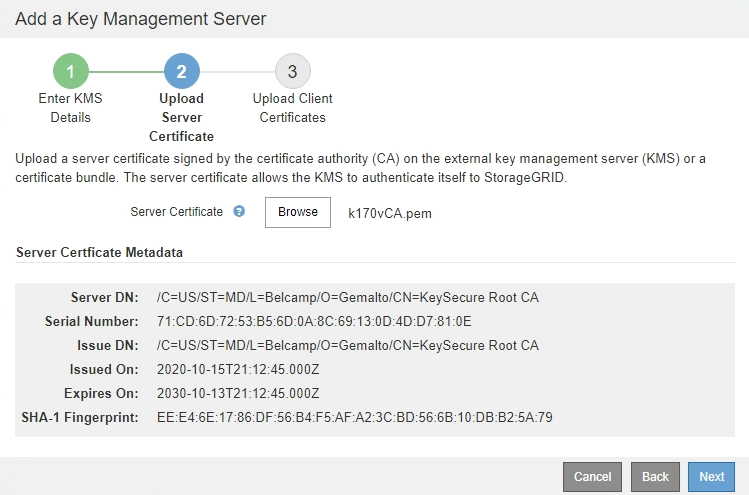

= Step 2: Upload Server Certificate
:icons: font
:imagesdir: ../media/

[.lead]
In Step 2 (Upload Server Certificate) of the Add a Key Management Server wizard, you upload the server certificate (or certificate bundle) for the KMS. The server certificate allows the external KMS to authenticate itself to StorageGRID.

.Steps

. From *Step 2 (Upload Server Certificate)*, browse to the location of the saved server certificate or certificate bundle.
+

. Upload the certificate file.
+
The server certificate metadata appears.
+

+
NOTE: If you uploaded a certificate bundle, the metadata for each certificate appears on its own tab.

. Select *Next*.
+
Step 3 (Upload Client Certificates) of the Add a Key Management Server wizard appears.
