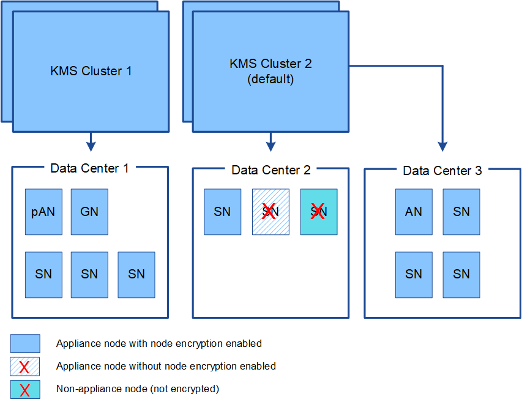

= Considerations and requirements for using a key management server
:icons: font
:imagesdir: ../media/

[.lead]
Before configuring an external key management server (KMS), you must understand the considerations and requirements.

== What are the KMIP requirements?

StorageGRID supports KMIP version 1.4.

http://docs.oasis-open.org/kmip/spec/v1.4/os/kmip-spec-v1.4-os.html[Key Management Interoperability Protocol Specification Version 1.4^]

Communications between the appliance nodes and the configured KMS use secure TLS connections. StorageGRID supports the following TLS v1.2 ciphers for KMIP:

* TLS_ECDHE_RSA_WITH_AES_256_GCM_SHA384
* TLS_ECDHE_ECDSA_WITH_AES_256_GCM_SHA384

You must ensure that each appliance node that uses node encryption has network access to the KMS or KMS cluster you configured for the site.

The network firewall settings must allow each appliance node to communicate through the port used for Key Management Interoperability Protocol (KMIP) communications. The default KMIP port is 5696.

== Which appliances are supported?

You can use a key management server (KMS) to manage encryption keys for any StorageGRID appliance in your grid that has the *Node Encryption* setting enabled. This setting can only be enabled during the hardware configuration stage of appliance installation using the StorageGRID Appliance Installer.

IMPORTANT: You cannot enable node encryption after an appliance is added to the grid, and you cannot use external key management for appliances that do not have node encryption enabled.

You can use the configured KMS for the following StorageGRID appliances and appliance nodes:

[cols="1a,1a" options="header"]
|===
| Appliance| Node type
a|
SG1000 services appliance
a|
Admin Node or Gateway Node
a|
SG100 services appliance
a|
Admin Node or Gateway Node
a|
SG6000 storage appliance
a|
Storage Node
a|
SG5700 storage appliance
a|
Storage Node
a|
SG5600 storage appliance
a|
Storage Node
|===
You cannot use the configured KMS for software-based (non-appliance) nodes, including the following:

* Nodes deployed as virtual machines (VMs)
* Nodes deployed within Docker containers on Linux hosts

Nodes deployed on these other platforms can use encryption outside of StorageGRID at the datastore or disk level.

== When should I configure key management servers?

For a new installation, you should typically set up one or more key management servers in the Grid Manager before creating tenants. This order ensures that the nodes are protected before any object data is stored on them.

You can configure the key management servers in the Grid Manager before or after you install the appliance nodes.

== How many key management servers do I need?

You can configure one or more external key management servers to provide encryption keys to the appliance nodes in your StorageGRID system. Each KMS provides a single encryption key to the StorageGRID appliance nodes at a single site or at a group of sites.

StorageGRID supports the use of KMS clusters. Each KMS cluster contains multiple, replicated key management servers that share configuration settings and encryption keys. Using KMS clusters for key management is recommended because it improves the failover capabilities of a high availability configuration.

For example, suppose your StorageGRID system has three data center sites. You might configure one KMS cluster to provide a key to all appliance nodes at Data Center 1 and a second KMS cluster to provide a key to all appliance nodes at all other sites. When you add the second KMS cluster, you can configure a default KMS for Data Center 2 and Data Center 3.

Note that you cannot use a KMS for non-appliance nodes or for any appliance nodes that did not have the *Node Encryption* setting enabled during installation.

== What happens when a key is rotated?

As a security best practice, you should periodically rotate the encryption key used by each configured KMS.

When rotating the encryption key, use the KMS software to rotate from the last used version of the key to a new version of the same key. Do not rotate to an entirely different key.

CAUTION: Never attempt to rotate a key by changing the key name (alias) for the KMS in the Grid Manager. Instead, rotate the key by updating the key version in the KMS software. Use the same key alias for new keys as was used for previous keys. If you change the key alias for a configured KMS, StorageGRID might not be able to decrypt your data.

When the new key version is available:

* It is automatically distributed to the encrypted appliance nodes at the site or sites associated with the KMS. The distribution should occur within an hour of when the key is rotated.
* If the encrypted appliance node is offline when the new key version is distributed, the node will receive the new key as soon as it reboots.
* If the new key version cannot be used to encrypt appliance volumes for any reason, the *KMS encryption key rotation failed* alert is triggered for the appliance node. You might need to contact technical support for help in resolving this alert.

== Can I reuse an appliance node after it has been encrypted?

If you need to install an encrypted appliance into another StorageGRID system, you must first decommission the grid node to move object data to another node. Then, you can use the StorageGRID Appliance Installer to clear the KMS configuration. Clearing the KMS configuration disables the *Node Encryption* setting and removes the association between the appliance node and the KMS configuration for the StorageGRID site.

NOTE: With no access to the KMS encryption key, any data that remains on the appliance can no longer be accessed and is permanently locked.

xref:../sg100-1000/index.adoc[SG100 & SG1000 services appliances]

xref:../sg6000/index.adoc[SG6000 storage appliances]

xref:../sg5700/index.adoc[SG5700 storage appliances]

xref:../sg5600/index.adoc[SG5600 storage appliances]
