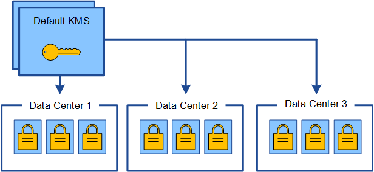
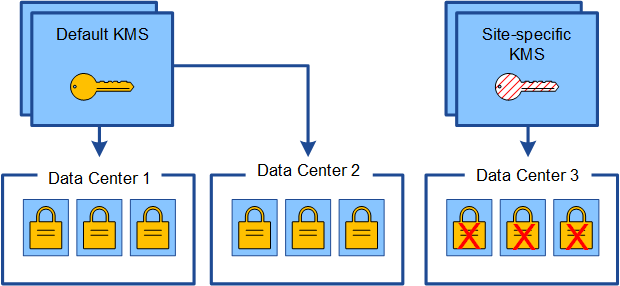
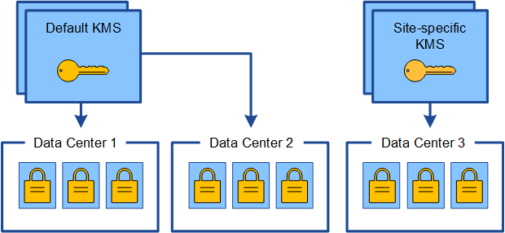

= Considerations for changing the KMS for a site
:icons: font
:imagesdir: ../media/

[.lead]
Each key management server (KMS) or KMS cluster provides an encryption key to all appliance nodes at a single site or at a group of sites. If you need to change which KMS is used for a site, you might need to copy the encryption key from one KMS to another.

If you change the KMS used for a site, you must ensure that the previously encrypted appliance nodes at that site can be decrypted using the key stored on the new KMS. In some cases, you might need to copy the current version of the encryption key from the original KMS to the new KMS. You must ensure that the KMS has the correct key to decrypt the encrypted appliance nodes at the site.

For example:

. You initially configure a default KMS that applies to all sites that do not have a dedicated KMS.
. When the KMS is saved, all appliance nodes that have the *Node Encryption* setting enabled connect to the KMS and request the encryption key. This key is used to encrypt the appliance nodes at all sites. This same key must also be used to decrypt those appliances.
+

. You decide to add a site-specific KMS for one site (Data Center 3 in the figure). However, because the appliance nodes are already encrypted, a validation error occurs when you attempt to save the configuration for the site-specific KMS. The error occurs because the site-specific KMS does not have the correct key to decrypt the nodes at that site.
+

. To address the issue, you copy the current version of the encryption key from the default KMS to the new KMS. (Technically, you copy the original key to a new key with the same alias. The original key becomes a prior version of the new key.) The site-specific KMS now has the correct key to decrypt the appliance nodes at Data Center 3, so it can be saved in StorageGRID.
+

== Use cases for changing which KMS is used for a site

The table summarizes the required steps for the most common cases for changing the KMS for a site.

[cols="1a,1a" options="header"]
|===
| Use case for changing a site's KMS| Required steps
a|
You have one or more site-specific KMS entries, and you want to use one of them as the default KMS.
a|
Edit the site-specific KMS. In the *Manages keys for* field, select *Sites not managed by another KMS (default KMS)*. The site-specific KMS will now be used as the default KMS. It will apply to any sites that do not have a dedicated KMS.

xref:kms-editing.adoc[Editing a key management server (KMS)]

a|
You have a default KMS and you add a new site in an expansion. You do not want to use the default KMS for the new site.
a|

. If the appliance nodes at the new site have already been encrypted by the default KMS, use the KMS software to copy the current version of the encryption key from the default KMS to a new KMS.
. Using the Grid Manager, add the new KMS and select the site.

xref:kms-adding.adoc[Adding a key management server (KMS)]

a|
You want the KMS for a site to use a different server.
a|

. If the appliance nodes at the site have already been encrypted by the existing KMS, use the KMS software to copy the current version of the encryption key from the existing KMS to the new KMS.
. Using the Grid Manager, edit the existing KMS configuration and enter the new host name or IP address.

xref:kms-adding.adoc[Adding a key management server (KMS)]

|===
