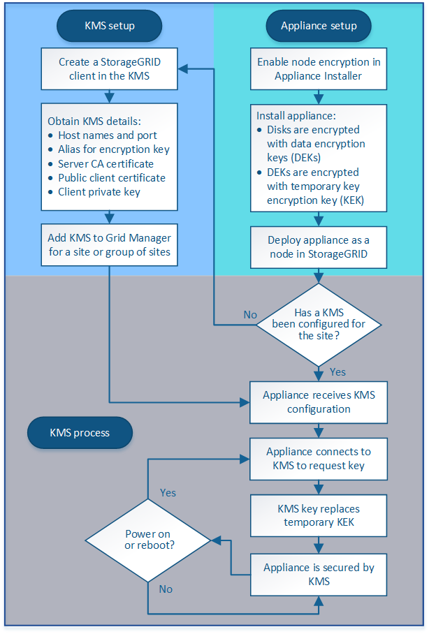

= Overview of KMS and appliance configuration
:icons: font
:imagesdir: ../media/

[.lead]
Before you can use a key management server (KMS) to secure StorageGRID data on appliance nodes, you must complete two configuration tasks: setting up one or more KMS servers and enabling node encryption for the appliance nodes. When these two configuration tasks are complete, the key management process occurs automatically.

The flowchart shows the high-level steps for using a KMS to secure StorageGRID data on appliance nodes.

The flowchart shows KMS setup and appliance setup occurring in parallel; however, you can set up the key management servers before or after you enable node encryption for new appliance nodes, based on your requirements.

== Setting up the key management server (KMS)

Setting up a key management server includes the following high-level steps.

[cols="1a,1a" options="header"]
|===
| Step| Refer to
a|
Access the KMS software and add a client for StorageGRID to each KMS or KMS cluster.
a|
xref:kms-configuring-storagegrid-as-client.adoc[Configuring StorageGRID as a client in the KMS]
a|
Obtain the required information for the StorageGRID client on the KMS.
a|
xref:kms-configuring-storagegrid-as-client.adoc[Configuring StorageGRID as a client in the KMS]
a|
Add the KMS to the Grid Manager, assign it to a single site or to a default group of sites, upload the required certificates, and save the KMS configuration.
a|
xref:kms-adding.adoc[Adding a key management server (KMS)]
|===

== Setting up the appliance

Setting up an appliance node for KMS use includes the following high-level steps.

. During the hardware configuration stage of appliance installation, use the StorageGRID Appliance Installer to enable the *Node Encryption* setting for the appliance.
+
IMPORTANT: You cannot enable the *Node Encryption* setting after an appliance is added to the grid, and you cannot use external key management for appliances that do not have node encryption enabled.

. Run the StorageGRID Appliance Installer. During installation, a random data encryption key (DEK) is assigned to each appliance volume, as follows:
 ** The DEKs are used to encrypt the data on each volume. These keys are generated using Linux Unified Key Setup (LUKS) disk encryption in the appliance OS and cannot be changed.
 ** Each individual DEK is encrypted by a master key encryption key (KEK). The initial KEK is a temporary key that encrypts the DEKs until the appliance can connect to the KMS.
. Add the appliance node to StorageGRID.

For details, refer to the following:

* xref:../sg100-1000/index.adoc[SG100 & SG1000 services appliances]
* xref:../sg6000/index.adoc[SG6000 storage appliances]
* xref:../sg5700/index.adoc[SG5700 storage appliances]
* xref:../sg5600/index.adoc[SG5600 storage appliances]

== Key management encryption process (occurs automatically)

Key management encryption includes the following high-level steps that are performed automatically.

. When you install an appliance that has node encryption enabled into the grid, StorageGRID determines if a KMS configuration exists for the site that contains the new node.
 ** If a KMS has already been configured for the site, the appliance receives the KMS configuration.
 ** If a KMS has not yet been configured for the site, data on the appliance continues to be encrypted by the temporary KEK until you configure a KMS for the site and the appliance receives the KMS configuration.
. The appliance uses the KMS configuration to connect to the KMS and request an encryption key.
. The KMS sends an encryption key to the appliance. The new key from the KMS replaces the temporary KEK and is now used to encrypt and decrypt the DEKs for the appliance volumes.
+
IMPORTANT: Any data that exists before the encrypted appliance node connects to the configured KMS is encrypted with a temporary key. However, the appliance volumes should not be considered protected from removal from the data center until the temporary key is replaced by the KMS encryption key.

. If the appliance is powered on or rebooted, it reconnects to the KMS to request the key. The key, which is saved in volatile memory, cannot survive a loss of power or a reboot.
