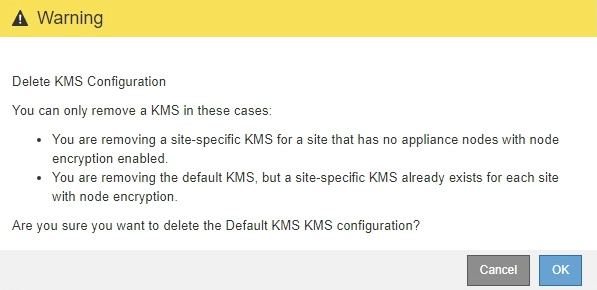

= Removing a key management server (KMS)
:icons: font
:imagesdir: ../media/

[.lead]
You might want to remove a key management server in some cases. For example, you might want to remove a site-specific KMS if you have decommissioned the site.

.What you'll need

* You must have reviewed the xref:kms-considerations-and-requirements.adoc[considerations and requirements for using a key management server].

* You must have the Root Access permission.
* You must be signed in to the Grid Manager using a xref:../admin/web-browser-requirements.adoc[supported web browser].

.About this task

You can remove a KMS in these cases:

* You can remove a site-specific KMS if the site has been decommissioned or if the site includes no appliance nodes with node encryption enabled.
* You can remove the default KMS if a site-specific KMS already exists for each site that has appliance nodes with node encryption enabled.

.Steps

. Select *Configuration* > *System Settings* > *Key Management Server*.
+
The Key Management Server page appears and shows all key management servers that have been configured.
+
image::../media/kms_configuration_details_table.png[KMS Configuration Details KMS Table]

. Select the radio button for the KMS you want to remove, and select *Remove*.
. Review the considerations in the warning dialog.
+

. Select *OK*.
+
The KMS configuration is removed.
