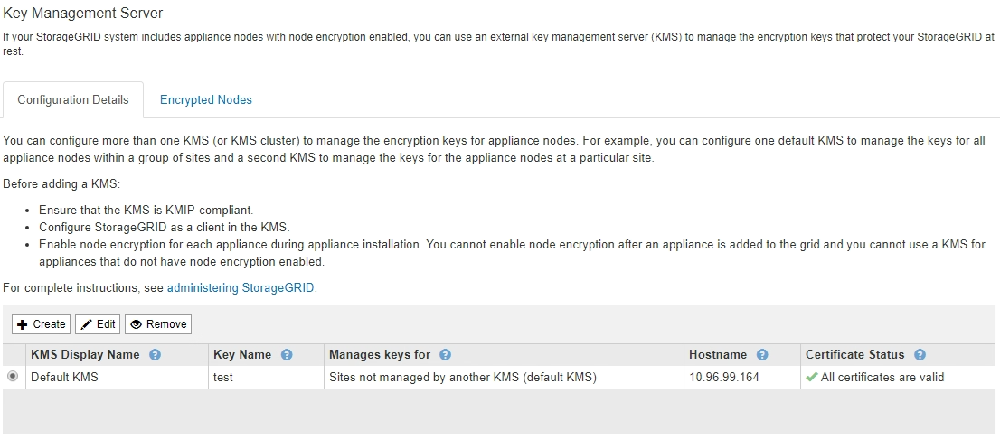

= Viewing KMS details
:icons: font
:imagesdir: ../media/

[.lead]
You can view information about each key management server (KMS) in your StorageGRID system, including the current status of the server and client certificates.

.Steps

. Select *Configuration* > *System Settings* > *Key Management Server*.
+
The Key Management Server page appears. The Configuration Details tab shows any key management servers that are configured.
+

. Review the information in the table for each KMS.
+
[cols="1a,1a" options="header"]
|===
| Field| Description
a|
KMS Display Name
a|
The descriptive name of the KMS.
a|
Key Name
a|
The key alias for the StorageGRID client in the KMS.
a|
Manages keys for
a|
The StorageGRID site associated with the KMS.

This field displays the name of a specific StorageGRID site or *Sites not managed by another KMS (default KMS).*
a|
Hostname
a|
The fully qualified domain name or IP address of the KMS.

If there is a cluster of two key management servers, the fully qualified domain name or IP address of both servers are listed. If there are more than two key management servers in a cluster, the fully qualified domain name or IP address of the first KMS is listed along with the number of additional key management servers in the cluster.

For example: `10.10.10.10 and 10.10.10.11` or `10.10.10.10 and 2 others`.

To view all hostnames in a cluster, select a KMS and then select *Edit*.
a|
Certificate Status
a|
Current state of the server certificate, optional CA certificate, and the client certificate: valid, expired, nearing expiration, or unknown.

*Note:* It might take StorageGRID as long as 30 minutes to get updates to the certificate status. You must refresh your web browser to see the current values.

|===

. If the Certificate Status is Unknown, wait up to 30 minutes and then refresh your web browser.
+
NOTE: Immediately after you add a KMS, the certificate status on the Key Management Server page appears as Unknown. It might take StorageGRID as long as 30 minutes to get the actual status of each certificate. You must refresh your web browser to see the actual status.

. If the Certificate Status column indicates that a certificate has expired or is nearing expiration, address the issue as soon as possible.
+
See the recommended actions for the *KMS CA certificate expiration*, *KMS client certificate expiration*, and *KMS server certificate expiration* alerts in the instructions for monitoring and troubleshooting StorageGRID.
+
IMPORTANT: You must address any certificate issues as soon as possible to maintain data access.

.Related information

xref:../monitor/index.adoc[Monitor & troubleshoot]
