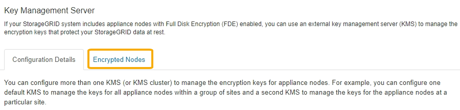
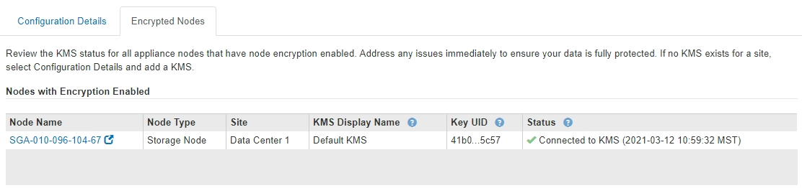

= Viewing encrypted nodes
:icons: font
:imagesdir: ../media/

[.lead]
You can view information about the appliance nodes in your StorageGRID system that have the *Node Encryption* setting enabled.

.Steps

. Select *Configuration* > *System Settings* > *Key Management Server*.
+
The Key Management Server page appears. The Configuration Details tab shows any key management servers that have been configured.
+
image::../media/kms_configuration_details_table.png[KMS Configuration Details KMS Table]

. From the top of the page, select the *Encrypted Nodes* tab.
+

+
The Encrypted Nodes tab lists the appliance nodes in your StorageGRID system that have the *Node Encryption* setting enabled.
+

. Review the information in the table for each appliance node.
+
[cols="1a,2a" options="header"]
|===
| Column| Description
a|
Node Name
a|
The name of the appliance node.
a|
Node Type
a|
The type of node: Storage, Admin, or Gateway.
a|
Site
a|
The name of the StorageGRID site where the node is installed.
a|
KMS Display Name
a|
The descriptive name of the KMS used for the node.

If no KMS is listed, select the Configuration Details tab to add a KMS.

xref:kms-adding.adoc[Adding a key management server (KMS)]
a|
Key UID
a|
The unique ID of the encryption key used to encrypt and decrypt data on the appliance node. To view an entire key UID, hover your cursor over the cell.

A dash (--) indicates the key UID is unknown, possibly because of a connection issue between the appliance node and the KMS.
a|
Status
a|
The status of the connection between the KMS and the appliance node. If the node is connected, the timestamp updates every 30 minutes. It can take several minutes for the connection status to update after the KMS configuration changes.

*Note:* You must refresh your web browser to see the new values.

|===

. If the Status column indicates a KMS issue, address the issue immediately.
+
During normal KMS operations, the status will be *Connected to KMS*. If a node is disconnected from the grid, the node connection state is shown (Administratively Down or Unknown).
+
Other status messages correspond to StorageGRID alerts with the same names:

 ** KMS configuration failed to load
 ** KMS connectivity error
 ** KMS encryption key name not found
 ** KMS encryption key rotation failed
 ** KMS key failed to decrypt an appliance volume
 ** KMS is not configured
See the recommended actions for these alerts in the instructions for monitoring and troubleshooting StorageGRID.

+
IMPORTANT: You must address any issues immediately to ensure that your data is fully protected.

.Related information

xref:../monitor/index.adoc[Monitor & troubleshoot]
