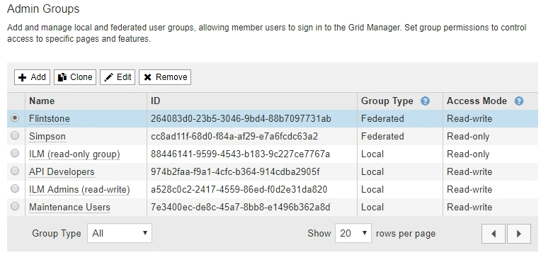
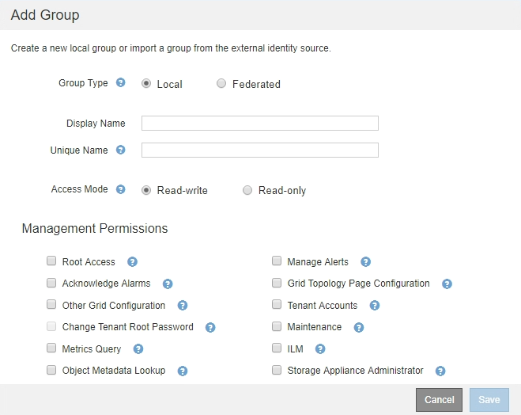

= Manage admin groups
:icons: font
:imagesdir: ../media/

[.lead]
You can create admin groups to manage the security permissions for one or more admin users. Users must belong to a group to be granted access to the StorageGRID system.

== Creating admin groups

Admin groups allow you to determine which users can access which features and operations in the Grid Manager and the Grid Management API.

.What you'll need

* You are signed in to the Grid Manager using a xref:../admin/web-browser-requirements.adoc[supported web browser].
* You have specific access permissions.
* If you plan to import a federated group, you have configured identity federation and the federated group already exists in the configured identity source.

.Steps

. Select *CONFIGURATION* > *Access control* > *Admin groups*.
+

. Select *Add*.
+
The Add Group dialog box appears.
+

. For Group Type, select *Local* if you want to create a group that will be used only within StorageGRID, or select *Federated* if you want to import a group from the identity source.
. If you selected *Local*, enter a display name for the group. The display name is the name that appears in the Grid Manager. For example, "`Maintenance Users`" or "`ILM Administrators.`"
. Enter a unique name for the group.
 ** *Local*: Enter whatever unique name you want. For example, "`ILM Administrators.`"
 ** *Federated*: Enter the group's name exactly as it appears in the configured identity source.
. For *Access Mode*, select whether users in the group can change settings and perform operations in the Grid Manager and the Grid Management API or whether they can only view settings and features.
 ** *Read-write* (default): Users can change settings and perform the operations allowed by their management permissions.
 ** *Read-only*: Users can only view settings and features. They cannot make any changes or perform any operations in the Grid Manager or Grid Management API. Local read-only users can change their own passwords.
+
NOTE: If a user belongs to multiple groups and any group is set to *Read-only*, the user will have read-only access to all selected settings and features.
. Select one or more management permissions.
+
You must assign at least one permission to each group; otherwise, users belonging to the group will not be able to sign in to StorageGRID.

. Select *Save*.
+
The new group is created. If this is a local group, you can now xref:managing-local-users.adoc[add one or more users]. If this is a federated group, the identity source manages which users belong to the group.

== Admin group permissions

When creating admin user groups, you select one or more permissions to control access to specific features of the Grid Manager. You can then assign each user to one or more of these admin groups to determine which tasks that user can perform.

You must assign at least one permission to each group; otherwise, users belonging to that group will not be able to sign in to the Grid Manager.

By default, any user who belongs to a group that has at least one permission can perform the following tasks:

* Sign in to the Grid Manager
* View the Dashboard
* View the Nodes pages
* Monitor grid topology
* View current and resolved alerts
* View current and historical alarms (legacy system)
* Change their own password (local users only)
* View certain information on the Configuration and Maintenance pages

The following sections describe the permissions you can assign when creating or editing an admin group. Any functionality not explicitly mentioned requires the Root Access permission.

=== Root Access

This permission provides access to all grid administration features.

=== Manage Alerts

This permission provides access to options for managing alerts. Users must have this permission to manage silences, alert notifications, and alert rules.

=== Acknowledge Alarms (legacy system)

This permission provides access to acknowledge and respond to alarms (legacy system). All signed-in users can view current and historical alarms.

If you want a user to monitor grid topology and acknowledge alarms only, you should assign this permission.

=== Grid Topology Page Configuration

This permission provides access to the following menu options:

* Configuration tabs available from the pages in *SUPPORT* > *Tools* > *Grid topology*.
* *Reset event counts* link on the *NODES* > *Events* tab.

=== Other Grid Configuration

This permission provides access to additional grid configuration options.

IMPORTANT: To see these additional options, users must also have the Grid Topology Page Configuration permission.

* *ILM*:
 ** Storage pools
 ** Storage grades
* *CONFIGURATION* > *Network*:
 ** Link cost
* *CONFIGURATION* > *System*:
 ** Display options
 ** Grid options
 ** Storage options
* *SUPPORT*:
 ** AutoSupport
* *SUPPORT* > *Alarms (legacy)*:
 ** Global alarms
 ** Legacy email setup

=== Tenant Accounts

This permission provides access to the *TENANTS* > *Tenant* page, where you can create, edit, and remove tenant accounts. This permission also allows users to view existing traffic classification policies. 

=== Change Tenant Root Password

This permission provides access to the *Change root password* option on the Tenants page, allowing you to control who can change the password for the tenant's local root user. For S3 tenants, it also provides access to the S3 key import feature. Users who do not have this permission cannot see the *Change root password* option.

NOTE: You must assign the Tenant Accounts permission to the group before you can assign this permission.

=== Maintenance

This permission provides access to the following menu options:

* *CONFIGURATION* > *Security*:
** Certificates*
 ** Domain names*
* *CONFIGURATION* > *Monitoring*:
 ** Audit messages*
* *CONFIGURATION* > *Access control*:
 ** Grid passwords
 
* *MAINTENANCE* > *Tasks*
 ** Decommission
 ** Expansion
 ** Recovery
 ** Object existence check
* *MAINTENANCE* > *System*:
 ** License*
 ** Recovery package
 ** Software update
* *MAINTENANCE* > *Network*:
 ** DNS servers*
 ** Grid network*
 ** NTP servers*

* *SUPPORT* > *Tools*:
 ** Logs

* Users who do not have the Maintenance permission can view, but not edit, the pages marked with an asterisk.

=== Metrics Query

This permission provides access to the *SUPPORT* > *Tools* > *Metrics* page. This permission also provides access to custom Prometheus metrics queries using the *Metrics* section of the Grid Management API.

=== ILM

This permission provides access to the following *ILM* menu options:

* *Erasure coding*
* *Rules*
* *Policies*
* *Regions*

NOTE: Access to the *ILM* > *Storage pools* and *ILM* > *Storage grades* menu options is controlled by the Other Grid Configuration and Grid Topology Page Configuration permissions.

=== Object Metadata Lookup

This permission provides access to the *ILM* > *Object metadata lookup* menu option.

=== Storage Appliance Administrator

This permission provides access to the E-Series SANtricity System Manager on storage appliances through the Grid Manager.

=== Interaction between permissions and Access Mode

For all permissions, the group's Access Mode setting determines whether users can change settings and perform operations or whether they can only view the related settings and features. If a user belongs to multiple groups and any group is set to *Read-only*, the user will have read-only access to all selected settings and features.

=== Deactivating features from the Grid Management API

You can use the Grid Management API to completely deactivate certain features in the StorageGRID system. When a feature is deactivated, no one can be assigned permissions to perform the tasks related to that feature.

.About this task
The Deactivated Features system allows you to prevent access to certain features in the StorageGRID system. Deactivating a feature is the only way to prevent the root user or users who belong to admin groups with the Root Access permission from being able to use that feature.

To understand how this functionality might be useful, consider the following scenario:

_Company A is a service provider who leases the storage capacity of their StorageGRID system by creating tenant accounts. To protect the security of their leaseholders' objects, Company A wants to ensure that its own employees can never access any tenant account after the account has been deployed._

_Company A can accomplish this goal by using the Deactivate Features system in the Grid Management API. By completely deactivating the *Change Tenant Root Password* feature in the Grid Manager (both the UI and the API), Company A can ensure that no Admin user--including the root user and users belonging to groups with the Root Access permission--can change the password for any tenant account's root user._

==== Reactivating deactivated features ====

By default, you can use the Grid Management API to reactivate a feature that has been deactivated. However, if you want to prevent deactivated features from ever being reactivated, you can deactivate the *activateFeatures* feature itself.

CAUTION: The *activateFeatures* feature cannot be reactivated. If you decide to deactivate this feature, be aware that you will permanently lose the ability to reactivate any other deactivated features. You must contact technical support to restore any lost functionality.

For details, see the instructions for implementing S3 or Swift client applications.

.Steps

. Access the Swagger documentation for the Grid Management API.
. Locate the Deactivate Features endpoint.
. To deactivate a feature, such as *Change Tenant Root Password*, send a body to the API like this:
+
----
{ "grid": {"changeTenantRootPassword": true} }
----
+
When the request is complete, the Change Tenant Root Password feature is disabled. The Change Tenant Root Password management permission no longer appears in the user interface, and any API request that attempts to change the root password for a tenant will fail with "`403 Forbidden.`"

. To reactivate all features, send a body to the API like this:
+
----
{ "grid": null }
----
+
When this request is complete, all features, including the Change Tenant Root Password feature, are reactivated. The Change Tenant Root Password management permission now appears in the user interface, and any API request that attempts to change the root password for a tenant will succeed, assuming the user has the Root Access or Change Tenant Root Password management permission.
+
NOTE: The previous example causes _all_ deactivated features to be reactivated. If other features have been deactivated that should remain deactivated, you must explicitly specify them in the PUT request. For example, to reactivate the Change Tenant Root Password feature and continue to deactivate the Alarm Acknowledgment feature, send this PUT request:
+
----
{ "grid": { "alarmAcknowledgment": true } }
----

.Related information

xref:using-grid-management-api.adoc[Using the Grid Management API]

== Modifying an admin group

You can modify an admin group to change the permissions associated with the group. For local admin groups, you can also update the display name.

.What you'll need

* You must be signed in to the Grid Manager using a xref:../admin/web-browser-requirements.adoc[supported web browser].
* You must have specific access permissions.

.Steps

. Select *CONFIGURATION* > *Access control* > *Admin groups*.
. Select the group.
+
If your system includes more than 20 items, you can specify how many rows are shown on each page at one time. You can then use your browser's find feature to search for a specific item in the currently displayed rows.

. Click *Edit*.
. Optionally, for local groups, enter the group's name that will appear to users, for example, "`Maintenance Users.`"
+
You cannot change the unique name, which is the internal group name.

. Optionally, change the group's Access Mode.
 ** *Read-write* (default): Users can change settings and perform the operations allowed by their management permissions.
 ** *Read-only*: Users can only view settings and features. They cannot make any changes or perform any operations in the Grid Manager or Grid Management API. Local read-only users can change their own passwords.
+
NOTE: If a user belongs to multiple groups and any group is set to *Read-only*, the user will have read-only access to all selected settings and features.
. Optionally, add or remove group permissions.
+
See information about admin group permissions.

. Select *Save*.

.Related information

<<Admin group permissions>>

== Deleting an admin group

You can delete an admin group when you want to remove the group from the system, and remove all permissions associated with the group. Deleting an admin group removes any admin users from the group, but does not delete the admin users.

.What you'll need

* You must be signed in to the Grid Manager using a xref:../admin/web-browser-requirements.adoc[supported web browser].
* You must have specific access permissions.

.About this task

When you delete a group, users assigned to that group will lose all access privileges to the Grid Manager, unless they are granted privileges by a different group.

.Steps

. Select *CONFIGURATION* > *Access control* > *Admin groups*.
. Select the name of the group.
+
If your system includes more than 20 items, you can specify how many rows are shown on each page at one time. You can then use your browser's find feature to search for a specific item in the currently displayed rows.

. Select *Remove*.
. Select *OK*.
