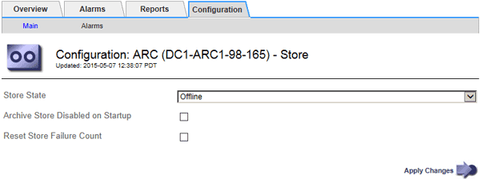

= Manage an Archive Node when TSM server reaches capacity
:icons: font
:imagesdir: ../media/

[.lead]
The TSM server has no way to notify the Archive Node when either the TSM database or the archival media storage managed by the TSM server is nearing capacity. This situation can be avoided through proactive monitoring of the TSM server.

.What you'll need

* You are signed in to the Grid Manager using a xref:../admin/web-browser-requirements.adoc[supported web browser].
* You have specific access permissions.

.About this task

The Archive Node continues to accept object data for transfer to the TSM server after the TSM server stops accepting new content. This content cannot be written to media managed by the TSM server. An alarm is triggered if this happens. 

== Prevent ARC service from sending content to TSM server

To prevent the ARC service from sending further content to the TSM server, you can take the Archive Node offline by taking its *ARC* > *Store* component offline. This procedure can also be useful in preventing alarms when the TSM server is unavailable for maintenance.

.Steps

. Select *SUPPORT* > *Tools* > *Grid topology*.
. Select *_Archive Node_* > *ARC* > *Store*.
. Select *Configuration* > *Main*.
+

. Change *Store State* to `Offline`.
. Select *Archive Store Disabled on Startup*.
. Select *Apply Changes*.

== Set Archive Node to read-only if TSM middleware reaches capacity

If the targeted TSM middleware server reaches capacity, the Archive Node can be optimized to only perform retrievals.

.Steps

. Select *SUPPORT* > *Tools* > *Grid topology*.
. Select *_Archive Node_* > *ARC* > *Target*.
. Select *Configuration* > *Main*.
. Change Maximum Retrieve Sessions to be the same as the number of concurrent sessions listed in Number of Sessions.
. Change Maximum Store Sessions to 0.
+
NOTE: Changing Maximum Store Sessions to 0 is not necessary if the Archive Node is Read-only. Store sessions will not be created.

. Select *Apply Changes*.
