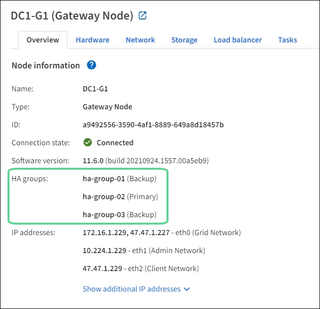

= Manage high availability (HA) groups: Overview
:icons: font
:imagesdir: ../media/

[.lead]
You can group the network interfaces of multiple Admin and Gateway Nodes into a high availability (HA) group. If the active interface in the HA group fails, a backup interface can manage the workload.

== What is an HA group?

You can use high availability (HA) groups to provide highly available data connections for S3 and Swift clients or to provide highly available connections to the Grid Manager and the Tenant Manager.

Each HA group provides access to the shared services on the selected nodes.

* HA groups that include Gateway Nodes, Admin Nodes, or both provide highly available data connections for S3 and Swift clients.

* HA groups that include only Admin Nodes provide highly available connections to the Grid Manager and the Tenant Manager.

* An HA group that includes only SG100 or SG1000 appliances and VMware-based software nodes can provide highly available connections for xref:../admin/manage-s3-select-for-tenant-accounts.adoc[S3 tenants that use S3 Select].
 HA groups are recommended when using S3 Select, but not required.

== How do you create an HA group?
. You select a network interface for one or more Admin Nodes or Gateway Nodes. You can use a Grid Network (eth0) interface, Client Network (eth2) interface, VLAN interface, or an access interface you have added to the node. 
+
NOTE: You cannot add an interface to an HA group if it has a DHCP-assigned IP address.

. You specify one interface to be the Primary interface. The Primary interface is the active interface unless a failure occurs.

. You determine the priority order for any Backup interfaces.

. You assign one to 10 virtual IP (VIP) addresses to the group. Clients applications can use any of these VIP addresses to connect to StorageGRID.

For instructions, see xref:configure-high-availability-group.adoc[Configure high availability groups].

== What is the active interface?

During normal operation, all of the VIP addresses for the HA group are added to the Primary interface, which is the first interface in the priority order. As long as the Primary interface remains available, it is used when clients connect to any VIP address for the group. That is, during normal operation, the Primary interface is the "`active`" interface for the group.

Similarly, during normal operation, any lower priority interfaces for the HA group act as "`backup`" interfaces. These backup interfaces are not used unless the Primary (currently active) interface becomes unavailable.

== View the current HA group status of a node

To see if a node is assigned to an HA group and determine its current status, select *NODES* > *_node_*. 

If the *Overview* tab includes an entry for *HA groups*, the node is assigned to the HA groups listed. The value after the group name is the current status of the node in the HA group:

* *Active*: The HA group is currently being hosted on this node.
* *Backup*: The HA group is not currently using this node; this is a backup interface. 
* *Stopped*: The HA group cannot be hosted on this node because the High Availability (keepalived) service has been stopped manually.
* *Fault*: The HA group cannot be hosted on this node because of one or more of the following:
** The Load Balancer (nginx-gw) service is not running on the node.
** The node's eth0 or VIP interface is down.
** The node is down.

In this example, the primary Admin Node has been added to two HA groups. This node is currently the active interface for the Admin clients group and a backup interface for the FabricPool clients group.

== What happens when the active interface fails?

The interface that currently hosts the VIP addresses is the active interface. If the HA group includes more than one interface and the active interface fails, the VIP addresses move to the first available backup interface in the priority order. If that interface fails, the VIP addresses move to the next available backup interface, and so on.

Failover can be triggered for any of these reasons:

* The node on which the interface is configured goes down.
* The node on which the interface is configured loses connectivity to all other nodes for at least 2 minutes.
* The active interface goes down.
* The Load Balancer service stops.
* The High Availability service stops.

NOTE: Failover might not be triggered by network failures external to the node that hosts the active interface. Similarly, failover is not triggered by the failure of the CLB service (deprecated) or services for the Grid Manager or the Tenant Manager.

The failover process generally takes only a few seconds and is fast enough that client applications should experience little impact and can rely on normal retry behaviors to continue operation.

When failure is resolved and a higher priority interface becomes available again, the VIP addresses are automatically moved to the highest priority interface that is available.

