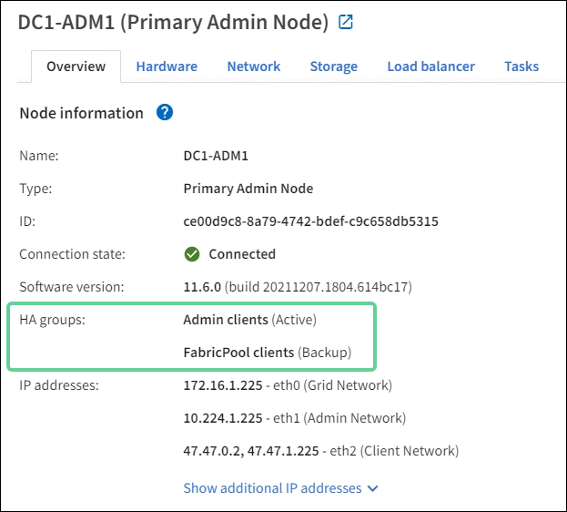

= Manage high availability (HA) groups: Overview
:icons: font
:imagesdir: ../media/

[.lead]
You can group the network interfaces of multiple Admin and Gateway Nodes into a high availability (HA) group. If the active interface in the HA group fails, a backup interface can manage the workload.

== What is an HA group?

You can use high availability (HA) groups to provide highly available data connections for S3 and Swift clients or to provide highly available connections to the Grid Manager and the Tenant Manager.

Each HA group provides access to the shared services on the selected nodes.

* HA groups that include Gateway Nodes, Admin Nodes, or both provide highly available data connections for S3 and Swift clients.

* HA groups that include only Admin Nodes provide highly available connections to the Grid Manager and the Tenant Manager.

* If S3 tenants will use S3 Select, you must select  SG100 or SG1000 appliance or VMware-based software nodes for the HA group that will be used in the LB endpoint. HA groups are not required, but are recommended when using S3 Select.

== How do you create an HA group?
. You select a network interface for one or more Admin Nodes or Gateway Nodes. The interfaces can belong to the Grid Network (eth0), the Admin Network (eth1), the Client Network (eth2), or a VLAN network.
+
NOTE: You cannot add an interface to an HA group if it has a DHCP-assigned IP address.
+
. You assign one to 10 virtual IP (VIP) addresses to the group. Clients applications can use any of these VIP addresses to connect to StorageGRID.

. You specify one interface to be the Primary interface. The Primary interface is the active interface unless a failure occurs.

. You determine the failover order for any Backup interfaces.

For instructions: xref:configure-high-availability-group.adoc[Configure high availability groups].

== What is the active interface?

During normal operation, all of the group's VIP addresses are added to the active interface. When clients connect to any of the VIP addresses, they use the active interface.

The active interface in an HA group is designated as Primary. All other interfaces are designated as Backup. To view these designations, select *NODES* > *_node_* > *Overview*.

== What happens when the active interface fails?

If the HA group includes more than one interface and the Primary interface fails, the VIP addresses move to the first Backup interface in the failover order. If that interface fails, the VIP addresses move to the next Backup interface, and so on.

Failover can be triggered for any of these reasons:

* The node on which the interface is configured goes down.
* The node on which the interface is configured loses connectivity to all other nodes for at least 2 minutes.
* The active interface goes down.
* The Load Balancer service stops.
* The High Availability service stops.

NOTE: Failover might not be triggered by network failures external to the node that hosts the active interface. Similarly, failover is not triggered by the failure of the CLB service (deprecated) or services for the Grid Manager or the Tenant Manager.

The failover process generally takes only a few seconds and is fast enough that client applications should experience little impact and can rely on normal retry behaviors to continue operation.

When the failure is resolved, the VIP addresses are automatically moved back to the primary interface.

