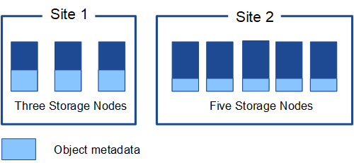
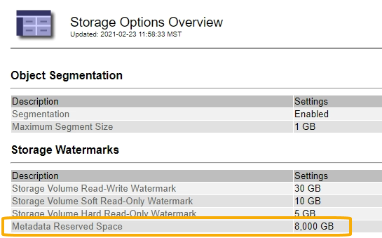
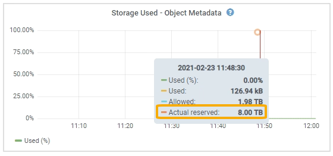
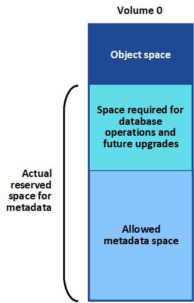
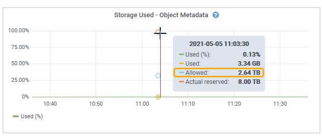
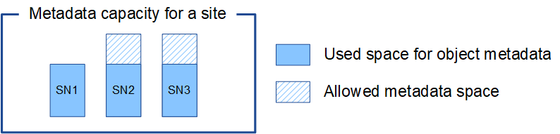

= Managing object metadata storage
:icons: font
:imagesdir: ../media/

[.lead]
The object metadata capacity of a StorageGRID system controls the maximum number of objects that can be stored on that system. To ensure that your StorageGRID system has adequate space to store new objects, you must understand where and how StorageGRID stores object metadata.

== What is object metadata?

Object metadata is any information that describes an object. StorageGRID uses object metadata to track the locations of all objects across the grid and to manage each object's lifecycle over time.

For an object in StorageGRID, object metadata includes the following types of information:

* System metadata, including a unique ID for each object (UUID), the object name, the name of the S3 bucket or Swift container, the tenant account name or ID, the logical size of the object, the date and time the object was first created, and the date and time the object was last modified.
* Any custom user metadata key-value pairs associated with the object.
* For S3 objects, any object tag key-value pairs associated with the object.
* For replicated object copies, the current storage location of each copy.
* For erasure-coded object copies, the current storage location of each fragment.
* For object copies in a Cloud Storage Pool, the location of the object, including the name of the external bucket and the object's unique identifier.
* For segmented objects and multipart objects, segment identifiers and data sizes.

== How is object metadata stored?

StorageGRID maintains object metadata in a Cassandra database, which is stored independently of object data. To provide redundancy and to protect object metadata from loss, StorageGRID stores three copies of the metadata for all objects in the system at each site. The three copies of object metadata are evenly distributed across all Storage Nodes at each site.

This figure represents the Storage Nodes at two sites. Each site has the same amount of object metadata, which is equally distributed across the Storage Nodes at that site.

== Where is object metadata stored?

This figure represents the storage volumes for a single Storage Node.

image::../media/metadata_space_storage_node.png[Metadata Space Storage Node]

As shown in the figure, StorageGRID reserves space for object metadata on storage volume 0 of each Storage Node. It uses the reserved space to store object metadata and to perform essential database operations. Any remaining space on storage volume 0 and all other storage volumes in the Storage Node are used exclusively for object data (replicated copies and erasure-coded fragments).

The amount of space that is reserved for object metadata on a particular Storage Node depends on a number of factors, which are described below.

== Metadata Reserved Space setting

The _Metadata Reserved Space_ is a system-wide setting that represents the amount of space that will be reserved for metadata on volume 0 of every Storage Node. As shown in the table, the default value of this setting for StorageGRID 11.5 is based the following:

* The software version you were using when you initially installed StorageGRID.
* The amount of RAM on each Storage Node.

[cols="1a,1a,1a" options="header"]
|===
| Version used for initial StorageGRID installation| Amount of RAM on Storage Nodes| Default Metadata Reserved Space setting for StorageGRID 11.5

|11.5
|128 GB or more on each Storage Node in the grid
|8 TB (8,000 GB)

|
|Less than 128 GB on any Storage Node in the grid
|3 TB (3,000 GB)

|11.1 to 11.4
|128 GB or more on each Storage Node at any one site
|4 TB (4,000 GB)

|
|Less than 128 GB on any Storage Node at each site
|3 TB (3,000 GB)

|11.0 or earlier
|Any amount
|2 TB (2,000 GB)
|===
To view the Metadata Reserved Space setting for your StorageGRID system:

. Select *Configuration* > *System Settings* > *Storage Options*.
. In the Storage Watermarks table, locate *Metadata Reserved Space*.
+

In the screenshot, the *Metadata Reserved Space* value is 8,000 GB (8 TB). This is the default setting for a new StorageGRID 11.5 installation in which each Storage Node has 128 GB or more of RAM.

== Actual reserved space for metadata

In contrast to the system-wide Metadata Reserved Space setting, the _actual reserved space_ for object metadata is determined for each Storage Node. For any given Storage Node, the actual reserved space for metadata depends on the size of volume 0 for the node and the system-wide *Metadata Reserved Space* setting.

[cols="1a,1a" options="header"]
|===
| Size of volume 0 for the node| Actual reserved space for metadata
a|
Less than 500 GB (non production use)
a|
10% of volume 0
a|
500 GB or more
a|
The smaller of these values:

* Volume 0
* Metadata Reserved Space setting

|===
To view the actual reserved space for metadata on a particular Storage Node:

. From the Grid Manager, select *Nodes* > *_Storage Node_*.
. Select the *Storage* tab.
. Hover your cursor over the Storage Used -- Object Metadata chart and locate the *Actual reserved* value.
+

In the screenshot, the *Actual reserved* value is 8 TB. This screenshot is for a large Storage Node in a new StorageGRID 11.5 installation. Because the system-wide Metadata Reserved Space setting is smaller than volume 0 for this Storage Node, the actual reserved space for this node equals the Metadata Reserved Space setting.

The *Actual reserved* value corresponds to this Prometheus metric:

----
storagegrid_storage_utilization_metadata_reserved_bytes
----

== Example for actual reserved metadata space

Suppose you install a new StorageGRID system using version 11.5. For this example, assume that each Storage Node has more than 128 GB of RAM and that volume 0 of Storage Node 1 (SN1) is 6 TB. Based on these values:

* The system-wide *Metadata Reserved Space* is set to 8 TB. (This is the default value for a new StorageGRID 11.5 installation if each Storage Node has more than 128 GB RAM.)
* The actual reserved space for metadata for SN1 is 6 TB. (The entire volume is reserved because volume 0 is smaller than the *Metadata Reserved Space* setting.)

== Allowed metadata space

Each Storage Node's actual reserved space for metadata is subdivided into the space available for object metadata (the _allowed metadata space_) and the space required for essential database operations (such as compaction and repair) and future hardware and software upgrades. The allowed metadata space governs overall object capacity.

The following table summarizes how StorageGRID determines the allowed metadata space value for a Storage Node.

[cols="1a,1a" options="header"]
|===
| Actual reserved space for metadata| Allowed metadata space
a|
4 TB or less
a|
60% of actual reserved space for metadata, up to a maximum of 1.98 TB
a|
More than 4 TB
a|
(Actual reserved space for metadata − 1 TB) × 60%, up to a maximum of 2.64 TB
|===

NOTE: If your StorageGRID system stores (or is expected to store) more than 2.64 TB of metadata on any Storage Node, the allowed metadata space can be increased in some cases. If your Storage Nodes each have more than 128 GB of RAM and available free space on storage volume 0, contact your NetApp account representative. NetApp will review your requirements and increase the allowed metadata space for each Storage Node, if possible.

To view the allowed metadata space for a Storage Node:

. From the Grid Manager, select *Node* > *_Storage Node_*.
. Select the *Storage* tab.
. Hover your cursor over the Storage Used -- Object Metadata chart and locate the *Allowed* value.
+

In the screenshot, the *Allowed* value is 2.64 TB, which is the maximum value for a Storage Node whose actual reserved space for metadata is more than 4 TB.

The *Allowed* value corresponds to this Prometheus metric:

----
storagegrid_storage_utilization_metadata_allowed_bytes
----

== Example for allowed metadata space

Suppose you install a StorageGRID system using version 11.5. For this example, assume that each Storage Node has more than 128 GB of RAM and that volume 0 of Storage Node 1 (SN1) is 6 TB. Based on these values:

* The system-wide *Metadata Reserved Space* is set to 8 TB. (This is the default value for StorageGRID 11.5 when each Storage Node has more than 128 GB RAM.)
* The actual reserved space for metadata for SN1 is 6 TB. (The entire volume is reserved because volume 0 is smaller than the *Metadata Reserved Space* setting.)
* The allowed space for metadata on SN1 is 2.64 TB. (This is the maximum value for actual reserved space.)

== How Storage Nodes of different sizes affect object capacity

As described above, StorageGRID evenly distributes object metadata across the Storage Nodes at each site. For this reason, if a site contains Storage Nodes of different sizes, the smallest node at the site determines the site's metadata capacity.

Consider the following example:

* You have a single-site grid containing three Storage Nodes of different sizes.
* The *Metadata Reserved Space* setting is 4 TB.
* The Storage Nodes have the following values for the actual reserved metadata space and the allowed metadata space.
+
[cols="1a,1a,1a,1a" options="header"]
|===
| Storage Node| Size of volume 0| Actual reserved metadata space| Allowed metadata space
a|
SN1
a|
2.2 TB
a|
2.2 TB
a|
1.32 TB
a|
SN2
a|
5 TB
a|
4 TB
a|
1.98 TB
a|
SN3
a|
6 TB
a|
4 TB
a|
1.98 TB
|===

Because object metadata is evenly distributed across the Storage Nodes at a site, each node in this example can only hold 1.32 TB of metadata. The additional 0.66 TB of allowed metadata space for SN2 and SN3 cannot be used.

Similarly, because StorageGRID maintains all object metadata for a StorageGRID system at each site, the overall metadata capacity of a StorageGRID system is determined by the object metadata capacity of the smallest site.

And because object metadata capacity controls the maximum object count, when one node runs out of metadata capacity, the grid is effectively full.

.Related information

* To learn how to monitor the object metadata capacity for each Storage Node:
+
xref:../monitor/index.adoc[Monitor & troubleshoot]

* To increase the object metadata capacity for your system, you must add new Storage Nodes:
+
xref:../expand/index.adoc[Expand your grid]
