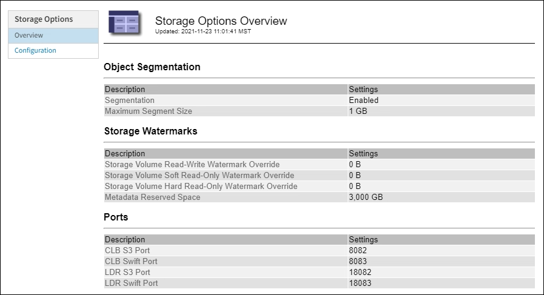

= Manage Storage options
:icons: font
:imagesdir: ../media/

[.lead]
Storage options include the object segmentation settings, the current values for storage volume watermarks, and the Metadata Reserved Space setting. You can also view the S3 and Swift ports used by the deprecated CLB service on Gateway Nodes and by the LDR service on Storage Nodes.

For information about port assignments, see xref:summary-ip-addresses-and-ports-for-client-connections.adoc[Summary: IP addresses and ports for client connections].

