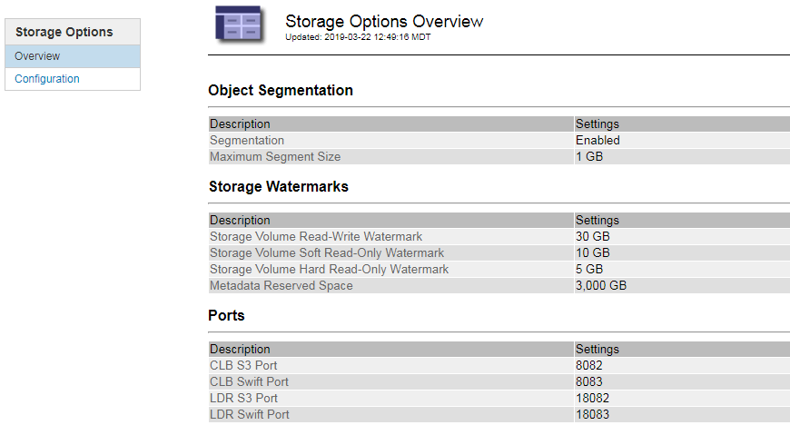

= Managing Storage Options
:icons: font
:imagesdir: ../media/

[.lead]
You can view and configure Storage Options using the Configuration menu in the Grid Manager. Storage Options include the object segmentation settings and the current values for storage watermarks. You can also view the S3 and Swift ports used by the deprecated CLB service on Gateway Nodes and by the LDR service on Storage Nodes.

For information on port assignments, see xref:summary_ip_addresses_and_ports_for_client_connections.adoc[Summary: IP addresses and ports for client connections].

