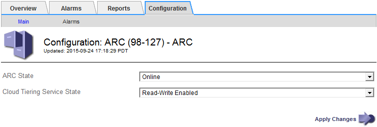

= Modify the Cloud Tiering Service state
:icons: font
:imagesdir: ../media/

[.lead]
You can control the Archive Node's ability read and write to the targeted external archival storage system that connects through the S3 API by changing the state of the Cloud Tiering Service.

.What you'll need

* You must be signed in to the Grid Manager using a xref:../admin/web-browser-requirements.adoc[supported web browser].
* You must have specific access permissions.
* The Archive Node must be configured.

.About this task

You can effectively take the Archive Node offline by changing the Cloud Tiering Service State to *Read-Write Disabled*.

.Steps

. Select *SUPPORT* > *Tools* > *Grid topology*.
. Select *_Archive Node_* > *ARC*.
. Select *Configuration* > *Main*.
+

. Select a *Cloud Tiering Service State*.
. Select *Apply Changes*.
