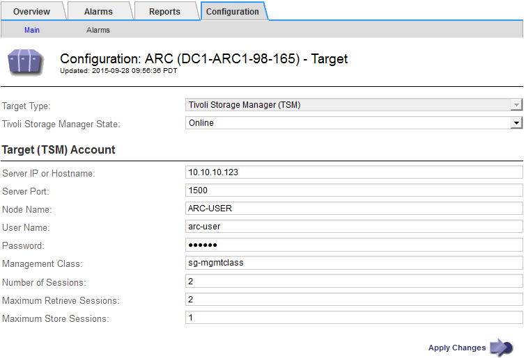

= Optimizing an Archive Node for TSM middleware sessions
:icons: font
:imagesdir: ../media/

[.lead]
You can optimize the performance of an Archive Node that connects to Tivoli Server Manager (TSM) by configuring the Archive Node's sessions.

* You must be signed in to the Grid Manager using a supported browser.
* You must have specific access permissions.

Typically, the number of concurrent sessions that the Archive Node has open to the TSM middleware server is set to the number of tape drives the TSM server has dedicated to the Archive Node. One tape drive is allocated for storage while the rest are allocated for retrieval. However, in situations where a Storage Node is being rebuilt from Archive Node copies or the Archive Node is operating in Read-only mode, you can optimize TSM server performance by setting the maximum number of retrieve sessions to be the same as number of concurrent sessions. The result is that all drives can be used concurrently for retrieval, and, at most, one of these drives can also be used for storage if applicable.

. Select *Support* > *Tools* > *Grid Topology*.
. Select *Archive Node* > *ARC* > *Target*.
. Select *Configuration* > *Main*.
. Change Maximum Retrieve Sessions to be the same as Number of Sessions.
+

. Click *Apply Changes*.
