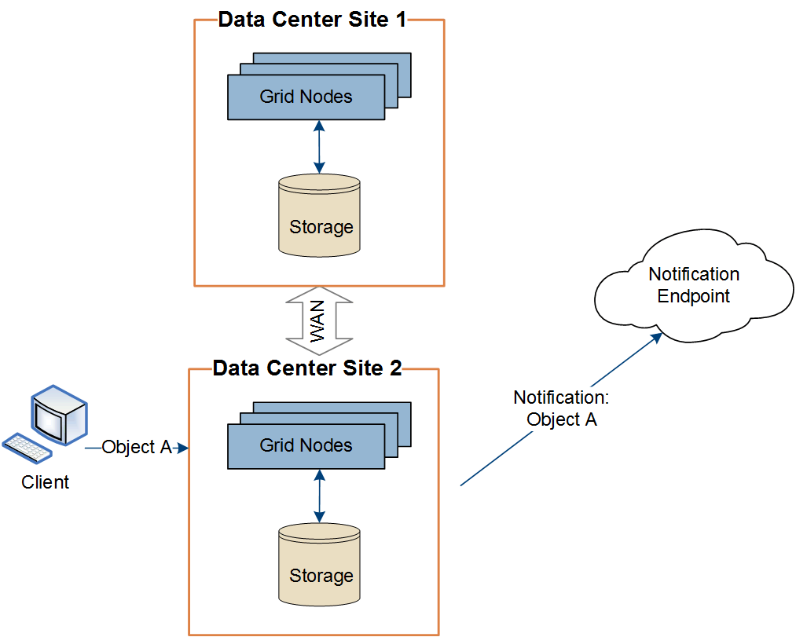

= Per-site delivery of platform services messages
:icons: font
:imagesdir: ../media/

[.lead]
All platform services operations are performed on a per-site basis.

That is, if a tenant uses a client to perform an S3 API Create operation on an object by connecting to a Gateway Node at Data Center Site 1, the notification about that action is triggered and sent from Data Center Site 1.

image::../media/notification_multiple_sites.gif[Diagram showing that action on object at site 1 triggers notification from site 1]

If the client subsequently performs an S3 API Delete operation on that same object from Data Center Site 2, the notification about the delete action is triggered and sent from Data Center Site 2.

Make sure that the networking at each site is configured such that platform services messages can be delivered to their destinations.
