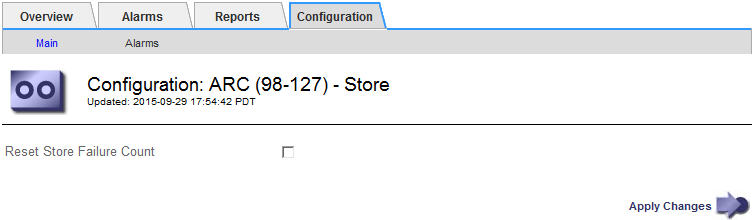

= Reset the Store Failure Count for S3 API connection
:icons: font
:imagesdir: ../media/

[.lead]
If your Archive Node connects to an archival storage system through the S3 API, you can reset the Store Failure Count, which can be used to clear the ARVF (Store Failures) alarm.

.What you'll need

* You are signed in to the Grid Manager using a xref:../admin/web-browser-requirements.adoc[supported web browser].
* You have specific access permissions.

.Steps

. Select *SUPPORT* > *Tools* > *Grid topology*.
. Select *_Archive Node_* > *ARC* > *Store*.
. Select *Configuration* > *Main*.
+

. Select *Reset Store Failure Count*.
. Select *Apply Changes*.
+
The Store Failures attribute resets to zero.
