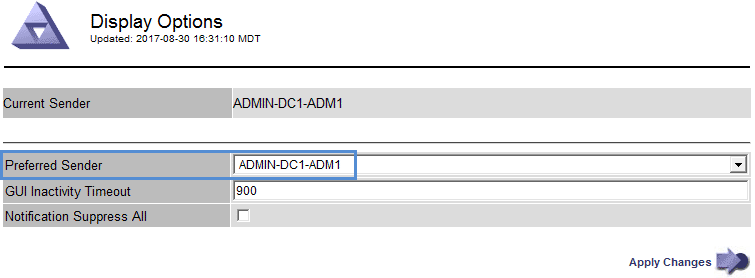

= Select a preferred sender
:icons: font
:imagesdir: ../media/

[.lead]
If your StorageGRID deployment includes multiple Admin Nodes, you can select which Admin Node should be the preferred sender of notifications. By default, the primary Admin Node is selected, but any Admin Node can be the preferred sender.

.What you'll need

* You are signed in to the Grid Manager using a xref:../admin/web-browser-requirements.adoc[supported web browser].
* You have specific access permissions.

.About this task

The *CONFIGURATION* > *System* > *Display options* page shows which Admin Node is currently selected to be the preferred sender. The primary Admin Node is selected by default.

Under normal system operations, only the preferred sender sends the following notifications:

* AutoSupport messages
* SNMP notifications
* Alert emails
* Alarm emails (legacy system)

However, all other Admin Nodes (standby senders) monitor the preferred sender. If a problem is detected, a standby sender can also send these notifications.

Both the preferred sender and a standby sender might send notifications in these cases:

* If Admin Nodes become "`islanded`" from each other, both the preferred sender and the standby senders will attempt to send notifications, and multiple copies of notifications might be received.
* After a standby sender detects problems with the preferred sender and starts sending notifications, the preferred sender might regain its ability to send notifications. If this occurs, duplicate notifications might be sent. The standby sender will stop sending notifications when it no longer detects errors on the preferred sender.

NOTE: When you test alarm notifications and AutoSupport messages, all Admin Nodes send the test email. When you test alert notifications, you must sign in to every Admin Node to verify connectivity.

.Steps

. Select *CONFIGURATION* > *System* > *Display options*.
. From the Display Options menu, select *Options*.
. Select the Admin Node you want to set as the preferred sender from the drop-down list.
+

. Select *Apply Changes*.
+
The Admin Node is set as the preferred sender of notifications.
