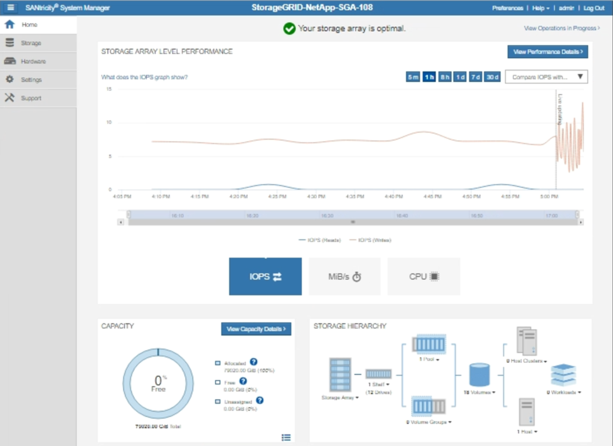
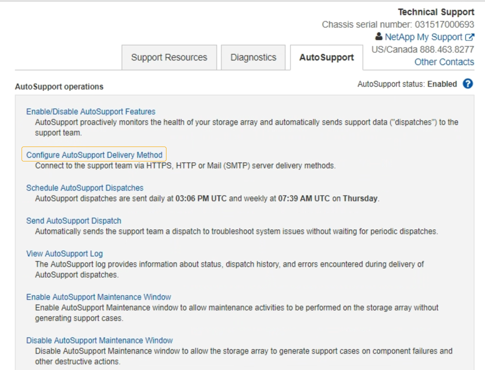
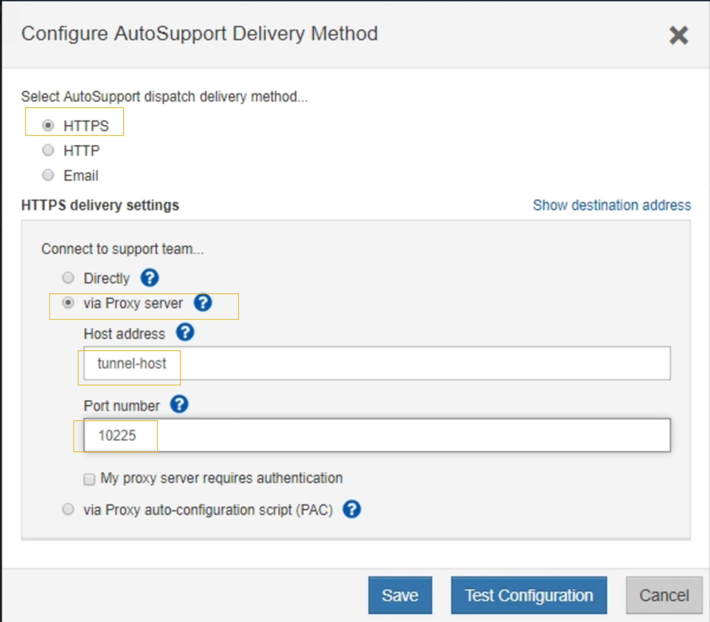

= Send E-Series AutoSupport messages through StorageGRID
:icons: font
:imagesdir: ../media/

[.lead]
You can send E-Series SANtricity System Manager AutoSupport messages to technical support through a StorageGRID Admin Node rather than the storage appliance management port.

.What you'll need
* You are signed into the Grid Manager using a xref:../admin/web-browser-requirements.adoc[supported web browser].
* You have the Storage Appliance Administrator permission or Root access permission.

NOTE: You must have SANtricity firmware 8.70 or higher to access SANtricity System Manager using the Grid Manager.

.About this task

E-Series AutoSupport messages contain details of the storage hardware and are more specific than other AutoSupport messages sent by the StorageGRID system.

Configure a special proxy server address in SANtricity System Manager to cause the AutoSupport messages to be transmitted through a StorageGRID Admin Node without the use of the appliance's management port. AutoSupport messages transmitted in this way respect the Preferred Sender and Admin proxy settings which may have been configured in the Grid Manager.

If you want to configure the Admin proxy server in Grid Manager, see xref:configuring-admin-proxy-settings.adoc[Configure Admin proxy settings].

NOTE: This procedure is only for configuring a StorageGRID proxy server for E-Series AutoSupport messages. For additional details on E-Series AutoSupport configuration, see the https://mysupport.netapp.com/info/web/ECMP1658252.html[NetApp E-Series and SANtricity Documentation^].

.Steps
. In the Grid Manager, select *NODES*.
. From the list of nodes on the left, select the storage appliance node you want to configure.
. Select *SANtricity System Manager*.
+
The SANtricity System Manager home page appears.
+

. Select *SUPPORT* > *Support center* > *AutoSupport*.
+
The AutoSupport operations page appears.
+

. Select *Configure AutoSupport Delivery Method*.
+
The Configure AutoSupport Delivery Method page appears.
+

. Select *HTTPS* for the delivery method.
+
NOTE: The certificate that enables the HTTPS protocol is pre-installed.

. Select *via Proxy server*.
. Enter `tunnel-host` for the *Host address*.
+
`tunnel-host` is the special address to use an Admin Node to send E-Series AutoSupport messages.

. Enter `10225` for the *Port number*.
+
`10225` is the port number on the StorageGRID proxy server that receives AutoSupport messages from the E-Series controller in the appliance.

. Select *Test Configuration* to test the routing and configuration of your AutoSupport proxy server.
+
If correct, a message in a green banner appears: "`Your AutoSupport configuration has been verified.`"
+
If the test fails, an error message appears in a red banner. Check your StorageGRID DNS settings and networking, ensure the preferred sender Admin Node can connect to the NetApp support site, and try the test again.

. Select *Save*.
+
The configuration is saved, and a confirmation message appears: "`AutoSupport delivery method has been configured.`"
