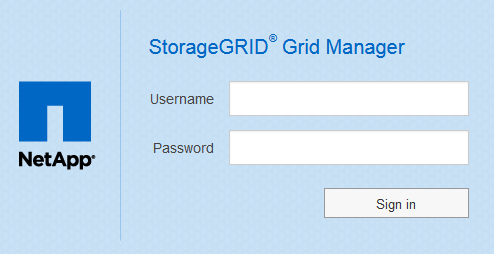

= Sign in to the Grid Manager
:icons: font
:imagesdir: ../media/

[.lead]
You access the Grid Manager sign-in page by entering the fully qualified domain name (FQDN) or IP address of an Admin Node into the address bar of a supported web browser.

.What you'll need
* You have your login credentials.
* You have the URL for the Grid Manager.
* You are using a xref:../admin/web-browser-requirements.adoc[supported web browser].
* Cookies are enabled in your web browser.
* You have specific access permissions.

.About this task
Each StorageGRID system includes one primary Admin Node and any number of non-primary Admin Nodes. You can sign in to the Grid Manager on any Admin Node to manage the StorageGRID system. However, the Admin Nodes are not exactly the same:

* Alarm acknowledgments (legacy system) made on one Admin Node are not copied to other Admin Nodes. For this reason, the information displayed for alarms might not look the same on each Admin Node.
* Some maintenance procedures can only be performed from the primary Admin Node.

If Admin Nodes are included in a high availability (HA) group, you connect using the virtual IP address of the HA group or a fully qualified domain name that maps to the virtual IP address. The primary Admin Node should be selected as the group's primary interface, so that when you access the Grid Manager, you access it on the primary Admin Node unless the primary Admin Node is not available.

.Steps
. Launch a supported web browser.
. In the browser's address bar, enter the URL for the Grid Manager:
+
`https://_FQDN_or_Admin_Node_IP_/`
+
where `_FQDN_or_Admin_Node_IP_` is a fully qualified domain name or the IP address of an Admin Node or the virtual IP address of an HA group of Admin Nodes.
+
If you must access the Grid Manager on a port other than the standard port for HTTPS (443), enter the following, where `_FQDN_or_Admin_Node_IP_` is a fully qualified domain name or IP address, and port is the port number:
+
`https://_FQDN_or_Admin_Node_IP:port_/`

. If you are prompted with a security alert, install the certificate using the browser's installation wizard (see xref:using-storagegrid-security-certificates.adoc[About security certificates]).
. Sign in to the Grid Manager:
 ** If single sign-on (SSO) is not being used for your StorageGRID system:
  ... Enter your username and password for the Grid Manager.
  ... Select *Sign In*.
+

 ** If SSO is enabled for your StorageGRID system and this is the first time you have accessed the URL on this browser:
  ... Select *Sign in*. You can leave the Account ID field blank.
+
image::../media/sso_sign_in_first_time.gif[Sign in screen if SSO enabled and no cookies]

  ... Enter your standard SSO credentials on your organization's SSO sign-in page. For example:
+
image::../media/sso_organization_page.gif[example organization sign in page for SSO]
 ** If SSO is enabled for your StorageGRID system and you have previously accessed the Grid Manager or a tenant account:
  ... Do either of the following:
   **** Enter *0* (the account ID for the Grid Manager), and select *Sign in*.
   **** Select *Grid Manager* if it appears in the list of recent accounts, and select *Sign in*.
+
image::../media/sign_in_grid_manager_sso.gif[Select Grid Manager from recent account list if SSO is enabled]
  ... Sign in with your standard SSO credentials on your organization's SSO sign-in page.
When you are signed in, the home page of the Grid Manager appears, which includes the Dashboard. To learn what information is provided, see xref:../monitor/viewing-dashboard.adoc[View the Dashboard].

+
image::../media/grid_manager_dashboard.png[Dashboard]
. If you want to sign in to another Admin Node:
+
[cols="1a,2a" options="header"]
|===
| Option| Steps
a|
SSO not enabled
a|

 .. In the browser's address bar, enter the fully qualified domain name or IP address of the other Admin Node. Include the port number as required.
 .. Enter your username and password for the Grid Manager.
 .. Select *Sign In*.

a|
SSO enabled
a|
In the browser's address bar, enter the fully qualified domain name or IP address of the other Admin Node.

If you have signed in to one Admin Node, you can access other Admin Nodes without having to sign in again. However, if your SSO session expires, you are prompted for your credentials again.

*Note:* SSO is not available on the restricted Grid Manager port. You must use the default HTTPS port (443) if you want users to authenticate with single sign-on.

|===

.Related information

* xref:controlling-access-through-firewalls.adoc[Control access through firewalls]

* xref:configuring-sso.adoc[Configure single sign-on]

* xref:managing-admin-groups.adoc[Manage admin groups]

* xref:managing-high-availability-groups.adoc[Manage high availability groups]

* xref:../tenant/index.adoc[Use a tenant account]

* xref:../monitor/index.adoc[Monitor and troubleshoot]
