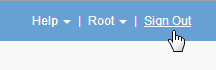

= Signing out of the Grid Manager
:icons: font
:imagesdir: ../media/

[.lead]
When you are done working with the Grid Manager, you must sign out to ensure that unauthorized users cannot access the StorageGRID system. Closing your browser might not sign you out of the system, based on browser cookie settings.

.Steps
. Locate the *Sign Out* link in the top-right corner of the user interface.
+

. Click *Sign Out*.
+

[cols="1a,1a" options="header"]
|===
| Option| Description
a|
SSO not in use
a|
You are signed out of the Admin Node.

The Grid Manager sign in page is displayed.

*Note:* If you signed into more than one Admin Node, you must sign out of each node.
a|
SSO enabled
a|
You are signed out of all Admin Nodes you were accessing.     The StorageGRID sign in page is displayed. *Grid Manager* is listed as the default in the *Recent Accounts* drop-down, and the *Account ID* field shows 0.

*Note:* If SSO is enabled and you are also signed in to the Tenant Manager, you must also sign out of the tenant account to sign out of SSO.
|===

.Related information

xref:configuring-sso.adoc[Configuring single sign-on]

xref:../tenant/index.adoc[Use a tenant account]
