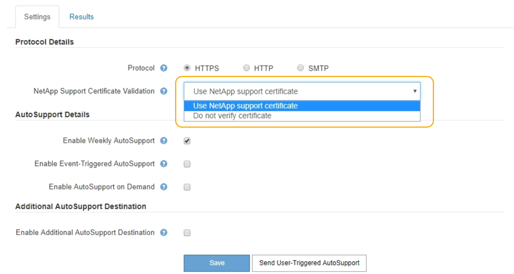

= Specifying the protocol for AutoSupport messages
:icons: font
:imagesdir: ../media/

[.lead]
You can use one of three protocols for sending AutoSupport messages.

.What you'll need

* You must be signed in to the Grid Manager using a supported browser.
* You must have the Root Access or Other Grid Configuration permission.
* If you will use the HTTPS or HTTP protocol for sending AutoSupport messages, you must have provided outbound internet access to the primary Admin Node, either directly or using a proxy server (inbound connections not required).
* If you will use the HTTPS or HTTP protocol and you want to use a proxy server, you must have configured an Admin proxy server.
* If you will use SMTP as the protocol for AutoSupport messages, you must have configured an SMTP mail server. The same mail server configuration is used for alarm email notifications (legacy system).

.About this task

AutoSupport messages can be sent using any of the following protocols:

* *HTTPS*: This is the default and recommended setting for new installations. The HTTPS protocol uses port 443. If you want to enable the AutoSupport on Demand feature, you must use the HTTPS protocol.
* *HTTP*: This protocol is not secure, unless it is used in a trusted environment where the proxy server converts to HTTPS when sending data over the internet. The HTTP protocol uses port 80.
* *SMTP*: Use this option if you want AutoSupport messages to be emailed. If you use SMTP as the protocol for AutoSupport messages, you must configure an SMTP mail server on the Legacy Email Setup page (*Support* > *Alarms (legacy)* > *Legacy Email Setup*).
+
NOTE: SMTP was the only protocol available for AutoSupport messages before the StorageGRID 11.2 release. If you installed an earlier version of StorageGRID initially, SMTP might be the selected protocol.

The protocol you set is used for sending all types of AutoSupport messages.

.Steps

. Select *Support* > *Tools* > *AutoSupport*.
+
The AutoSupport page appears, and the *Settings* tab is selected.

. Select the protocol you want to use to send AutoSupport messages.
+

. Select your choice for *Netapp Support Certificate Validation*.
 ** Use NetApp support certificate (default): Certificate validation ensures that the transmission of AutoSupport messages is secure. The NetApp support certificate is already installed with the StorageGRID software.
 ** Do not verify certificate: Select this choice only when you have a good reason not to use certificate validation, such as when there is a temporary problem with a certificate.
. Select *Save*.
+
All weekly, user-triggered, and event-triggered messages are sent using the selected protocol.

.Related information

xref:configuring_admin_proxy_settings.adoc[Configuring Admin proxy settings]
