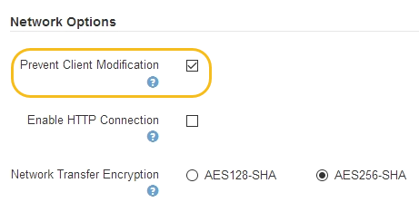

= Controlling which client operations are permitted
:icons: font
:imagesdir: ../media/

[.lead]
You can select the Prevent Client Modification grid option to deny specific HTTP client operations.

* You must be signed in to the Grid Manager using a supported browser.
* You must have specific access permissions.

Prevent Client Modification is a system wide setting. When the Prevent Client Modification option is selected, the following requests are denied:

* *S3 REST API*
 ** Delete Bucket requests
 ** Any requests to modify an existing object's data, user-defined metadata, or S3 object tagging
+
NOTE: This setting does not apply to buckets with versioning enabled. Versioning already prevents modifications to object data, user-defined metadata, and object tagging.
* *Swift REST API*
 ** Delete Container requests
 ** Requests to modify any existing object. For example, the following operations are denied: Put Overwrite, Delete, Metadata Update, and so on.

. Select *Configuration* > *System Settings* > *Grid Options*.
. In the Network Options section, select the *Prevent Client Modification* check box.
+

. Click *Save*.
