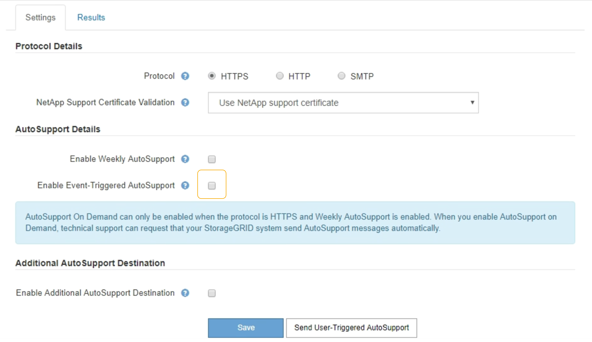

= Disabling event-triggered AutoSupport messages
:icons: font
:imagesdir: ../media/

[.lead]
By default, the StorageGRID system is configured to send an AutoSupport message to NetApp Support when an important alert or other significant system event occurs.

* You must be signed in to the Grid Manager using a supported browser.
* You must have the Root Access or Other Grid Configuration permission.

You can disable event-triggered AutoSupport messages at any time.

NOTE: Event-triggered AutoSupport messages are also suppressed when you suppress email notifications system wide. (Select *Configuration* > *System Settings* > *Display Options*. Then, select *Notification Suppress All*.)

. Select *Support* > *Tools* > *AutoSupport*.
+
The AutoSupport page appears with the *Settings* tab selected.

. Clear the *Enable Event-Triggered AutoSupport* check box.
+

. Select *Save*.
