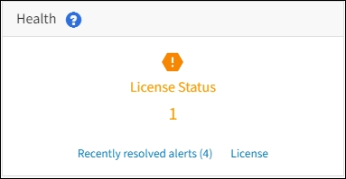

= Viewing StorageGRID license information
:icons: font
:imagesdir: ../media/

[.lead]
You can view the license information for your StorageGRID system, such as the maximum storage capacity of your grid, whenever necessary.

* You must be signed in to the Grid Manager using a supported browser.

If there is an issue with the software license for this StorageGRID system, the Health panel on the Dashboard includes a License Status icon and a *License* link. The number indicates how many license-related issues there are.

. To view the license, do one of the following:
 ** From the Health panel on the Dashboard, click the License status icon or the *License* link. This link appears only if there is an issue with the license.
 ** Select *Maintenance* > *System* > *License*.
The License Page appears and provides the following, read-only information about the current license:
 ** StorageGRID system ID, which is the unique identification number for this StorageGRID installation
 ** License serial number
 ** Licensed storage capacity of the grid
 ** Software license end date
 ** Support service contract end date
 ** Contents of the license text file
*Note:* For licenses issued before StorageGRID 10.3, the licensed storage capacity is not included in the license file, and a "`See License Agreement`" message is displayed instead of a value.
