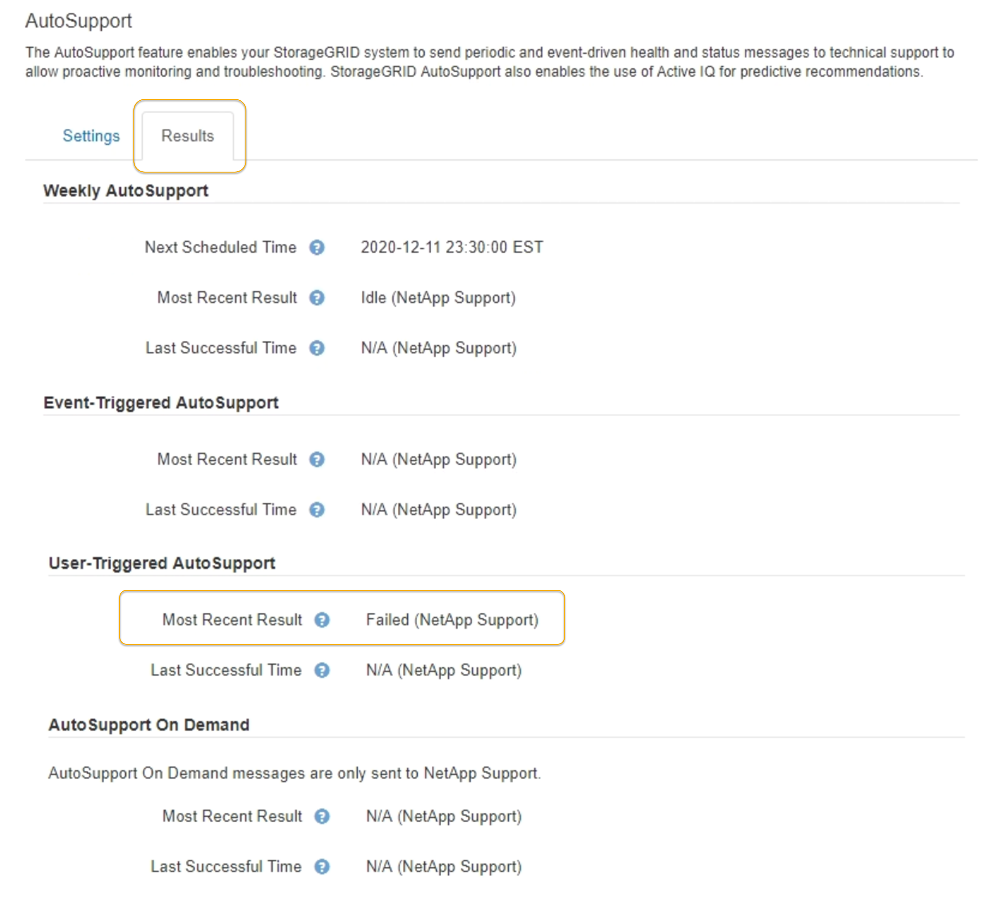

= Troubleshooting AutoSupport messages
:icons: font
:imagesdir: ../media/

[.lead]
If an attempt to send an AutoSupport message fails, the StorageGRID system takes different actions depending on the type of AutoSupport message. You can check the status of AutoSupport messages by selecting *Support* > *Tools* > *AutoSupport* > *Results*.

NOTE: Event-triggered AutoSupport messages are suppressed when you suppress email notifications system wide. (Select *Configuration* > *System Settings* > *Display Options*. Then, select *Notification Suppress All*.)

When the AutoSupport message fails to send, "`Failed`" appears on the *Results* tab of the *AutoSupport* page.

== Weekly AutoSupport message failure

If a weekly AutoSupport message fails to send, the StorageGRID system takes the following actions:

. Updates the Most Recent Result attribute to Retrying.
. Attempts to resend the AutoSupport message 15 times every four minutes for one hour.
. After one hour of send failures, updates the Most Recent Result attribute to Failed.
. Attempts to send an AutoSupport message again at the next scheduled time.
. Maintains the regular AutoSupport schedule if the message fails because the NMS service is unavailable, and if a message is sent before seven days pass.
. When the NMS service is available again, sends an AutoSupport message immediately if a message has not been sent for seven days or more.

== User-triggered or event-triggered AutoSupport message failure

If a user-triggered or an event-triggered AutoSupport message fails to send, the StorageGRID system takes the following actions:

. Displays an error message if the error is known. For example, if a user selects the SMTP protocol without providing correct email configuration settings, the following error is displayed: `AutoSupport messages cannot be sent using SMTP protocol due to incorrect settings on the E-mail Server page.`
. Does not attempt to send the message again.
. Logs the error in `nms.log`.

If a failure occurs and SMTP is the selected protocol, verify that the StorageGRID system's email server is correctly configured and that your email server is running (*Support* > *Alarms (legacy)* > *> Legacy Email Setup*). The following error message might appear on the AutoSupport page: `AutoSupport messages cannot be sent using SMTP protocol due to incorrect settings on the E-mail Server page.`

Learn how to configure email server settings in the xref:../monitor/index.adoc[monitor & troubleshoot instructions].

== Correcting an AutoSupport message failure

If a failure occurs and SMTP is the selected protocol, verify that the StorageGRID system's email server is correctly configured and that your email server is running. The following error message might appear on the AutoSupport page: `AutoSupport messages cannot be sent using SMTP protocol due to incorrect settings on the E-mail Server page.`

.Related information

xref:../monitor/index.adoc[Monitor & troubleshoot]
