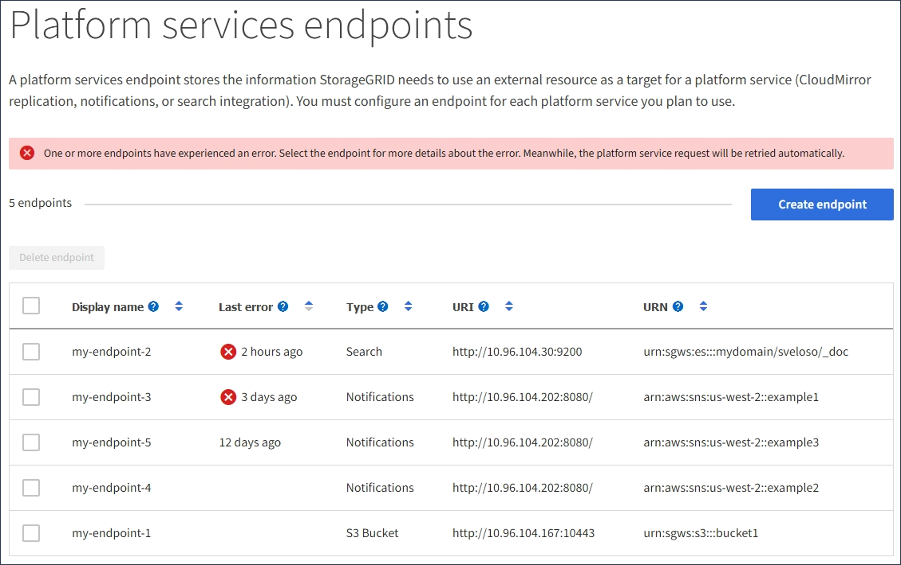

= Troubleshooting platform services
:icons: font
:imagesdir: ../media/

[.lead]
The endpoints used in platform services are created and maintained by tenant users in the Tenant Manager; however, if a tenant has issues configuring or using platform services, you might be able to use the Grid Manager to help resolve the issue.

== Issues with new endpoints

Before a tenant can use platform services, they must create one or more endpoints using the Tenant Manager. Each endpoint represents an external destination for one platform service, such as a StorageGRID S3 bucket, an Amazon Web Services bucket, a Simple Notification Service topic, or an Elasticsearch cluster hosted locally or on AWS. Each endpoint includes both the location of the external resource and the credentials needed to access that resource.

When a tenant creates an endpoint, the StorageGRID system validates that the endpoint exists and that it can be reached using the credentials that were specified. The connection to the endpoint is validated from one node at each site.

If endpoint validation fails, an error message explains why endpoint validation failed. The tenant user should resolve the issue, then try creating the endpoint again.

NOTE: Endpoint creation will fail if platform services are not enabled for the tenant account.

== Issues with existing endpoints

If an error occurs when StorageGRID tries to reach an existing endpoint, a message is displayed on the Dashboard in the Tenant Manager.

image::../media/tenant_dashboard_endpoint_error.png[endpoint error message on the Dashboard]

Tenant users can go to the Endpoints page to review the most recent error message for each endpoint and to determine how long ago the error occurred. The *Last error* column displays the most recent error message for each endpoint and indicates how long ago the error occurred. Errors that include the image:../media/icon_alert_red_critical.png[Red X Icon] icon occurred within the past 7 days.

NOTE: Some error messages in the *Last error* column might include a logID in parentheses. A grid administrator or technical support can use this ID to locate more detailed information about the error in the bycast.log.

== Issues related to proxy servers

If you have configured a Storage proxy between Storage Nodes and platform service endpoints, errors might occur if your proxy service does not allow messages from StorageGRID. To resolve these issues, check the settings of your proxy server to ensure that platform service-related messages are not blocked.

== Determining if an error has occurred

If any endpoint errors have occurred within the past 7 days, the Dashboard in the Tenant Manager displays an alert message. You can go the Endpoints page to see more details about the error.

== Client operations fail

Some platform services issues might cause client operations on the S3 bucket to fail. For example, S3 client operations will fail if the internal Replicated State Machine (RSM) service stops, or if there are too many platform services messages queued for delivery.

To check the status of services:

. Select *Support* > *Tools* > *Grid Topology*.
. Select *_site_* > *_Storage Node_* > *SSM* > *Services*.

== Recoverable and unrecoverable endpoint errors

After endpoints have been created, platform service request errors can occur for various reasons. Some errors are recoverable with user intervention. For example, recoverable errors might occur for the following reasons:

* The user's credentials have been deleted or have expired.
* The destination bucket does not exist.
* The notification cannot be delivered.

If StorageGRID encounters a recoverable error, the platform service request will be retried until it succeeds.

Other errors are unrecoverable. For example, an unrecoverable error occurs if the endpoint is deleted.

If StorageGRID encounters an unrecoverable endpoint error, the Total Events (SMTT) alarm is triggered in the Grid Manager. To view the Total Events alarm:

. Select *Nodes*.
. Select *_site_* > *_grid node_* > *Events*.
. View Last Event at the top of the table.
+
Event messages are also listed in `/var/local/log/bycast-err.log`.

. Follow the guidance provided in the SMTT alarm contents to correct the issue.
. Click *Reset event counts*.
. Notify the tenant of the objects whose platform services messages have not been delivered.
. Instruct the tenant to re-trigger the failed replication or notification by updating the object's metadata or tags.
+
The tenant can resubmit the existing values to avoid making unwanted changes.

== Platform services messages cannot be delivered

If the destination encounters an issue that prevents it from accepting platform services messages, the client operation on the bucket succeeds, but the platform services message is not delivered. For example, this error might happen if credentials are updated on the destination such that StorageGRID can no longer authenticate to the destination service.

If platform services messages cannot be delivered because of an unrecoverable error, the Total Events (SMTT) alarm is triggered in the Grid Manager.

== Slower performance for platform service requests

StorageGRID software might throttle incoming S3 requests for a bucket if the rate at which the requests are being sent exceeds the rate at which the destination endpoint can receive the requests. Throttling only occurs when there is a backlog of requests waiting to be sent to the destination endpoint.

The only visible effect is that the incoming S3 requests will take longer to execute. If you start to detect significantly slower performance, you should reduce the ingest rate or use an endpoint with higher capacity. If the backlog of requests continues to grow, client S3 operations (such as PUT requests) will eventually fail.

CloudMirror requests are more likely to be affected by the performance of the destination endpoint because these requests typically involve more data transfer than search integration or event notification requests.

== Platform service requests fail

To view the request failure rate for platform services:

. Select *Nodes*.
. Select *_site_* > *Platform Services*.
. View the Request Failure Rate chart.
+
image::../media/nodes_page_site_level_platform_services.gif[Nodes Page Site-Level Platform Services]

== Platform services unavailable alert

The *Platform services unavailable* alert indicates that no platform service operations can be performed at a site because too few Storage Nodes with the RSM service are running or available.

The RSM service ensures platform service requests are sent to their respective endpoints.

To resolve this alert, determine which Storage Nodes at the site include the RSM service. (The RSM service is present on Storage Nodes that also include the ADC service.) Then, ensure that a simple majority of those Storage Nodes are running and available.

NOTE: If more than one Storage Node that contains the RSM service fails at a site, you lose any pending platform service requests for that site.

== Additional troubleshooting guidance for platform services endpoints

For additional information about troubleshooting platform services endpoints, see the instructions for using tenant accounts.

xref:../tenant/index.adoc[Use a tenant account]

.Related information

xref:../monitor/index.adoc[Monitor & troubleshoot]

xref:configuring-storage-proxy-settings.adoc[Configuring Storage proxy settings]
