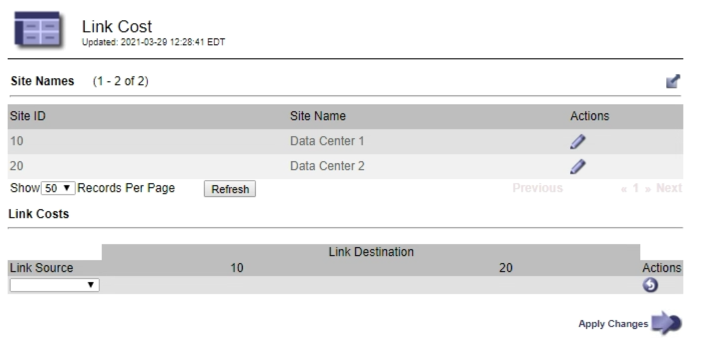

= Update link costs
:icons: font
:imagesdir: ../media/

[.lead]
You can update the link costs between data center sites to reflect latency between sites.

.What you'll need

* You are signed in to the Grid Manager using a xref:../admin/web-browser-requirements.adoc[supported web browser].
* You have the Grid Topology Page Configuration permission.

.Steps

. Select *CONFIGURATION* > *Network* > *Link cost*.
+

. Select a site under *Link Source* and enter a cost value between 0 and 100 under *Link Destination*.
+
You cannot change the link cost if the source is the same as the destination.
+
To cancel changes, select *Revert*.

. Select *Apply Changes*.
