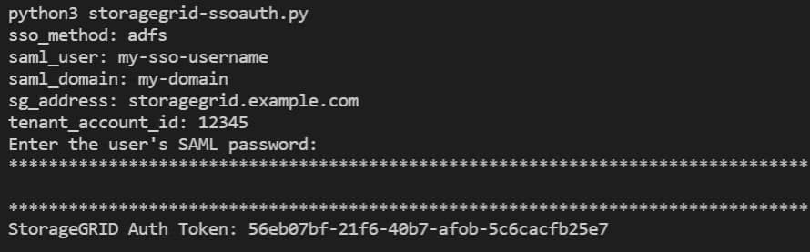

= Use the API if single sign-on is enabled (Active Directory)
:icons: font
:imagesdir: ../media/

[.lead]
If you have xref:../admin/configuring-sso.adoc[configured and enabled single sign-on (SSO)] and you use Active Directory as the SSO provider, you must issue a series of API requests to obtain an authentication token that is valid for the Grid Management API or the Tenant Management API.

== Sign in to the API if single sign-on is enabled

These instructions apply if you are using Active Directory as the SSO identity provider.

.What you'll need

* You know the SSO username and password for a federated user who belongs to a StorageGRID user group.
* If you want to access the Tenant Management API, you know the tenant account ID.

.About this task

To obtain an authentication token, you can use one of the following examples:

* The `storagegrid-ssoauth.py` Python script, which is located in the StorageGRID installation files directory (`./rpms` for Red Hat Enterprise Linux or CentOS, `./debs` for Ubuntu or Debian, and `./vsphere` for VMware).
* An example workflow of curl requests.
+
The curl workflow might time out if you perform it too slowly. You might see the error: `A valid SubjectConfirmation was not found on this Response`.
+
NOTE: The example curl workflow does not protect the password from being seen by other users.

If you have a URL-encoding issue, you might see the error: `Unsupported SAML version`.

.Steps
. Select one of the following methods to obtain an authentication token:
 ** Use the `storagegrid-ssoauth.py` Python script. Go to step 2.
 ** Use curl requests. Go to step 3.
. If you want to use the `storagegrid-ssoauth.py` script, pass the script to the Python interpreter and run the script.
+
When prompted, enter values for the following arguments:

 ** The SSO method. Enter ADFS or adfs.
 ** The SSO username
 ** The domain where StorageGRID is installed
 ** The address for StorageGRID
 ** The tenant account ID, if you want to access the Tenant Management API.
+

+
The StorageGRID authorization token is provided in the output. You can now use the token for other requests, similar to how you would use the API if SSO was not being used.

. If you want to use curl requests, use the following procedure.
 .. Declare the variables needed to sign in.
+
[source,bash]
----
export SAMLUSER='my-sso-username'
export SAMLPASSWORD='my-password'
export SAMLDOMAIN='my-domain'
export TENANTACCOUNTID='12345'
export STORAGEGRID_ADDRESS='storagegrid.example.com'
export AD_FS_ADDRESS='adfs.example.com'
----
+
NOTE: To access the Grid Management API, use 0 as `TENANTACCOUNTID`.

 .. To receive a signed authentication URL, issue a POST request to `/api/v3/authorize-saml`, and remove the additional JSON encoding from the response.
+
This example shows a POST request for a signed authentication URL for `TENANTACCOUNTID`. The results will be passed to `python -m json.tool` to remove the JSON encoding.
+
[source,bash]
curl -X POST "https://$STORAGEGRID_ADDRESS/api/v3/authorize-saml" \
  -H "accept: application/json" -H  "Content-Type: application/json" \
  --data "{\"accountId\": \"$TENANTACCOUNTID\"}" | python -m json.tool
+
The response for this example includes a signed URL that is URL-encoded, but it does not include the additional JSON-encoding layer.
+
----
{
    "apiVersion": "3.0",
    "data": "https://adfs.example.com/adfs/ls/?SAMLRequest=fZHLbsIwEEV%2FJTuv7...sSl%2BfQ33cvfwA%3D&RelayState=12345",
    "responseTime": "2018-11-06T16:30:23.355Z",
    "status": "success"
}
----

 .. Save the `SAMLRequest` from the response for use in subsequent commands.
+
[source,bash]
----
export SAMLREQUEST='fZHLbsIwEEV%2FJTuv7...sSl%2BfQ33cvfwA%3D'
----

 .. Get a full URL that includes the client request ID from AD FS.
+
One option is to request the login form using the URL from the previous response.
+
[source,bash]
----
curl "https://$AD_FS_ADDRESS/adfs/ls/?SAMLRequest=$SAMLREQUEST&RelayState=$TENANTACCOUNTID" | grep 'form method="post" id="loginForm"'
----
+
The response includes the client request ID:
+
----
<form method="post" id="loginForm" autocomplete="off" novalidate="novalidate" onKeyPress="if (event && event.keyCode == 13) Login.submitLoginRequest();" action="/adfs/ls/?
SAMLRequest=fZHRToMwFIZfhb...UJikvo77sXPw%3D%3D&RelayState=12345&client-request-id=00000000-0000-0000-ee02-0080000000de" >
----

 .. Save the client request ID from the response.
+
[source,bash]
----
export SAMLREQUESTID='00000000-0000-0000-ee02-0080000000de'
----

 .. Send your credentials to the form action from the previous response.
+
[source,bash]
----
curl -X POST "https://$AD_FS_ADDRESS/adfs/ls/?SAMLRequest=$SAMLREQUEST&RelayState=$TENANTACCOUNTID&client-request-id=$SAMLREQUESTID" \
--data "UserName=$SAMLUSER@$SAMLDOMAIN&Password=$SAMLPASSWORD&AuthMethod=FormsAuthentication" --include
----
+
AD FS returns a 302 redirect, with additional information in the headers.
+
NOTE: If multi-factor authentication (MFA) is enabled for your SSO system, the form post will also contain the second password or other credentials.
+
----
HTTP/1.1 302 Found
Content-Length: 0
Content-Type: text/html; charset=utf-8
Location: https://adfs.example.com/adfs/ls/?SAMLRequest=fZHRToMwFIZfhb...UJikvo77sXPw%3D%3D&RelayState=12345&client-request-id=00000000-0000-0000-ee02-0080000000de
Set-Cookie: MSISAuth=AAEAADAvsHpXk6ApV...pmP0aEiNtJvWY=; path=/adfs; HttpOnly; Secure
Date: Tue, 06 Nov 2018 16:55:05 GMT
----

.. Save the `MSISAuth` cookie from the response.
+
[source,bash]
----
export MSISAuth='AAEAADAvsHpXk6ApV...pmP0aEiNtJvWY='
----

.. Send a GET request to the specified location with the cookies from the authentication POST.
+
[source,bash]
----
curl "https://$AD_FS_ADDRESS/adfs/ls/?SAMLRequest=$SAMLREQUEST&RelayState=$TENANTACCOUNTID&client-request-id=$SAMLREQUESTID" \ 
--cookie "MSISAuth=$MSISAuth" --include
----
+
The response headers will contain AD FS session information for later logout usage, and the response body contains the SAMLResponse in a hidden form field.
+
----
HTTP/1.1 200 OK
Cache-Control: no-cache,no-store
Pragma: no-cache
Content-Length: 5665
Content-Type: text/html; charset=utf-8
Expires: -1
Server: Microsoft-HTTPAPI/2.0
P3P: ADFS doesn't have P3P policy, please contact your site's admin for more details
Set-Cookie: SamlSession=a3dpbnRlcnMtUHJpbWFyeS1BZG1pbi0xNzgmRmFsc2Umcng4NnJDZmFKVXFxVWx3bkl1MnFuUSUzZCUzZCYmJiYmXzE3MjAyZTA5LThmMDgtNDRkZC04Yzg5LTQ3NDUxYzA3ZjkzYw==; path=/adfs; HttpOnly; Secure
Set-Cookie: MSISAuthenticated=MTEvNy8yMDE4IDQ6MzI6NTkgUE0=; path=/adfs; HttpOnly; Secure
Set-Cookie: MSISLoopDetectionCookie=MjAxOC0xMS0wNzoxNjozMjo1OVpcMQ==; path=/adfs; HttpOnly; Secure
Date: Wed, 07 Nov 2018 16:32:59 GMT

<form method="POST" name="hiddenform" action="https://storagegrid.example.com:443/api/saml-response">
  <input type="hidden" name="SAMLResponse" value="PHNhbWxwOlJlc3BvbnN...1scDpSZXNwb25zZT4=" /><input type="hidden" name="RelayState" value="12345" />
----

 .. Save the `SAMLResponse` from the hidden field:
+
[source,bash]
----
export SAMLResponse='PHNhbWxwOlJlc3BvbnN...1scDpSZXNwb25zZT4='
----

 .. Using the saved `SAMLResponse`, make a StorageGRID``/api/saml-response`` request to generate a StorageGRID authentication token.
+
For `RelayState`, use the tenant account ID or use 0 if you want to sign in to the Grid Management API.
+
[source,bash]
----
curl -X POST "https://$STORAGEGRID_ADDRESS:443/api/saml-response" \
  -H "accept: application/json" \
  --data-urlencode "SAMLResponse=$SAMLResponse" \
  --data-urlencode "RelayState=$TENANTACCOUNTID" \
  | python -m json.tool
----
+
The response includes the authentication token.
+
----
{
    "apiVersion": "3.0",
    "data": "56eb07bf-21f6-40b7-af0b-5c6cacfb25e7",
    "responseTime": "2018-11-07T21:32:53.486Z",
    "status": "success"
}
----

 .. Save the authentication token in the response as `MYTOKEN`.
+
[source,bash]
----
export MYTOKEN="56eb07bf-21f6-40b7-af0b-5c6cacfb25e7"
----
+
You can now use `MYTOKEN` for other requests, similar to how you would use the API if SSO was not being used.

== Sign out of the API if single sign-on is enabled

If single sign-on (SSO) has been enabled, you must issue a series of API requests to sign out of the Grid Management API or the Tenant Management API. 
These instructions apply if you are using Active Directory as the SSO identity provider

.About this task

If required, you can sign out of the StorageGRID API simply by logging out from your organization's single logout page. Or, you can trigger single logout (SLO) from StorageGRID, which requires a valid StorageGRID bearer token.

.Steps

. To generate a signed logout request, pass `cookie "sso=true"` to the SLO API:
+
[source,bash]
----
curl -k -X DELETE "https://$STORAGEGRID_ADDRESS/api/v3/authorize" \
-H "accept: application/json" \
-H "Authorization: Bearer $MYTOKEN" \
--cookie "sso=true" \
| python -m json.tool
----
+
A logout URL is returned:
+
----
{
    "apiVersion": "3.0",
    "data": "https://adfs.example.com/adfs/ls/?SAMLRequest=fZDNboMwEIRfhZ...HcQ%3D%3D",
    "responseTime": "2018-11-20T22:20:30.839Z",
    "status": "success"
}
----

. Save the logout URL.
+
[source,bash]
----
export LOGOUT_REQUEST='https://adfs.example.com/adfs/ls/?SAMLRequest=fZDNboMwEIRfhZ...HcQ%3D%3D'
----

. Send a request to the logout URL to trigger SLO and to redirect back to StorageGRID.
+
[source,bash]
----
curl --include "$LOGOUT_REQUEST"
----
+
The 302 response is returned. The redirect location is not applicable to API-only logout.
+
----
HTTP/1.1 302 Found
Location: https://$STORAGEGRID_ADDRESS:443/api/saml-logout?SAMLResponse=fVLLasMwEPwVo7ss%...%23rsa-sha256
Set-Cookie: MSISSignoutProtocol=U2FtbA==; expires=Tue, 20 Nov 2018 22:35:03 GMT; path=/adfs; HttpOnly; Secure
----

. Delete the StorageGRID bearer token.
+
Deleting the StorageGRID bearer token works the same way as without SSO. If `cookie "sso=true"` is not provided, the user is logged out of StorageGRID without affecting the SSO state.
+
[source,bash]
----
curl -X DELETE "https://$STORAGEGRID_ADDRESS/api/v3/authorize" \
-H "accept: application/json" \
-H "Authorization: Bearer $MYTOKEN" \
--include
----
+
A `204 No Content` response indicates the user is now signed out.
+
----
HTTP/1.1 204 No Content
----
