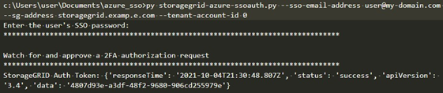

= Use the API if single sign-on is enabled (Azure)
:icons: font
:imagesdir: ../media/

[.lead]
If you have xref:../admin/configuring-sso.adoc[configured and enabled single sign-on (SSO)] and you use Azure as the SSO provider, you can use two example scripts to obtain an authentication token that is valid for the Grid Management API or the Tenant Management API.

== Sign in to the API if Azure single sign-on is enabled
 
These instructions apply if you are using Azure as the SSO identity provider

.What you'll need
* You know the SSO email address and password for a federated user who belongs to a StorageGRID user group.
* If you want to access the Tenant Management API, you know the tenant account ID.

.About this task
To obtain an authentication token, you can use the following example scripts:

* The `storagegrid-ssoauth-azure.py` Python script
* The `storagegrid-ssoauth-azure.js` Node.js script

Both scripts  are located in the StorageGRID installation files directory (`./rpms` for Red Hat Enterprise Linux or CentOS, `./debs` for Ubuntu or Debian, and `./vsphere` for VMware).

To write your own API integration with Azure, see the `storagegrid-ssoauth-azure.py` script. The Python script makes two requests to StorageGRID directly (first to get the SAMLRequest, and later to get the authorization token), and also calls the Node.js script to interact with Azure to perform the SSO operations.

SSO operations can be executed using a series of API requests, but doing so is not straightforward. The Puppeteer Node.js module is used to scrape the Azure SSO interface.

If you have a URL-encoding issue, you might see the error: `Unsupported SAML version`.

.Steps
. Install the required dependencies, as follows:

.. Install Node.js (see https://nodejs.org/en/download/[https://nodejs.org/en/download/^]).
.. Install the required Node.js modules (puppeteer and jsdom):
+
`npm install -g <module>`

.	Pass the Python script to the Python interpreter to run the script.
+
The Python script will then call the corresponding Node.js script to perform the Azure SSO interactions.

. When prompted, enter values for the following arguments (or pass them in using parameters):

** The SSO email address used to sign in to Azure
** The address for StorageGRID
** The tenant account ID, if you want to access the Tenant Management API
 
. When prompted, enter the password and be prepared to provide an MFA authorization to Azure if requested.
+

+
NOTE: The script assumes MFA is done using Microsoft Authenticator. You might need to modify the script to support other forms of MFA (such as entering a code received via text message).
+
The StorageGRID authorization token is provided in the output. You can now use the token for other requests, similar to how you would use the API if SSO was not being used.
