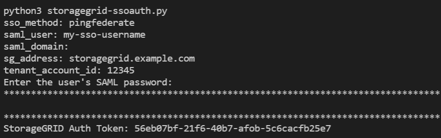

= Use the API if single sign-on is enabled (PingFederate)
:icons: font
:imagesdir: ../media/

[.lead]
If you have xref:../admin/configuring-sso.adoc[configured and enabled single sign-on (SSO)] and you use PingFederate as the SSO provider, you must issue a series of API requests to obtain an authentication token that is valid for the Grid Management API or the Tenant Management API.

== Sign in to the API if single sign-on is enabled

These instructions apply if you are using PingFederate as the SSO identity provider

.What you'll need

* You know the SSO username and password for a federated user who belongs to a StorageGRID user group.
* If you want to access the Tenant Management API, you know the tenant account ID.

.About this task

To obtain an authentication token, you can use one of the following examples:

* The `storagegrid-ssoauth.py` Python script, which is located in the StorageGRID installation files directory (`./rpms` for Red Hat Enterprise Linux or CentOS, `./debs` for Ubuntu or Debian, and `./vsphere` for VMware).
* An example workflow of curl requests.
+
The curl workflow might time out if you perform it too slowly. You might see the error: `A valid SubjectConfirmation was not found on this Response`.
+
NOTE: The example curl workflow does not protect the password from being seen by other users.
+
If you have a URL-encoding issue, you might see the error: `Unsupported SAML version`.

.Steps
. Select one of the following methods to obtain an authentication token:
 ** Use the `storagegrid-ssoauth.py` Python script. Go to step 2.
 ** Use curl requests. Go to step 3.
. If you want to use the `storagegrid-ssoauth.py` script, pass the script to the Python interpreter and run the script.
+
When prompted, enter values for the following arguments:

 ** The SSO method. You can enter any variation of "`pingfederate`" (PINGFEDERATE, pingfederate, and so on). 
 ** The SSO username
 ** The domain where StorageGRID is installed. This field is not used for PingFederate. You can leave it blank or enter any value.
 ** The address for StorageGRID
 ** The tenant account ID, if you want to access the Tenant Management API.
+

+
The StorageGRID authorization token is provided in the output. You can now use the token for other requests, similar to how you would use the API if SSO was not being used.

. If you want to use curl requests, use the following procedure.

 .. Declare the variables needed to sign in.
+
[source,bash]
----
export SAMLUSER='my-sso-username'
export SAMLPASSWORD='my-password'
export TENANTACCOUNTID='12345'
export STORAGEGRID_ADDRESS='storagegrid.example.com'
----
+
NOTE: To access the Grid Management API, use 0 as `TENANTACCOUNTID`.

 .. To receive a signed authentication URL, issue a POST request to `/api/v3/authorize-saml`, and remove the additional JSON encoding from the response.
+
This example shows a POST request for a signed authentication URL for TENANTACCOUNTID. The results will be passed to python -m json.tool to remove the JSON encoding.
+
[source,bash]
curl -X POST "https://$STORAGEGRID_ADDRESS/api/v3/authorize-saml" \
  -H "accept: application/json" -H  "Content-Type: application/json" \
  --data "{\"accountId\": \"$TENANTACCOUNTID\"}" | python -m json.tool
+
The response for this example includes a signed URL that is URL-encoded, but it does not include the additional JSON-encoding layer.
+
----
{
    "apiVersion": "3.0",
    "data": "https://my-pf-baseurl/idp/SSO.saml2?...",
    "responseTime": "2018-11-06T16:30:23.355Z",
    "status": "success"
}
----

 .. Save the `SAMLRequest` from the response for use in subsequent commands.
+
----
export SAMLREQUEST="https://my-pf-baseurl/idp/SSO.saml2?..."
----
.. Export the response and cookie, and echo the response:
+
[source,bash]
----
RESPONSE=$(curl -c - "$SAMLREQUEST")
----
+
[source,bash]
----
echo "$RESPONSE" | grep 'input type="hidden" name="pf.adapterId" id="pf.adapterId"'
----

.. Export the 'pf.adapterId' value, and echo the response:
+
----
export ADAPTER='myAdapter'
----
+
[source,bash]
----
echo "$RESPONSE" | grep 'base'
----

.. Export the 'href' value (remove the trailing slash /), and echo the response:
+
----
export BASEURL='https://my-pf-baseurl'
----
+
[source,bash]
----
echo "$RESPONSE" | grep 'form method="POST"'
----

.. Export the 'action' value:
+
----
export SSOPING='/idp/.../resumeSAML20/idp/SSO.ping'
----

 .. Send cookies along with credentials:
+
[source,bash]
----
curl -b <(echo "$RESPONSE") -X POST "$BASEURL$SSOPING" \
--data "pf.username=$SAMLUSER&pf.pass=$SAMLPASSWORD&pf.ok=clicked&pf.cancel=&pf.adapterId=$ADAPTER" --include
----

.. Save the `SAMLResponse` from the hidden field:
+
[source,bash]
----
export SAMLResponse='PHNhbWxwOlJlc3BvbnN...1scDpSZXNwb25zZT4='
----

 .. Using the saved `SAMLResponse`, make a StorageGRID``/api/saml-response`` request to generate a StorageGRID authentication token.
+
For `RelayState`, use the tenant account ID or use 0 if you want to sign in to the Grid Management API.
+
[source,bash]
----
curl -X POST "https://$STORAGEGRID_ADDRESS:443/api/saml-response" \
  -H "accept: application/json" \
  --data-urlencode "SAMLResponse=$SAMLResponse" \
  --data-urlencode "RelayState=$TENANTACCOUNTID" \
  | python -m json.tool
----
+
The response includes the authentication token.
+
----
{
    "apiVersion": "3.0",
    "data": "56eb07bf-21f6-40b7-af0b-5c6cacfb25e7",
    "responseTime": "2018-11-07T21:32:53.486Z",
    "status": "success"
}
----

 .. Save the authentication token in the response as `MYTOKEN`.
+
[source,bash]
----
export MYTOKEN="56eb07bf-21f6-40b7-af0b-5c6cacfb25e7"
----
+
You can now use `MYTOKEN` for other requests, similar to how you would use the API if SSO was not being used.

== Sign out of the API if single sign-on is enabled

If single sign-on (SSO) has been enabled, you must issue a series of API requests to sign out of the Grid Management API or the Tenant Management API. 
These instructions apply if you are using PingFederate as the SSO identity provider

.About this task

If required, you can sign out of the StorageGRID API simply by logging out from your organization's single logout page. Or, you can trigger single logout (SLO) from StorageGRID, which requires a valid StorageGRID bearer token.

.Steps

. To generate a signed logout request, pass `cookie "sso=true"` to the SLO API:
+
[source,bash]
----
curl -k -X DELETE "https://$STORAGEGRID_ADDRESS/api/v3/authorize" \
-H "accept: application/json" \
-H "Authorization: Bearer $MYTOKEN" \
--cookie "sso=true" \
| python -m json.tool
----
+
A logout URL is returned:
+
----
{
    "apiVersion": "3.0",
    "data": "https://my-ping-url/idp/SLO.saml2?SAMLRequest=fZDNboMwEIRfhZ...HcQ%3D%3D",
    "responseTime": "2021-10-12T22:20:30.839Z",
    "status": "success"
}
----

. Save the logout URL.
+
[source,bash]
----
export LOGOUT_REQUEST='https://my-ping-url/idp/SLO.saml2?SAMLRequest=fZDNboMwEIRfhZ...HcQ%3D%3D'
----

. Send a request to the logout URL to trigger SLO and to redirect back to StorageGRID.
+
[source,bash]
----
curl --include "$LOGOUT_REQUEST"
----
+
The 302 response is returned. The redirect location is not applicable to API-only logout.
+
----
HTTP/1.1 302 Found
Location: https://$STORAGEGRID_ADDRESS:443/api/saml-logout?SAMLResponse=fVLLasMwEPwVo7ss%...%23rsa-sha256
Set-Cookie: PF=QoKs...SgCC; Path=/; Secure; HttpOnly; SameSite=None
----

. Delete the StorageGRID bearer token.
+
Deleting the StorageGRID bearer token works the same way as without SSO. If `cookie "sso=true"` is not provided, the user is logged out of StorageGRID without affecting the SSO state.
+
[source,bash]
----
curl -X DELETE "https://$STORAGEGRID_ADDRESS/api/v3/authorize" \
-H "accept: application/json" \
-H "Authorization: Bearer $MYTOKEN" \
--include
----
+
A `204 No Content` response indicates the user is now signed out.
+
----
HTTP/1.1 204 No Content
----
