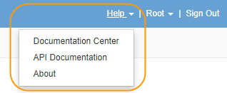
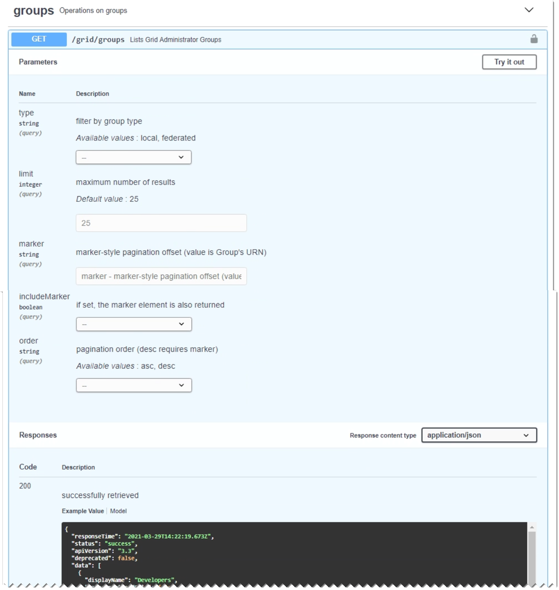

= Use the Grid Management API
:icons: font
:imagesdir: ../media/

[.lead]
You can perform system management tasks using the Grid Management REST API instead of the Grid Manager user interface. For example, you might want to use the API to automate operations or to create multiple entities, such as users, more quickly.

== Top-level resources

The Grid Management API provides the following top-level resources:

* `/grid`: Access is restricted to Grid Manager users and is based on the configured group permissions.
* `/org`: Access is restricted to users who belong to a local or federated LDAP group for a tenant account. For details, see xref:../tenant/index.adoc[Use a tenant account].
* `/private`: Access is restricted to Grid Manager users and is based on the configured group permissions. The private APIs are subject to change without notice. StorageGRID private endpoints also ignore the API version of the request. 

== Issue API requests

The Grid Management API uses the Swagger open source API platform. Swagger provides an intuitive user interface that allows developers and non-developers to perform real-time operations in StorageGRID with the API.

The Swagger user interface provides complete details and documentation for each API operation.

.What you'll need
* You are signed in to the Grid Manager using a xref:../admin/web-browser-requirements.adoc[supported web browser].
* You have specific access permissions.

IMPORTANT: Any API operations you perform using the API Docs webpage are live operations. Be careful not to create, update, or delete configuration data or other data by mistake.

.Steps
. From the Grid Manager header, select the help icon and select *API Documentation*.
+

. To perform an operation with the private API, select *Go to private API documentation* on the StorageGRID Management API page.
+
The private APIs are subject to change without notice. StorageGRID private endpoints also ignore the API version of the request. 

. Select the desired operation.
+
When you expand an API operation, you can see the available HTTP actions, such as GET, PUT, UPDATE, and DELETE.

. Select an HTTP action to see the request details, including the endpoint URL, a list of any required or optional parameters, an example of the request body (when required), and the possible responses.
+

. Determine if the request requires additional parameters, such as a group or user ID. Then, obtain these values. You might need to issue a different API request first to get the information you need.
. Determine if you need to modify the example request body. If so, you can select *Model* to learn the requirements for each field.
. Select *Try it out*.
. Provide any required parameters, or modify the request body as required.
. Select *Execute*.
. Review the response code to determine if the request was successful.

