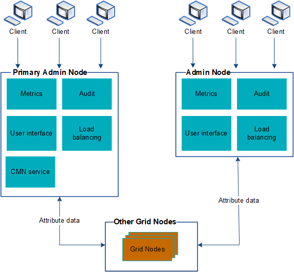

= Using multiple Admin Nodes
:icons: font
:imagesdir: ../media/

[.lead]
A StorageGRID system can include multiple Admin Nodes to enable you to continuously monitor and configure your StorageGRID system even if one Admin Node fails.

If an Admin Node becomes unavailable, attribute processing continues, alerts and alarms (legacy system) are still triggered, and email notifications and AutoSupport messages are still sent. However, having multiple Admin Nodes does not provide failover protection except for notifications and AutoSupport messages. In particular, alarm acknowledgments made from one Admin Node are not copied to other Admin Nodes.

There are two options for continuing to view and configure the StorageGRID system if an Admin Node fails:

* Web clients can reconnect to any other available Admin Node.
* If a system administrator has configured a high availability group of Admin Nodes, web clients can continue to access the Grid Manager or the Tenant Manager using the virtual IP address of the HA group.
+
NOTE: When using an HA group, access is interrupted if the Master Admin Node fails. Users must sign in again after the virtual IP address of the HA group fails over to another Admin Node in the group.

Some maintenance tasks can only be performed using the primary Admin Node. If the primary Admin Node fails, it must be recovered before the StorageGRID system is fully functional again.

.Related information

xref:managing-high-availability-groups.adoc[Managing high availability groups]
