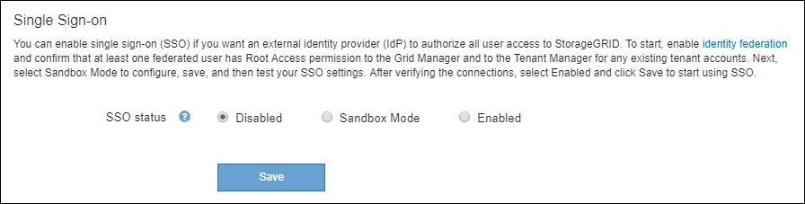
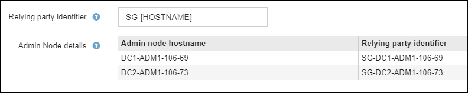
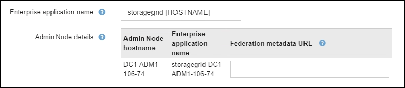
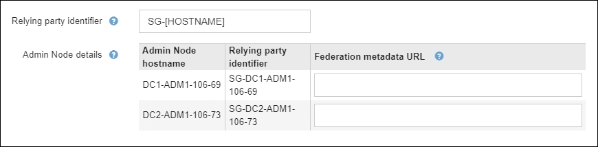
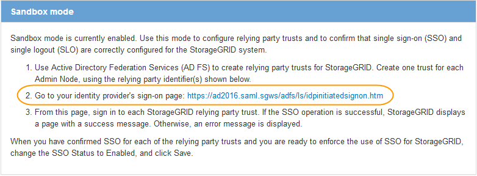
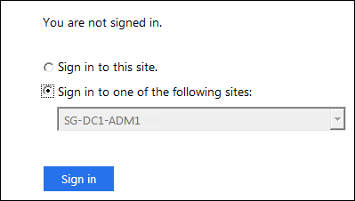
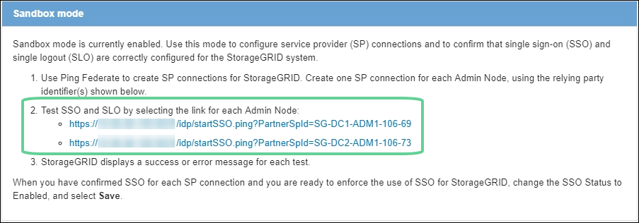

= Use sandbox mode
:icons: font
:imagesdir: ../media/

[.lead]
You can use sandbox mode to configure and test single sign-on (SSO) before enabling it for all StorageGRID users. After SSO has been enabled, you can return to sandbox mode whenever you need to change or retest the configuration. 

.What you'll need

* You are signed in to the Grid Manager using a xref:../admin/web-browser-requirements.adoc[supported web browser].
* You have the Root access permission.
* You have configured identity federation for your StorageGRID system.
* For the identity federation *LDAP service type*, you selected either Active Directory or Azure, based on the SSO identity provider you plan to use.
+
[cols="1a,1a"]  
|===
|Configured LDAP service type |Options for SSO identity provider

|Active Directory
|* Active Directory
* Azure
* PingFederate

|Azure
|Azure

|===

.About this task

When SSO is enabled and a user attempts to sign in to an Admin Node, StorageGRID sends an authentication request to the SSO identity provider. In turn, the SSO identity provider sends an authentication response back to StorageGRID, indicating whether the authentication request was successful. For successful requests:

* The response from Active Directory or PingFederate includes a universally unique identifier (UUID) for the user. 
* The response from Azure includes a User Principal Name (UPN).

To allow StorageGRID (the service provider) and the SSO identity provider to communicate securely about user authentication requests, you must configure certain settings in StorageGRID. Next, you must use the SSO identity provider's software to create a relying party trust (AD FS), Enterprise Application (Azure) or Service Provider (PingFederate) for each Admin Node. Finally, you must return to StorageGRID to enable SSO.

Sandbox mode makes it easy to perform this back-and-forth configuration and to test all of your settings before you enable SSO. When you are using sandbox mode, users cannot sign in using SSO.

== Access sandbox mode

. Select *CONFIGURATION* > *Access control* > *Single sign-on*.
+
The Single Sign-on page appears, with the *Disabled* option selected.
+

+
NOTE: If the SSO Status options do not appear, confirm you have configured the identity provider as the federated identity source. See xref:requirements-for-sso.adoc[Requirements for using single sign-on].

. Select *Sandbox Mode*.
+
The Identity Provider section appears.

== Enter identity provider details

. Select the *SSO type* from the drop-down list.

. Complete the fields in the Identity Provider section based on the SSO type you selected.

// start tabbed area

[role="tabbed-block"]
====

.Active Directory
--
.. Enter the *Federation service name* for the identity provider, exactly as it appears in Active Directory Federation Service (AD FS).
+
NOTE: To locate the federation service name, go to Windows Server Manager. Select *Tools* > *AD FS Management*. From the Action menu, select *Edit Federation Service Properties*. The Federation Service Name is shown in the second field.

.. Specify which TLS certificate will be used to secure the connection when the identity provider sends SSO configuration information in response to StorageGRID requests.

** *Use operating system CA certificate*: Use the default CA certificate installed on the operating system to secure the connection.

** *Use custom CA certificate*: Use a custom CA certificate to secure the connection.
+
If you select this setting, copy the text of the custom certificate and and paste it in the *CA Certificate* text box.

** *Do not use TLS*: Do not use a TLS certificate to secure the connection.

.. In the Relying Party section, specify the *Relying party identifier* for StorageGRID. This value controls the name you use for each relying party trust in AD FS.

* For example, if your grid has only one Admin Node and you do not anticipate adding more Admin Nodes in the future, enter `SG` or `StorageGRID`.

* If your grid includes more than one Admin Node, include the string `[HOSTNAME]` in the identifier. For example, `SG-[HOSTNAME]`. This generates a table that shows the relying party identifier for each Admin Node in your system, based on the node's hostname.
+

+
NOTE: You must create a relying party trust for each Admin Node in your StorageGRID system. Having a relying party trust for each Admin Node ensures that users can securely sign in to and out of any Admin Node.
.. Select *Save*.
+
A green check mark appears on the *Save* button for a few seconds.
+

--
.Azure
--

.. Specify which TLS certificate will be used to secure the connection when the identity provider sends SSO configuration information in response to StorageGRID requests.

** *Use operating system CA certificate*: Use the default CA certificate installed on the operating system to secure the connection.

** *Use custom CA certificate*: Use a custom CA certificate to secure the connection.
+
If you select this setting, copy the text of the custom certificate and and paste it in the *CA Certificate* text box.

** *Do not use TLS*: Do not use a TLS certificate to secure the connection.

.. In the Enterprise Application section, specify the *Enterprise application name* for StorageGRID. This value controls the name you use for each enterprise application in Azure AD.

* For example, if your grid has only one Admin Node and you do not anticipate adding more Admin Nodes in the future, enter `SG` or `StorageGRID`.

* If your grid includes more than one Admin Node, include the string `[HOSTNAME]` in the identifier. For example, `SG-[HOSTNAME]`. This generates a table that shows an enterprise application name for each Admin Node in your system, based on the node's hostname.
+

+
NOTE: You must create an enterprise application for each Admin Node in your StorageGRID system. Having an enterprise application for each Admin Node ensures that users can securely sign in to and out of any Admin Node.

.. Follow the steps in xref:../admin/creating-enterprise-application-azure.adoc[Create enterprise applications in Azure AD] to create an enterprise application for each Admin Node listed in the table.

.. From Azure AD, copy the federation metadata URL for each enterprise application. Then, paste this URL into the corresponding *Federation metadata URL* field in StorageGRID.

.. After you have copied and pasted a federation metadata URL for all Admin Nodes, select *Save*.
+
A green check mark appears on the *Save* button for a few seconds.
+

--
.PingFederate
--

.. Specify which TLS certificate will be used to secure the connection when the identity provider sends SSO configuration information in response to StorageGRID requests.

** *Use operating system CA certificate*: Use the default CA certificate installed on the operating system to secure the connection.

** *Use custom CA certificate*: Use a custom CA certificate to secure the connection.
+
If you select this setting, copy the text of the custom certificate and and paste it in the *CA Certificate* text box.

** *Do not use TLS*: Do not use a TLS certificate to secure the connection.

.. In the Service Provider (SP) section, specify the *SP connection ID* for StorageGRID. This value controls the name you use for each SP connection in PingFederate.

* For example, if your grid has only one Admin Node and you do not anticipate adding more Admin Nodes in the future, enter `SG` or `StorageGRID`.

* If your grid includes more than one Admin Node, include the string `[HOSTNAME]` in the identifier. For example, `SG-[HOSTNAME]`. This generates a table that shows the SP connection ID for each Admin Node in your system, based on the node's hostname.
+

+
NOTE: You must create an SP connection for each Admin Node in your StorageGRID system. Having an SP connection for each Admin Node ensures that users can securely sign in to and out of any Admin Node.

.. Specify the federation metadata URL for each Admin Node in the *Federation metadata URL* field.
+
Use the following format:
+
----
https://<Federation Service Name>:<port>/pf/federation_metadata.ping?PartnerSpId=<SP Connection ID>
----

.. Select *Save*.
+
A green check mark appears on the *Save* button for a few seconds.
+

--
====

// end tabbed area

== Configure relying party trusts, enterprise applications, or SP connections

When the configuration is saved, the Sandbox mode confirmation notice appears. This notice confirms that sandbox mode is now enabled and provides overview instructions.

StorageGRID can remain in sandbox mode as long as required. However, when *Sandbox Mode* is selected on the Single Sign-on page, SSO is disabled for all StorageGRID users. Only local users can sign in.

Follow these steps to configure relying party trusts (Active Directory), complete enterprise applications (Azure), or configure SP connections (PingFederate).

// start tabbed area

[role="tabbed-block"]
====

.Active Directory
--

. Go to Active Directory Federation Services (AD FS).

. Create one or more relying party trusts for StorageGRID, using each relying party identifier shown in the table on the StorageGRID Single Sign-on page.
+
You must create one trust for each Admin Node shown in the table.
+
For instructions, go to xref:../admin/creating-relying-party-trusts-in-ad-fs.adoc[Create relying party trusts in AD FS].

--

.Azure 
--

. From the Single sign-on page for the Admin Node you are currently signed in to, select the button to download and save the SAML metadata. 

. Then, for any other Admin Nodes in your grid, repeat these steps:
.. Sign in to the node.
.. Select *CONFIGURATION* > *Access control* > *Single sign-on*.
.. Download and save the SAML metadata for that node.

. Go to the Azure Portal.

. Follow the steps in xref:../admin/creating-enterprise-application-azure.adoc[Create enterprise applications in Azure AD] to upload the SAML metadata file for each Admin Node into its corresponding Azure enterprise application.

--

.PingFederate
--
. From the Single sign-on page for the Admin Node you are currently signed in to, select the button to download and save the SAML metadata. 

. Then, for any other Admin Nodes in your grid, repeat these steps:
.. Sign in to the node.
.. Select *CONFIGURATION* > *Access control* > *Single sign-on*.
.. Download and save the SAML metadata for that node.

. Go to PingFederate.

. xref:../admin/creating-sp-connection-ping.adoc[Create one or more service provider (SP) connections for StorageGRID]. Use the SP connection ID for each Admin Node (shown in the table on the StorageGRID Single Sign-on page) and the SAML metadata you downloaded for that Admin Node. 
+
You must create one SP connection for each Admin Node shown in the table.

--

====

// end tabbed area

== Test SSO connections

Before you enforce the use of single sign-on for your entire StorageGRID system, you should confirm that single sign-on and single logout are correctly configured for each Admin Node.

// start tabbed area

[role="tabbed-block"]
====

.Active Directory
--
. From the StorageGRID Single Sign-on page, locate the link in the Sandbox mode message. 
+
The URL is derived from the value you entered in the *Federation service name* field.
+

. Select the link, or copy and paste the URL into a browser, to access your identity provider's sign-on page.
. To confirm you can use SSO to sign in to StorageGRID, select *Sign in to one of the following sites*, select the relying party identifier for your primary Admin Node, and select *Sign in*.
+

. Enter your federated username and password.
 ** If the SSO sign-in and logout operations are successful, a success message appears.
+

 ** If the SSO operation is unsuccessful, an error message appears. Fix the issue, clear the browser's cookies, and try again.
. Repeat these steps to verify the SSO connection for each Admin Node in your grid.

--
.Azure
--

. Go to the Single sign-on page in the Azure portal.

. Select *Test this application*. 

. Enter the credentials of a federated user.

** If the SSO sign-in and logout operations are successful, a success message appears.
+

** If the SSO operation is unsuccessful, an error message appears. Fix the issue, clear the browser's cookies, and try again.

. Repeat these steps to verify the SSO connection for each Admin Node in your grid.

--
.PingFederate 
--

. From the StorageGRID Single Sign-on page, select the first link in the Sandbox mode message. 
+
Select and test one link at a time.
+

.  Enter the credentials of a federated user. 

 ** If the SSO sign-in and logout operations are successful, a success message appears.
+

** If the SSO operation is unsuccessful, an error message appears. Fix the issue, clear the browser's cookies, and try again.

. Select the next link to verify the SSO connection for each Admin Node in your grid.
+
If you see a Page Expired message, select the *Back* button in your browser and resubmit your credentials.

--
====

== Enable single sign-on

When you have confirmed you can use SSO to sign in to each Admin Node, you can enable SSO for your entire StorageGRID system.

IMPORTANT: When SSO is enabled, all users must use SSO to access the Grid Manager, the Tenant Manager, the Grid Management API, and the Tenant Management API. Local users can no longer access StorageGRID.

. Select *CONFIGURATION* > *Access control* > *Single sign-on*.
. Change the SSO Status to *Enabled*.
. Select *Save*.
. Review the warning message, and select *OK*.
+
Single sign-on is now enabled.

IMPORTANT: If you are using the Azure Portal and you access StorageGRID from the same computer you use to access Azure, ensure that the Azure Portal user is also an authorized StorageGRID user (a user in a federated group that has been imported into StorageGRID) or log out of the Azure Portal before attempting to sign in to StorageGRID. 

