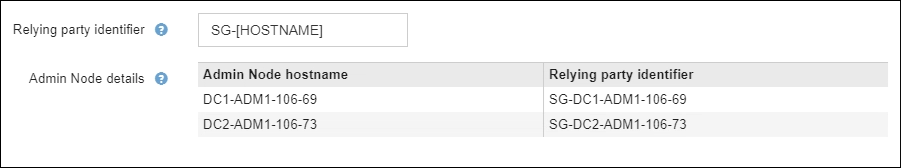

= Using sandbox mode
:icons: font
:imagesdir: ../media/

[.lead]
You can use sandbox mode to configure and test single sign-on (SSO) before enabling it for all StorageGRID users. After SSO has been enabled, you can return to sandbox mode whenever you need to change or retest the configuration. 

Whenever sandbox mode is enabled, SSO is disabled for all StorageGRID users.

.What you'll need

* You are signed in to the Grid Manager using a xref:../admin/web-browser-requirements.adoc[supported web browser].
* You have the Root access permission.
* You have configured identity federation for your StorageGRID system.
* For the identity federation *LDAP service type*, you selected either Active Directory or Azure, based on the SSO identity provider you plan to use.
+
[cols="1a,1a"]  
|===
|LDAP service type |SSO identity provider

|Active Directory
|Active Directory

|* Active Directory
* Azure AD

|Azure

|Active Directory
|Ping Federate

|===

.About this task

When SSO is enabled and a user attempts to sign in to an Admin Node, StorageGRID sends an authentication request to the SSO identity provider. In turn, the SSO identity provider sends an authentication response back to StorageGRID, indicating whether the authorization request was successful. For successful requests, the response includes a universally unique identifier (UUID) for the user.

To allow StorageGRID (the service provider) and the SSO identity provider to communicate securely about user authentication requests, you must configure certain settings in StorageGRID. Next, you must use the SSO identity provider's software to create a relying party trust (AD FS and Azure) or Service Provider (Ping Federate) for each Admin Node. Finally, you must return to StorageGRID to enable SSO.

Sandbox mode makes it easy to perform this back-and-forth configuration and to test all of your settings before you enable SSO. When you are using sandbox mode, users cannot sign in using SSO.

NOTE: Using sandbox mode is highly recommended, but not strictly required. If you are prepared to configure the SSO identity provider immediately after you configure SSO in StorageGRID, and you do not need to test the SSO and single logout (SLO) processes for each Admin Node, select *Enabled*, enter the StorageGRID settings, configure the SSO identity provider, and then select *Save* to enable SSO.

== Access sandbox mode

. Select *CONFIGURATION* > *Access control* > *Single sign-on*.
+
The Single Sign-on page appears, with the *Disabled* option selected.
+
image::../media/sso_status_disabled.png[Single Sign-on page with SSO Status disabled]
+
NOTE: If the SSO Status options do not appear, confirm you have configured the identity provider as the federated identity source. See xref:requirements-for-sso.adoc[Requirements for using single sign-on].

. Select *Sandbox Mode*.
+
The Identity Provider and Relying Party sections appear.

== Enter identity provider details

. Select the *SSO type* from the drop-down list.

. Complete the fields in the Identity Provider section based on the SSO type you selected.

// start tabbed area

[role="tabbed-block"]
====

.Active Directory
--
.. Enter the *Federation service name* for the identity provider, exactly as it appears in Active Directory Federation Service (AD FS).
+
NOTE: To locate the federation service name, go to Windows Server Manager. Select *Tools* > *AD FS Management*. From the Action menu, select *Edit Federation Service Properties*. The Federation Service Name is shown in the second field.

.. Specify which TLS certificate will be used to secure the connection when the identity provider sends SSO configuration information in response to StorageGRID requests.

** *Use operating system CA certificate*: Use the default CA certificate installed on the operating system to secure the connection.

** *Use custom CA certificate*: Use a custom CA certificate to secure the connection.
+
If you select this setting, copy the text of the custom certificate and and paste it in the *CA Certificate* text box.

** *Do not use TLS*: Do not use a TLS certificate to secure the connection.

.. In the Relying Party section, specify the unique *Relying party identifier* you will enter in relying party trusts to identify StorageGRID.

* For example, if your grid has only one Admin Node and you do not anticipate adding more Admin Nodes in the future, enter `SG` or `StorageGRID`.

* If your grid includes more than one Admin Node, include the string `[HOSTNAME]` in the identifier. For example, `SG-[HOSTNAME]`. This generates a table that shows the relying party identifier for each Admin Node in your system, based on the node's hostname.
+

+
NOTE: You must create a relying party trust for each Admin Node in your StorageGRID system. Having a relying party trust for each Admin Node ensures that users can securely sign in to and out of any Admin Node.

--
.Azure
--
.. Enter the *Federation service name* for the identity provider, exactly as it appears in Azure.

.. Specify which TLS certificate will be used to secure the connection when the identity provider sends SSO configuration information in response to StorageGRID requests.

** *Use operating system CA certificate*: Use the default CA certificate installed on the operating system to secure the connection.

** *Use custom CA certificate*: Use a custom CA certificate to secure the connection.
+
If you select this setting, copy the text of the custom certificate and and paste it in the *CA Certificate* text box.

** *Do not use TLS*: Do not use a TLS certificate to secure the connection.

.. In the Relying Party section, specify the unique *Relying party identifier* you will enter in relying party trusts to identify StorageGRID.

* For example, if your grid has only one Admin Node and you do not anticipate adding more Admin Nodes in the future, enter `SG` or `StorageGRID`.

* If your grid includes more than one Admin Node, include the string `[HOSTNAME]` in the identifier. For example, `SG-[HOSTNAME]`. This generates a table that shows the relying party identifier for each Admin Node in your system, based on the node's hostname.
+
image::../media/sso_status_sandbox_mode_ping_federated.png[Single Sign-on, Sandbox mode enabled, Relying party identifiers shown for several Admin Nodes]

.. Copy the federation metadata URL from the SAML Signing Certificate section and paste it in the *Federation metadata URL* field.
+
To access this URL, select the enterprise application and open the Single sign-on page.

--
.Ping Federated
--

.. Enter the *Federation service name* for the identity provider, exactly as it appears in Ping Federated.

.. Specify which TLS certificate will be used to secure the connection when the identity provider sends SSO configuration information in response to StorageGRID requests.

** *Use operating system CA certificate*: Use the default CA certificate installed on the operating system to secure the connection.

** *Use custom CA certificate*: Use a custom CA certificate to secure the connection.
+
If you select this setting, copy the text of the custom certificate and and paste it in the *CA Certificate* text box.

** *Do not use TLS*: Do not use a TLS certificate to secure the connection.

.. In the Relying Party section, specify the unique *Relying party identifier* you will enter in relying party trusts to identify StorageGRID.

* For example, if your grid has only one Admin Node and you do not anticipate adding more Admin Nodes in the future, enter `SG` or `StorageGRID`.

* If your grid includes more than one Admin Node, include the string `[HOSTNAME]` in the identifier. For example, `SG-[HOSTNAME]`. This generates a table that shows the relying party identifier for each Admin Node in your system, based on the node's hostname.
+
image::../media/sso_status_sandbox_mode_ping_federated.png[Single Sign-on, Sandbox mode enabled, Relying party identifiers shown for several Admin Nodes]

.. Specify the federation metadata URL for each Admin Node in the *Federation metadata URL* field.
+
Use the following format:
+
----
https://<Federation Service Name>:9031/pf/federation_metadata.ping?PartnerSpId=<Relying Party Identifier>
----
--

====

// end tabbed area

[start=3]
. Select *Save*.

* A green check mark appears on the *Save* button for a few seconds.
+
image::../media/save_button_green_checkmark.gif[Save Button with a green checkmark]

** The Sandbox mode confirmation notice appears, confirming that sandbox mode is now enabled. You can use this mode while you configure a relying party trust for each Admin Node in the SSO identity provider and while you test the single sign-in (SSO) and single logout (SLO) processes.
+
image::../media/sso_sandbox_mode_enabled.gif[SSO Sandbox Mode Enabled]

. Use the SSO identity provider software to configure a relying party trust for each Admin Node and test the single sign-in (SSO) and single logout (SLO) processes.

// start tabbed area

[role="tabbed-block"]
====

.Active Directory
--
//content
--

.Azure
--
//content
--

.Ping Federated
--
//content
--

====

// end tabbed area