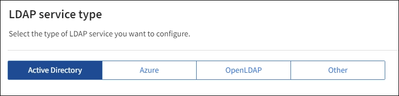

= Use identity federation
:icons: font
:imagesdir: ../media/

[.lead]
Using identity federation makes setting up groups and users faster, and it allows users to sign in to StorageGRID using familiar credentials.

== Configure identity federation

You can configure identity federation if you want admin groups and users to be managed in another system such as Active Directory, Azure Active Directory (Azure AD), OpenLDAP, or Oracle Directory Server.

.What you'll need
<<<<<<< HEAD
* You are signed in to the Grid Manager using a supported browser.
* You have specific access permissions.
* You are using Active Directory, Azure AD, OpenLDAP, or Oracle Directory Server as the identity provider.
=======
* You must be signed in to the Grid Manager using a xref:../admin/web_browser_requirements.adoc[supported web browser].
* You must have specific access permissions.
* If you plan to enable single sign-on (SSO), you must use Active Directory as the federated identity source and AD FS as the identity provider. See "`Requirements for using single sign-on.`"
* You must be using Active Directory, OpenLDAP, or Oracle Directory Server as the identity provider.
>>>>>>> main
+
NOTE: If you want to use an LDAP v3 service that is not listed, contact technical support.
* If you plan to use OpenLDAP, you must configure the OpenLDAP server. See <<Guidelines for configuring an OpenLDAP server>>.
* If you plan to enable single sign-on (SSO), you have reviewed the xref:requirements_for_sso.adoc[requirements for using single sign-on].
* If you plan to use Transport Layer Security (TLS) for communications with the LDAP server, the identity provider is using TLS 1.2 or 1.3. See xref:supported_ciphers_for_outgoing_tls_connections.adoc[Supported ciphers for outgoing TLS connections].

.About this task
You can configure an identity source for the Grid Manager if you want to import groups from another system such as Active Directory, Azure AD, OpenLDAP, or Oracle Directory Server. You can import the following types of groups:

* Admin groups. The users in admin groups can sign in to the Grid Manager and perform tasks, based on the management permissions assigned to the group.
* Tenant user groups for tenants that do not use their own identity source. Users in tenant groups can sign in to the Tenant Manager and perform tasks, based on the permissions assigned to the group in the Tenant Manager. See xref:creating_tenant_account.adoc[Creating a tenant account] and xref:../tenant/index.adoc[Use a tenant account] for details.

.Steps
. Select *Configuration* > *Access control* > *Identity federation*.
. Select *Enable identity federation*.

. In the LDAP service type section, select the type of LDAP service you want to configure.
+

+
Select *Other* to configure values for an LDAP server that uses Oracle Directory Server.

. If you selected *Other*, complete the fields in the LDAP Attributes section. Otherwise, go to the next step.
 ** *User Unique Name*: The name of the attribute that contains the unique identifier of an LDAP user. This attribute is equivalent to `sAMAccountName` for Active Directory and `uid` for OpenLDAP. If you are configuring Oracle Directory Server, enter `uid`.
 ** *User UUID*: The name of the attribute that contains the permanent unique identifier of an LDAP user. This attribute is equivalent to `objectGUID` for Active Directory and `entryUUID` for OpenLDAP. If you are configuring Oracle Directory Server, enter `nsuniqueid`. Each user's value for the specified attribute must be a 32-digit hexadecimal number in either 16-byte or string format, where hyphens are ignored.
 ** *Group Unique Name*: The name of the attribute that contains the unique identifier of an LDAP group. This attribute is equivalent to `sAMAccountName` for Active Directory and `cn` for OpenLDAP. If you are configuring Oracle Directory Server, enter `cn`.
 ** *Group UUID*: The name of the attribute that contains the permanent unique identifier of an LDAP group. This attribute is equivalent to `objectGUID` for Active Directory and `entryUUID` for OpenLDAP. If you are configuring Oracle Directory Server, enter `nsuniqueid`. Each group's value for the specified attribute must be a 32-digit hexadecimal number in either 16-byte or string format, where hyphens are ignored.

. For all LDAP service types, enter the required LDAP server and network connection information in the Configure LDAP server section,
 ** *Hostname*: The fully qualified domain name (FQDN) or IP address of the LDAP server.
 ** *Port*: The port used to connect to the LDAP server.
+
NOTE: The default port for STARTTLS is 389, and the default port for LDAPS is 636. However, you can use any port as long as your firewall is configured correctly.

 ** *Username*: The full path of the distinguished name (DN) for the user that will connect to the LDAP server.
+
For Active Directory, you can also specify the Down-Level Logon Name or the User Principal Name.
+
The specified user must have permission to list groups and users and to access the following attributes:

  *** `sAMAccountName` or `uid`
  *** `objectGUID`, `entryUUID`, or `nsuniqueid`
  *** `cn`
  *** `memberOf` or `isMemberOf`

 ** *Password*: The password associated with the username.
 ** *Group Base DN*: The full path of the distinguished name (DN) for an LDAP subtree you want to search for groups. In the Active Directory example (below), all groups whose Distinguished Name is relative to the base DN (DC=storagegrid,DC=example,DC=com) can be used as federated groups.
+
NOTE: The *Group unique name* values must be unique within the *Group Base DN* they belong to.

 ** *User Base DN*: The full path of the distinguished name (DN) of an LDAP subtree you want to search for users.
+
NOTE: The *User unique name* values must be unique within the *User Base DN* they belong to.

** *Bind username format*: The default username pattern StorageGRID should use if the pattern cannot be determined automatically.
+
Providing *Bind username format* is recommended because it can allow users to sign in if StorageGRID is unable to bind with the service account.
+
Enter one of these patterns:
+
*** *UserPrincipalName pattern (Active Directory and Azure)*: `[USERID]@_example_.com`
*** *Down-level logon name pattern (Active Directory and Azure)*: `_example_\[USERID]`
*** *Distinguished name pattern*: `CN=[USERID],CN=Users,DC=_example_,DC=com`
+
Include *[USERID]* exactly as written.

. In the Transport Layer Security (TLS) section, select a security setting.

 ** *Use STARTTLS*: Use STARTTLS to secure communications with the LDAP server. This is the recommended option for Active Directory, OpenLDAP, or Other, but this option is not supported for Azure.

 ** *Use LDAPS*: The LDAPS (LDAP over SSL) option uses TLS to establish a connection to the LDAP server. You must select this option for Azure.
 ** *Do not use TLS*: The network traffic between the StorageGRID system and the LDAP server will not be secured. This option is not supported for Azure.
+
NOTE: Using the *Do not use TLS* option is not supported if your Active Directory server enforces LDAP signing. You must use STARTTLS or LDAPS.

. If you selected STARTTLS or LDAPS, choose the certificate used to secure the connection.
 ** *Use operating system CA certificate*: Use the default CA certificate installed on the operating system to secure connections.
 ** *Use custom CA certificate*: Use a custom security certificate.
+
If you select this setting, copy and paste the custom security certificate into the CA certificate text box.
. Select *Test connection* to validate your connection settings for the LDAP server.
+
A confirmation message appears in the upper right corner of the page if the connection is valid.

. If the connection is valid, select *Save*.
+
The following screenshot shows example configuration values for an LDAP server that uses Active Directory.
+
image::../media/ldap_config_active_directory.png[Identity Federation page showing LDAP server that uses Active Directory]

=== Guidelines for configuring an OpenLDAP server

If you want to use an OpenLDAP server for identity federation, you must configure specific settings on the OpenLDAP server.

==== Memberof and refint overlays

The memberof and refint overlays should be enabled. For more information, see the instructions for reverse group membership maintenance in the Administrator's Guide for OpenLDAP.

==== Indexing

You must configure the following OpenLDAP attributes with the specified index keywords:

* `olcDbIndex: objectClass eq`
* `olcDbIndex: uid eq,pres,sub`
* `olcDbIndex: cn eq,pres,sub`
* `olcDbIndex: entryUUID eq`

In addition, ensure the fields mentioned in the help for Username are indexed for optimal performance.

See the information about reverse group membership maintenance in the
http://www.openldap.org/doc/admin24/index.html[OpenLDAP documentation: Version 2.4 Administrator's Guide^]

== Force synchronization with the identity source

The StorageGRID system periodically synchronizes federated groups and users from the identity source. You can force synchronization to start if you want to enable or restrict user permissions as quickly as possible.

<<<<<<< HEAD
=======
.What you'll need
* You must be signed in to the Grid Manager using a xref:../admin/web_browser_requirements.adoc[supported web browser].
* You must have specific access permissions.
* The identity source must be enabled.

>>>>>>> main
.Steps

. Select *Configuration* > *Access control* > *Identity federation*.
+
The *Sync server* button is at the top of the Identity Federation page.
+

. Select *Sync server*.
+
The synchronization process might take some time depending on your environment.
+
NOTE: The *Identity federation synchronization failure* alert is triggered if there is an issue synchronizing federated groups and users from the identity source.

== Disable identity federation

You can temporarily or permanently disable identity federation for groups and users. When identity federation is disabled, there is no communication between StorageGRID and the identity source. However, any settings you have configured are retained, allowing you to easily reenable identity federation in the future.

<<<<<<< HEAD
=======
.What you'll need

* You must be signed in to the Grid Manager using a xref:../admin/web_browser_requirements.adoc[supported web browser].
* You must have specific access permissions.

>>>>>>> main
.About this task

Before you disable identity federation, you should be aware of the following:

* Federated users will be unable to sign in.
* Federated users who are currently signed in will retain access to the StorageGRID system until their session expires, but they will be unable to sign in after their session expires.
* Synchronization between the StorageGRID system and the identity source will not occur, and alerts or alarms will not be raised for accounts that have not been synchronized.
* The *Enable identity federation* check box is disabled if single sign-on (SSO) is set to *Enabled* or *Sandbox Mode*. The SSO Status on the Single Sign-on page must be *Disabled* before you can disable identity federation. See xref:disabling_single_sign_on.adoc[Disabling single sign-on].

.Steps

. Select *Configuration* > *Access control* > *Identity federation*.
. Uncheck the *Enable identity federation* check box.
