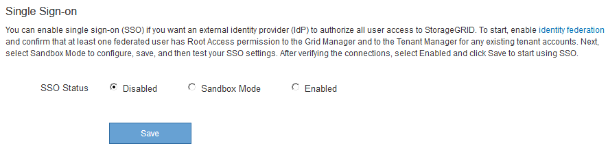
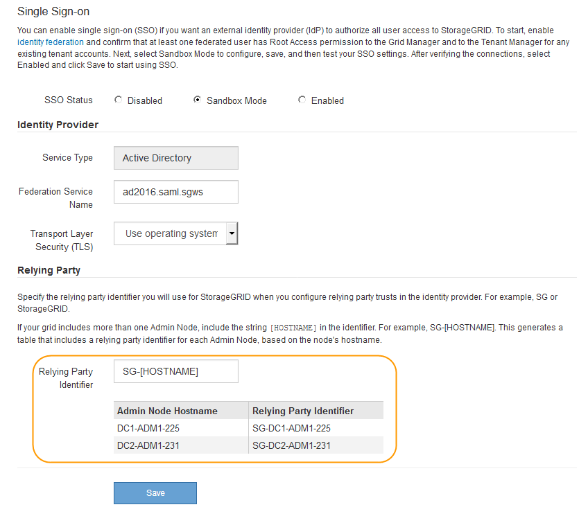
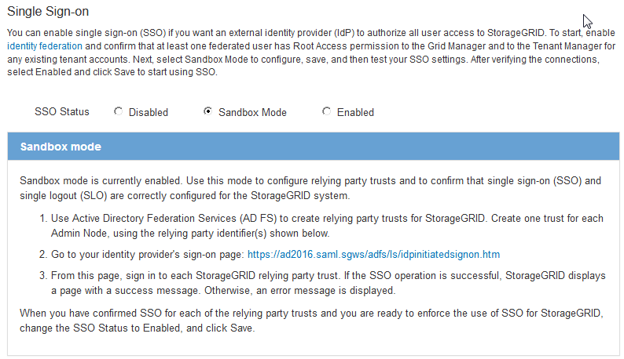

= Using sandbox mode
:icons: font
:imagesdir: ../media/

[.lead]
You can use sandbox mode to configure and test Active Directory Federation Services (AD FS) relying party trusts before you enforce single sign-on (SSO) for StorageGRID users. After SSO is enabled, you can reenable sandbox mode to configure or test new and existing relying party trusts. Reenabling sandbox mode temporarily disables SSO for StorageGRID users.

.What you'll need

* You must be signed in to the Grid Manager using a xref:../admin/web_browser_requirements.adoc[supported web browser].
* You must have specific access permissions.

.About this task

When SSO is enabled and a user attempts to sign in to an Admin Node, StorageGRID sends an authentication request to AD FS. In turn, AD FS sends an authentication response back to StorageGRID, indicating whether the authorization request was successful. For successful requests, the response includes a universally unique identifier (UUID) for the user.

To allow StorageGRID (the service provider) and AD FS (the identity provider) to communicate securely about user authentication requests, you must configure certain settings in StorageGRID. Next, you must use AD FS to create a relying party trust for every Admin Node. Finally, you must return to StorageGRID to enable SSO.

Sandbox mode makes it easy to perform this back-and-forth configuration and to test all of your settings before you enable SSO.

NOTE: Using sandbox mode is highly recommended, but not strictly required. If you are prepared to create AD FS relying party trusts immediately after you configure SSO in StorageGRID, and you do not need to test the SSO and single logout (SLO) processes for each Admin Node, click *Enabled*, enter the StorageGRID settings, create a relying party trust for each Admin Node in AD FS, and then click *Save* to enable SSO.

.Steps

. Select *Configuration* > *Access Control* > *Single Sign-on*.
+
The Single Sign-on page appears, with the *Disabled* option selected.
+

+
NOTE: If the SSO Status options do not appear, confirm you have configured Active Directory as the federated identity source. See "`Requirements for using single sign-on.`"

. Select the *Sandbox Mode* option.
+
The Identity Provider and Relying Party settings appear. In the Identity Provider section, the *Service Type* field is read only. It shows the type of identity federation service you are using (for example, Active Directory).

. In the Identity Provider section:
 .. Enter the Federation Service name, exactly as it appears in AD FS.
+
NOTE: To locate the Federation Service Name, go to Windows Server Manager. Select *Tools* > *AD FS Management*. From the Action menu, select *Edit Federation Service Properties*. The Federation Service Name is shown in the second field.

 .. Specify whether you want to use Transport Layer Security (TLS) to secure the connection when the identity provider sends SSO configuration information in response to StorageGRID requests.
  *** *Use operating system CA certificate*: Use the default CA certificate installed on the operating system to secure the connection.
  *** *Use custom CA certificate*: Use a custom CA certificate to secure the connection.
+
If you select this setting, copy and paste the certificate in the *CA Certificate* text box.

  *** *Do not use TLS*: Do not use a TLS certificate to secure the connection.
. In the Relying Party section, specify the relying party identifier you will use for StorageGRID Admin Nodes when you configure relying party trusts.
 ** For example, if your grid has only one Admin Node and you do not anticipate adding more Admin Nodes in the future, enter `SG` or `StorageGRID`.
 ** If your grid includes more than one Admin Node, include the string `[HOSTNAME]` in the identifier. For example, `SG-[HOSTNAME]`. This generates a table that includes a relying party identifier for each Admin Node, based on the node's hostname.
 +
NOTE: You must create a relying party trust for each Admin Node in your StorageGRID system. Having a relying party trust for each Admin Node ensures that users can securely sign in to and out of any Admin Node.

+

. Click *Save*.
 ** A green check mark appears on the *Save* button for a few seconds.
+
image::../media/save_button_green_checkmark.gif[Save Button with a green checkmark]

 ** The Sandbox mode confirmation notice appears, confirming that sandbox mode is now enabled. You can use this mode while you use AD FS to configure a relying party trust for each Admin Node and test the single sign-in (SSO) and single logout (SLO) processes.
+

.Related information

xref:requirements_for_sso.adoc[Requirements for using single sign-on]
