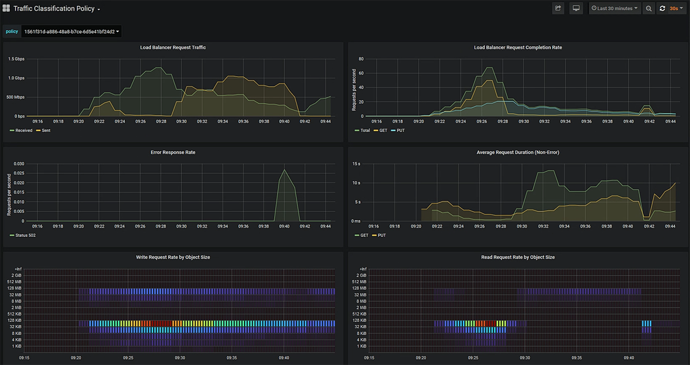
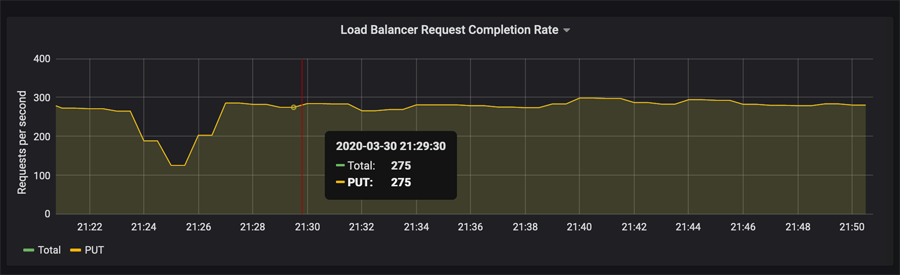
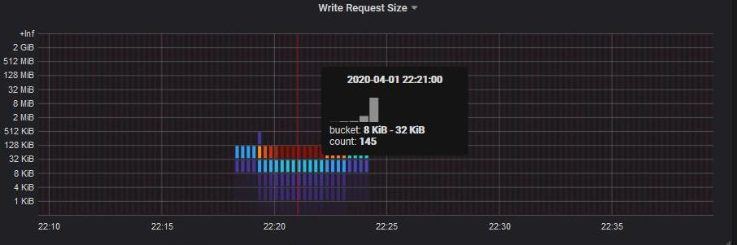

= View network traffic metrics
:icons: font
:imagesdir: ../media/

[.lead]
You can monitor network traffic by viewing the graphs that are available from the Traffic Classification Policies page.

.What you'll need

* You are signed in to the Grid Manager using a xref:../admin/web-browser-requirements.adoc[supported web browser].
* You have the Root access permission or the Tenant Accounts permission.

.About this task

For any existing traffic classification policy, you can view metrics for the Load Balancer service to determine if the policy is successfully limiting traffic across the network. The data in the graphs can help you determine if you need adjust the policy.

Even if no limits are set for a traffic classification policy, metrics are collected and the graphs provide useful information for understanding traffic trends.

.Steps

. Select *CONFIGURATION* > *Network* > *Traffic classification*.
+
The Traffic Classification Policies page appears, and the existing policies are listed in the table.
+
image::../media/traffic_classification_policies_main_screen_w_examples.png[Traffic Policy for Graph Example]
+
NOTE: The *Create*, *Edit*, and *Remove* buttons are disabled if you have the Tenant Accounts permission but you do not have the Root access permission. 

. Select the radio button to the left of the policy you want to view metrics for.
. Select *Metrics*.
+
A new browser window opens, and the Traffic Classification Policy graphs appear. The graphs display metrics only for the traffic that matches the selected policy.
+
You can select other policies to view by using the *policy* pull-down.
+

+
The following graphs are included on the web page.

 ** Load Balancer Request Traffic: This graph provides a 3-minute moving average of the throughput of data transmitted between load balancer endpoints and the clients making the requests, in bits per second.
 ** Load Balancer Request Completion Rate: This graph provides a 3-minute moving average of the number of completed requests per second, broken down by request type (GET, PUT, HEAD, and DELETE). This value is updated when the headers of a new request have been validated.
 ** Error Response Rate: This graph provides a 3-minute moving average of the number of error responses returned to clients per second, broken down by the error response code.
 ** Average Request Duration (Non-Error): This graph provides a 3-minute moving average of request durations, broken down by request type (GET, PUT, HEAD, and DELETE). Each request duration starts when a request header is parsed by the Load Balancer service and ends when the complete response body is returned to the client.
 ** Write Request Rate by Object Size: This heatmap provides a 3-minute moving average of the rate at which write requests are completed based on object size. In this context, write requests refer only to PUT requests.
 ** Read Request Rate by Object Size: This heatmap provides a 3-minute moving average of the rate at which read requests are completed based on object size. In this context, read requests refer only to GET requests.
The colors in the heatmap indicate the relative frequency of an object size within an individual graph. The cooler colors (for example, purple and blue) indicate lower relative rates, and the warmer colors (for example, orange and red) indicate higher relative rates.

. Hover the cursor over a line graph to see a pop-up of values on a specific part of the graph.
+

. Hover the cursor over a heatmap to see a pop-up that shows the date and time of the sample, object sizes that are aggregated into the count, and the number of requests per second during that time period.
+

. Use the *Policy* pull-down in the upper left to select a different policy.
+
The graphs for the selected policy appear.

. Alternatively, access the graphs from the *SUPPORT* menu.
 .. Select *SUPPORT* > *Tools* > *Metrics*.
 .. In the *Grafana* section of the page, select *Traffic Classification Policy*.
 .. Select the policy from the pull-down on the upper left of the page.
+
Traffic classification policies are identified by their ID. Policy IDs are listed on the Traffic Classification Policies page.
. Analyze the graphs to determine how often the policy is limiting traffic and whether you need to adjust the policy.

.Related information

xref:../monitor/index.adoc[Monitor and troubleshoot]
