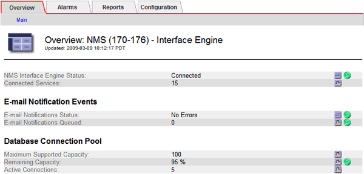

= Viewing notification status and queues
:icons: font
:imagesdir: ../media/

[.lead]
The NMS service on Admin Nodes sends notifications to the mail server. You can view the current status of the NMS service and the size of its notifications queue on the Interface Engine page.

To access the Interface Engine page, select *Support* > *Tools* > *Grid Topology*. Finally, select *_site_* > *_Admin Node_* > *NMS* > *Interface Engine*.

Notifications are processed through the email notifications queue and are sent to the mail server one after another in the order they are triggered. If there is a problem (for example, a network connection error) and the mail server is unavailable when the attempt is made to send the notification, a best effort attempt to resend the notification to the mail server continues for a period of 60 seconds. If the notification is not sent to the mail server after 60 seconds, the notification is dropped from the notifications queue and an attempt to send the next notification in the queue is made. Because notifications can be dropped from the notifications queue without being sent, it is possible that an alarm can be triggered without a notification being sent. In the event that a notification is dropped from the queue without being sent, the MINS (E-mail Notification Status) Minor alarm is triggered.
