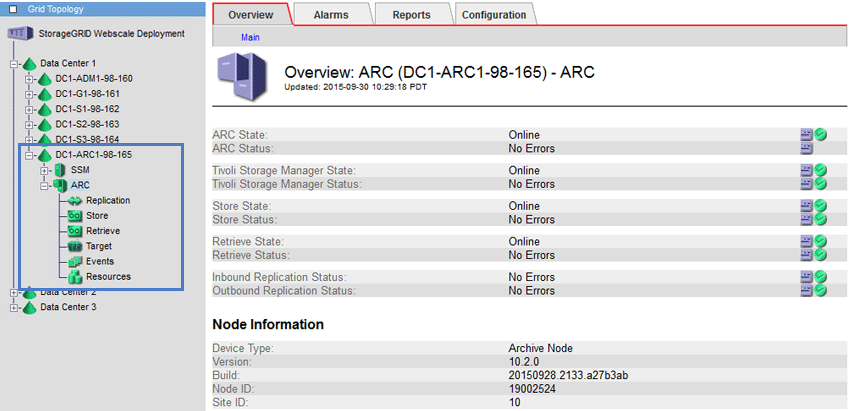

= What an Archive Node is
:icons: font
:imagesdir: ../media/

[.lead]
The Archive Node provides an interface through which you can target an external archival storage system for the long term storage of object data. The Archive Node also monitors this connection and the transfer of object data between the StorageGRID system and the targeted external archival storage system.

Object data that cannot be deleted, but is not regularly accessed, can at any time be moved off of a Storage Node's spinning disks and onto external archival storage such as the cloud or tape. This archiving of object data is accomplished through the configuration of a data center site's Archive Node and then the configuration of ILM rules where this Archive Node is selected as the "target" for content placement instructions. The Archive Node does not manage archived object data itself; this is achieved by the external archive device.

NOTE: Object metadata is not archived, but remains on Storage Nodes.
