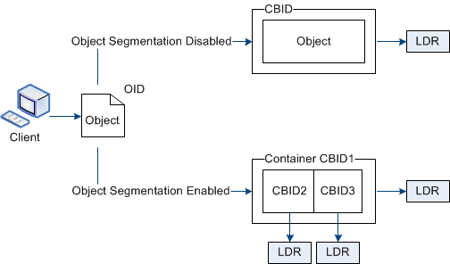

= What object segmentation is
:icons: font
:imagesdir: ../media/

[.lead]
Object segmentation is the process of splitting up an object into a collection of smaller fixed-size objects in order to optimize storage and resources usage for large objects. S3 multi-part upload also creates segmented objects, with an object representing each part.

When an object is ingested into the StorageGRID system, the LDR service splits the object into segments, and creates a segment container that lists the header information of all segments as content.

If your StorageGRID system includes an Archive Node whose Target Type is Cloud Tiering -- Simple Storage Service and the targeted archival storage system is Amazon Web Services (AWS), the Maximum Segment Size must be less than or equal to 4.5 GiB (4,831,838,208 bytes). This upper limit ensures that the AWS PUT limitation of five GBs is not exceeded. Requests to AWS that exceed this value fail.

On retrieval of a segment container, the LDR service assembles the original object from its segments and returns the object to the client.

The container and segments are not necessarily stored on the same Storage Node. Container and segments can be stored on any Storage Node.

Each segment is treated by the StorageGRID system independently and contributes to the count of attributes such as Managed Objects and Stored Objects. For example, if an object stored to the StorageGRID system is split into two segments, the value of Managed Objects increases by three after the ingest is complete, as follows:

segment container + segment 1 + segment 2 = three stored objects

You can improve performance when handling large objects by ensuring that:

* Each Gateway and Storage Node has sufficient network bandwidth for the throughput required. For example, configure separate Grid and Client Networks on 10 Gbps Ethernet interfaces.
* Enough Gateway and Storage Nodes are deployed for the throughput required.
* Each Storage Node has sufficient disk IO performance for the throughput required.
