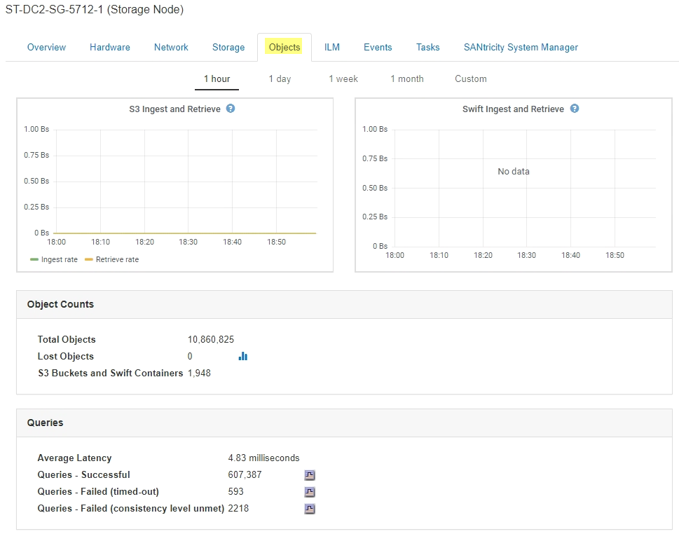
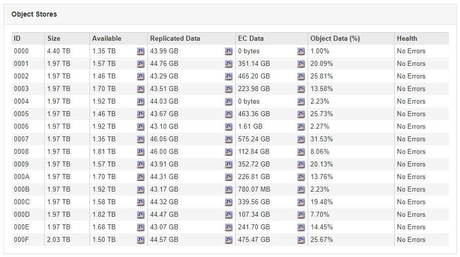

= What is a Storage Node?
:icons: font
:imagesdir: ../media/

[.lead]
Storage Nodes manage and store object data and metadata. Each StorageGRID system must have at least three Storage Nodes. If you have multiple sites, each site within your StorageGRID system must also have three Storage Nodes.

A Storage Node includes the services and processes required to store, move, verify, and retrieve object data and metadata on disk. You can view detailed information about the Storage Nodes on the *NODES* page.

== What is the ADC service?

The Administrative Domain Controller (ADC) service authenticates grid nodes and their connections with each other. The ADC service is hosted on each of the first three Storage Nodes at a site.

The ADC service maintains topology information including the location and availability of services. When a grid node requires information from another grid node or an action to be performed by another grid node, it contacts an ADC service to find the best grid node to process its request. In addition, the ADC service retains a copy of the StorageGRID deployment's configuration bundles, allowing any grid node to retrieve current configuration information.You can view ADC information for a Storage Node on the Grid Topology page (*SUPPORT* > *Grid topology*).

To facilitate distributed and islanded operations, each ADC service synchronizes certificates, configuration bundles, and information about services and topology with the other ADC services in the StorageGRID system.

In general, all grid nodes maintain a connection to at least one ADC service. This ensures that grid nodes are always accessing the latest information. When grid nodes connect, they cache other grid nodes`' certificates, enabling systems to continue functioning with known grid nodes even when an ADC service is unavailable. New grid nodes can only establish connections by using an ADC service.

The connection of each grid node lets the ADC service gather topology information. This grid node information includes the CPU load, available disk space (if it has storage), supported services, and the grid node's site ID. Other services ask the ADC service for topology information through topology queries. The ADC service responds to each query with the latest information received from the StorageGRID system.

== What is the DDS service?

Hosted by a Storage Node, the Distributed Data Store (DDS) service interfaces with the Cassandra database to perform background tasks on the object metadata stored in the StorageGRID system.

=== Object counts

The DDS service tracks the total number of objects ingested into the StorageGRID system as well as the total number of objects ingested through each of the system's supported interfaces (S3 or Swift).

You can see the Total Objects count on the Nodes page > Objects tab for any Storage Node.

=== Queries

You can identify the average time that it takes to run a query against the metadata store through the specific DDS service, the total number of successful queries, and the total number of queries that failed because of a timeout issue.

You might want to review query information to monitor the health of the metadata store, Cassandra, which impacts the system's ingest and retrieval performance. For example, if the latency for an average query is slow and the number of failed queries due to timeouts is high, the metadata store might be encountering a higher load or performing another operation.

You can also view the total number of queries that failed because of consistency failures. Consistency level failures result from an insufficient number of available metadata stores at the time a query is performed through the specific DDS service.

You can use the Diagnostics page to obtain additional information on the current state of your grid. See xref:../monitor/running-diagnostics.adoc[Run diagnostics].

=== Consistency guarantees and controls

StorageGRID guarantees read-after-write consistency for newly created objects. Any GET operation following a successfully completed PUT operation will be able to read the newly written data. Overwrites of existing objects, metadata updates, and deletes remain eventually consistent.

== What is the LDR service?

Hosted by each Storage Node, the Local Distribution Router (LDR) service handles content transport for the StorageGRID system. Content transport encompasses many tasks including data storage, routing, and request handling. The LDR service does the majority of the StorageGRID system's hard work by handling data transfer loads and data traffic functions.

The LDR service handles the following tasks:

* Queries
* Information lifecycle management (ILM) activity
* Object deletion
* Object data storage
* Object data transfers from another LDR service (Storage Node)
* Data storage management
* Protocol interfaces (S3 and Swift)

The LDR service also manages the mapping of S3 and Swift objects to the unique "`content handles`" (UUIDs) that the StorageGRID system assigns to each ingested object.

=== Queries

LDR queries include queries for object location during retrieve and archive operations. You can identify the average time that it takes to run a query, the total number of successful queries, and the total number of queries that failed because of a timeout issue.

You can review query information to monitor the health of the metadata store, which impacts the system's ingest and retrieval performance. For example, if the latency for an average query is slow and the number of failed queries due to timeouts is high, the metadata store might be encountering a higher load or performing another operation.

You can also view the total number of queries that failed because of consistency failures. Consistency level failures result from an insufficient number of available metadata stores at the time a query is performed through the specific LDR service.

You can use the Diagnostics page to obtain additional information on the current state of your grid. See xref:../monitor/running-diagnostics.adoc[Run diagnostics].

=== ILM activity

Information lifecycle management (ILM) metrics allow you to monitor the rate at which objects are evaluated for ILM implementation. You can view these metrics on the Dashboard or at *NODES* > *_Storage Node_* > *ILM*.

=== Object stores

The underlying data storage of an LDR service is divided into a fixed number of object stores (also known as storage volumes). Each object store is a separate mount point.

You can see the object stores for a Storage Node on the Nodes page > Storage tab.

The object stores in a Storage Node are identified by a hexadecimal number from 0000 to 002F, which is known as the volume ID. Space is reserved in the first object store (volume 0) for object metadata in a Cassandra database; any remaining space on that volume is used for object data. All other object stores are used exclusively for object data, which includes replicated copies and erasure-coded fragments.

To ensure even space usage for replicated copies, object data for a given object is stored to one object store based on available storage space. When one or more object stores fill to capacity, the remaining object stores continue to store objects until there is no more room on the Storage Node.

=== Metadata protection

Object metadata is information related to or a description of an object; for example, object modification time, or storage location. StorageGRID stores object metadata in a Cassandra database, which interfaces with the LDR service.

To ensure redundancy and thus protection against loss, three copies of object metadata are maintained at each site. The copies are evenly distributed across all Storage Nodes at each site. This replication is non-configurable and performed automatically.

xref:managing-object-metadata-storage.adoc[Manage object metadata storage]
