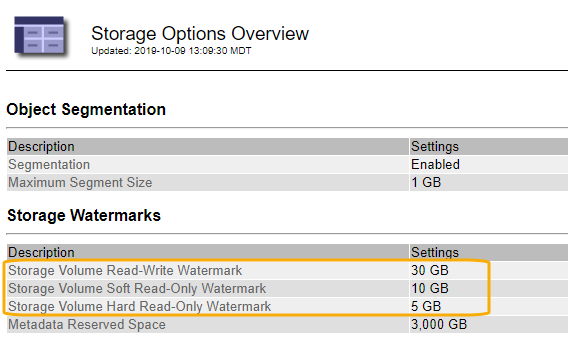
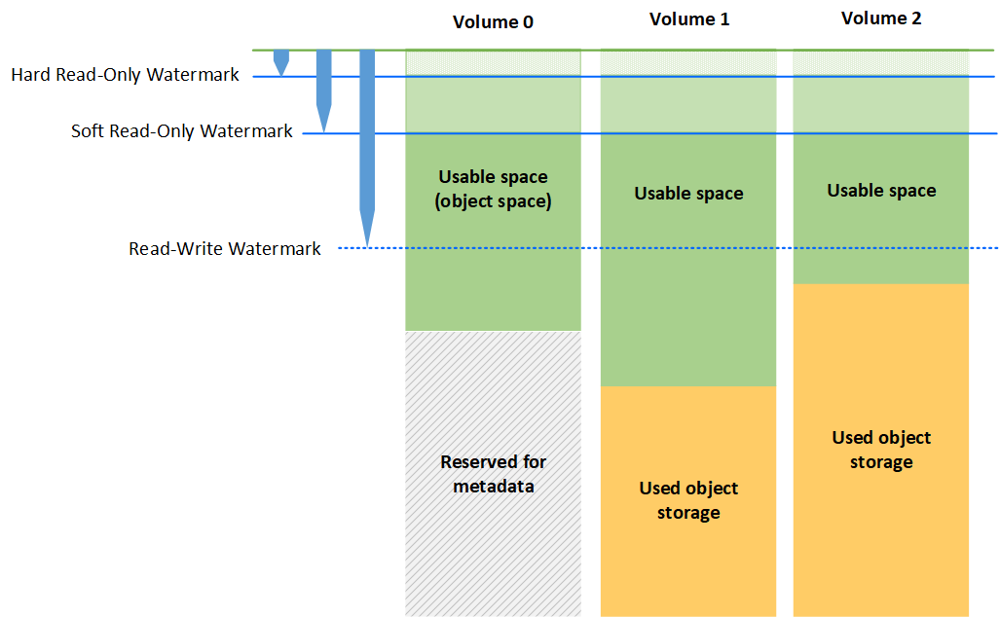

= What Storage Volume watermarks are
:icons: font
:imagesdir: ../media/

[.lead]
StorageGRID uses Storage Volume watermarks to allow you to monitor the amount of usable space available on Storage Nodes. If the amount of space available on a node is less than a configured watermark setting, the Storage Status (SSTS) alarm is triggered so that you can determine if you need to add Storage Nodes.

To view the current settings for the Storage Volume watermarks, select *Configuration* > *Storage Options* > *Overview*.

The following figure represents a Storage Node that has three volumes and shows the relative position of the three Storage Volume watermarks. Within each Storage Node, StorageGRID reserves space on volume 0 for object metadata; any remaining space on that volume is used for object data. All other volumes are used exclusively for object data, which includes replicated copies and erasure-coded fragments.

The Storage Volume watermarks are system-wide defaults that indicate the minimum amount of free space required on each volume in the Storage Node to prevent StorageGRID from changing the node's read-write behavior or triggering an alarm. Note that all volumes must reach the watermark before StorageGRID takes action. If some volumes have more than the minimum required amount of free space, the alarm is not triggered and the node's read-write behavior does not change.

== Storage Volume Soft Read-Only Watermark (VHWM)

The Storage Volume Soft Read-Only Watermark is the first watermark to indicate that a node's usable space for object data is becoming full. This watermark represents how much free space must exist on every volume in a Storage Node to prevent the node from going into "`soft read-only mode.`" Soft read-only mode means that the Storage Node advertises read-only services to the rest of the StorageGRID system, but fulfills all pending write requests.

If the amount of free space on each volume is less than the setting of this watermark, the Storage Status (SSTS) alarm is trigged at the Notice level, and the Storage Node transitions to soft read-only mode.

For example, suppose the Storage Volume Soft Read-Only Watermark is set to 10 GB, which is its default value. If less than 10 GB of free space remains on each volume in the Storage Node, the SSTS alarm is triggered at the Notice level, and the Storage Node transitions to soft read-only mode.

== Storage Volume Hard Read-Only Watermark (VROM)

The Storage Volume Hard Read-Only Watermark is the next watermark to indicate that a node's usable space for object data is becoming full. This watermark represents how much free space must exist on every volume in a Storage Node to prevent the node from going in to "`hard read-only mode.`" Hard read-only mode means that the Storage Node is read-only and no longer accepts write requests.

If the amount of free space on every volume in a Storage Node is less than the setting of this watermark, the Storage Status (SSTS) alarm is trigged at the Major level, and the Storage Node transitions to hard read-only mode.

For example, suppose the Storage Volume Hard Read-Only Watermark is set to 5 GB, which is its default value. If less than 5 GB of free space remains on each storage volume in the Storage Node, the SSTS alarm is triggered at the Major level, and the Storage Node transitions to hard read-only mode.

The value of the Storage Volume Hard Read-Only Watermark must be less than the value of the Storage Volume Soft Read-Only Watermark.

== Storage Volume Read-Write Watermark (VLWM)

The Storage Volume Read-Write Watermark only applies to Storage Nodes that have transitioned to read-only mode. This watermark determines when the Storage Node is allowed to become read-write again.

For example, suppose a Storage Node has transitioned to hard read-only mode. If the Storage Volume Read-Write Watermark is set to 30 GB (default), the free space on every storage volume in the Storage Node must increase from 5 GB to 30 GB before the node can become read-write again.

The value of the Storage Volume Read-Write Watermark must be greater than the value of the Storage Volume Soft Read-Only Watermark.

.Related information

xref:managing-full-storage-nodes.adoc[Managing full Storage Nodes]
