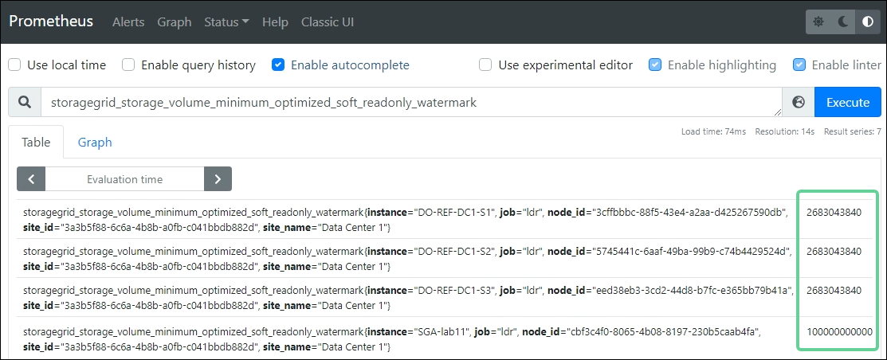

= What are storage volume watermarks?
:icons: font
:imagesdir: ../media/

[.lead]
StorageGRID uses three storage volume watermarks to ensure that Storage Nodes are safely transitioned to a read-only state before before they run critically low on space and to allow Storage Nodes that have been transitioned to a read-only state to become read-write again.

image::../media/storage_volume_watermarks.png[Storage volume watermarks]

NOTE: The storage volume watermarks only apply to the space used for object data (replicated and erasure-coded copies). To learn about the space reserved for object metadata on volume 0, go to 
xref:managing-object-metadata-storage.adoc[Manage object metadata storage].

== What is the Soft Read-Only Watermark?
The *Storage Volume Soft Read-Only Watermark* is the first watermark to indicate that a Storage Node's usable space for object data is becoming full. 

If each volume in a Storage Node has less free space than that volume's Soft Read-Only Watermark, the Storage Node transitions into _soft read-only mode_. Soft read-only mode means that the Storage Node advertises read-only services to the rest of the StorageGRID system, but fulfills all pending write requests.

For example, suppose each volume in a Storage Node has a Soft Read-Only Watermark of 10 GB. If each volume has less than 10 GB of free space, the Storage Node transitions to soft read-only mode.

== What is the Hard Read-Only Watermark?

The *Storage Volume Hard Read-Only Watermark* is the next watermark to indicate that a node's usable space for object data is becoming full. 

If each volume in a Storage Node has less free space than that volume's Hard Read-Only Watermark, the Storage Node transitions into _hard read-only mode_. Hard-read only mode means that the Storage Node is read-only and no longer accepts write requests.

For example, suppose each volume in a Storage Node has a Hard Read-Only Watermark of 5 GB. If each volume has less than 5 GB of free space, the Storage Node no longer accepts any write requests.

The Hard Read-Only Watermark is always less than the Soft Read-Only Watermark.

== What is the Read-Write Watermark?

The *Storage Volume Read-Write Watermark* only applies to Storage Nodes that have transitioned to read-only mode. It determines when the node can become read-write again. When the free space on any one storage volume in a Storage Node is greater than that volume’s Read-Write Watermark, the node automatically transitions back to the read-write state.

For example, suppose the Storage Node has transitioned to hard read-only mode. Also suppose that each volume has a Read-Write Watermark of 30 GB. If the free space for any volume increases to 30 GB, the node becomes read-write again.

The Read-Write Watermark is always larger than both the Soft Read-Only Watermark and the Hard Read-Only Watermark.

== Determine if optimized storage watermarks are in use

Starting in StorageGRID 11.6, StorageGRID optimizes the watermark settings for every storage volume in every Storage Node. StorageGRID uses the size of the Storage Node and the relative size of the volume to calculate the optimum watermark value for that volume. 

.What you'll need

* You are signed in to the Grid Manager using a xref:../admin/web-browser-requirements.adoc[supported web browser].

* You have the Root Access permission.

.About this task

Optimized watermarks are used for all new and most upgraded StorageGRID 11.6 systems. The exception is an upgraded system in which non-default watermark values had been in use.

If you recently upgraded to StorageGRID 11.6, you can determine if your system is using optimized values for the three storage volume watermarks. Then, if optimized watermarks are not being used, you can optionally switch to the optimized settings.

=== View current storage watermarks

You can view the current storage watermark settings in the Grid Manager.

.Steps

. Select *CONFIGURATION* > *System* > *Storage options*. 
. In the Storage Watermarks section, look at the settings for the three storage volume watermark overrides.
+
image::../media/storage-volume-watermark-overrides.png[Storage volume watermark overrides]

* If the watermark overrides are set to *0*, the watermarks are optimized for every storage volume on every Storage Node. 
+
This is the default and recommended setting. Do not update these values or unexpected errors might occur. 

* If the watermark overrides are set to a non-0 value, optimized watermarks are not used. Instead, these settings determine the watermarks used by all storage volumes on all Storage Nodes. Using non-optimized watermark settings is not recommended.

. If the overrides are not *0*, go to <<Determine if you can use watermark overrides>> to determine if you can or should adjust the settings.

=== Determine if you can use watermark overrides

If the watermark overrides are not *0*, you might want to use the optimized values instead.
 
IMPORTANT: Do not change the watermark settings until you check the *Available* values for each object store. If there is not enough available space, Storage Nodes might become read-only as soon as you change these values.

. <<View current storage watermarks>> and note the current setting for the *Storage Volume Soft Read-Only Watermark Override*.

. Select *NODES* to go to the Nodes page.

. For each online Storage Node, select *_Storage Node_* > *Storage* and look at the Object Stores table.

. Compare the *Available* value for each object store (volume) to the current setting of the *Storage Volume Soft Read-Only Watermark*.

. If at least one volume has more space available than the current watermark setting:

.. Go back to *CONFIGURATION* > *System* > *Storage options*.
.. Select *Configuration* from the Storage Options menu.
.. Change the *Storage Volume Soft Read-Only Watermark Override* to 0.
.. Select *Apply Changes*.

. If no volume has more space available than the system-wide watermark setting, perform an expansion, if possible. Either add storage volumes to an existing node or add new Storage Nodes.

NOTE: The *Low read-only watermark override* is triggered when the Storage Volume Soft Read-Only Watermark Override is less than the minimum optimized watermark for a Storage Node. If you need to use the current overrides for the storage volume watermarks, silence or disable the *Low read-only watermark override* alert.

== View the calculated storage watermarks

StorageGRID uses two Prometheus metrics to show the optimized values it has calculated for the Storage Volume Soft Read-Only Watermark:

* For a given Storage Node, the following metric shows the minimum optimized value of the Soft Read-Only Watermark for all storage volumes on that node:
+
`storagegrid_storage_volume_minimum_optimized_soft_readonly_watermark` 

* For a given Storage Node, the following metric shows the maximum optimized value of the Soft Read-Only Watermark for all storage volumes on that node: 
+
`storagegrid_storage_volume_maximum_optimized_soft_readonly_watermark`
+
NOTE: StorageGRID derives optimized values for the Hard Read-Only Watermark and the Read-Write Watermark using the two metrics above. The other watermarks do not have their own Prometheus metrics.

You can view the minimum and maximum values for all Storage Nodes.

.What you'll need
* You are signed in to the Grid Manager using a xref:../admin/web-browser-requirements.adoc[supported web browser].
* You have the Root access permission.

.Steps

. Select *SUPPORT* > *Tools* > *Metrics*.
. In the Prometheus section, select the link to access the Prometheus user interface.
. Enter the following Prometheus metric: 
+
`storagegrid_storage_volume_minimum_optimized_soft_readonly_watermark`

. Select *Execute*.

. In the results, look at the last column to find the optimized watermark setting.
+
This example shows four Storage Nodes in a data center. The recommended minimum soft read-only watermark for the appliance Storage Node is 100,000,000,000 bytes (93.13 GB). As you might expect, the optimize watermark value for an appliance storage volume is much larger than the optimized watermark value for a volume in a small, software-based Storage Node.
+

. To see the recommended maximum soft read-only watermark, execute the following Prometheus expression: 
+
`storagegrid_storage_volume_maximum_optimized_soft_readonly_watermark`

